# ACID Guarantees

FoundationDB provides **full ACID guarantees** for every transaction—not as an optional feature or limited to single partitions, but as a fundamental property of the system. This section explains what each guarantee means in practice and how FoundationDB achieves them at scale.

## What ACID Means

**ACID** is an acronym describing four properties that guarantee database transactions are processed reliably:

```mermaid
graph TB
    subgraph ACID["ACID Properties"]
        A[🔒 Atomicity<br/>All or nothing]
        C[✓ Consistency<br/>Valid states only]
        I[👁️ Isolation<br/>Transactions don't interfere]
        D[💾 Durability<br/>Committed = permanent]
    end
    style A fill:#e3f2fd
    style C fill:#e8f5e9
    style I fill:#fff3e0
    style D fill:#fce4ec
```



## Atomicity

**All operations in a transaction succeed or fail together.**

When you group multiple reads and writes in a transaction, FoundationDB guarantees they're treated as a single, indivisible operation:

```python
@fdb.transactional
def transfer(tr, from_account, to_account, amount):
    # These two writes are atomic
    from_balance = int(tr[from_account])
    to_balance = int(tr[to_account])

    tr[from_account] = str(from_balance - amount).encode()
    tr[to_account] = str(to_balance + amount).encode()
    # Either BOTH writes commit, or NEITHER does
```

### What Atomicity Prevents

| Scenario | Without Atomicity | With Atomicity |
|----------|-------------------|----------------|
| Power failure mid-transaction | Partial writes, corrupted state | Transaction rolls back |
| Network error | Some writes visible, others lost | All writes rolled back |
| Application crash | Inconsistent data | Clean rollback |

!!! success "No Partial Writes"
    You'll never see a state where money was deducted from one account but not yet added to another. Either the full transfer happened, or nothing happened.

## Consistency

**The database moves from one valid state to another.**

In ACID terminology, "consistency" means that transactions preserve application-defined invariants. FoundationDB itself doesn't know your business rules, but it provides the tools to enforce them:

```python
@fdb.transactional
def transfer(tr, from_account, to_account, amount):
    from_balance = int(tr[from_account])

    # Application-level consistency check
    if from_balance < amount:
        raise InsufficientFundsError("Balance too low")

    # If we get here, the invariant (balance >= 0) is maintained
    tr[from_account] = str(from_balance - amount).encode()
    tr[to_account] = str(int(tr[to_account]) + amount).encode()
```

**How FoundationDB helps maintain consistency:**

- **Transactions**: Group related changes together
- **Conflict detection**: Prevents race conditions that could violate invariants
- **Atomic commits**: No partial states that could break rules

!!! note "Consistency in ACID vs CAP"
    The "C" in ACID (application invariants) is different from the "C" in CAP theorem (linearizability/sequential consistency). FoundationDB provides both.

## Isolation

**Transactions behave as if they executed one at a time.**

FoundationDB provides **serializable isolation**—the strongest isolation level. Each transaction sees a consistent snapshot of the database, unaffected by concurrent transactions.

### Isolation Levels Compared

| Level | Dirty Reads | Non-Repeatable Reads | Phantom Reads | FoundationDB |
|-------|-------------|----------------------|---------------|--------------|
| Read Uncommitted | Possible | Possible | Possible | — |
| Read Committed | Prevented | Possible | Possible | — |
| Repeatable Read | Prevented | Prevented | Possible | — |
| **Serializable** | Prevented | Prevented | Prevented | **✅ Always** |

### What Isolation Prevents

```mermaid
sequenceDiagram
    participant T1 as Transaction 1
    participant DB as FoundationDB
    participant T2 as Transaction 2

    T1->>DB: Read key A (value: 100)
    T2->>DB: Write key A (value: 200)
    T2->>DB: Commit ✓
    T1->>DB: Read key A again
    Note over T1,DB: Still sees 100!<br/>Snapshot isolation
    T1->>DB: Commit ✓
```



**Serializable isolation means:**

- **No dirty reads**: You never see uncommitted changes from other transactions
- **No non-repeatable reads**: If you read a key twice in the same transaction, you get the same value
- **No phantom reads**: Range queries return consistent results throughout the transaction

### Snapshot Reads

All reads within a transaction see a consistent **snapshot** of the database at the transaction's read version:

```python
@fdb.transactional
def check_total(tr):
    # These reads are guaranteed to be from the same snapshot
    a = int(tr[b'account/a'])
    b = int(tr[b'account/b'])
    c = int(tr[b'account/c'])

    # This total is consistent, even if other transactions are
    # actively modifying these accounts
    return a + b + c
```

## Durability

**Once a transaction commits, it stays committed—even through hardware failures.**

When FoundationDB reports that a transaction committed successfully, that data is:

1. **Written to disk** on multiple machines (based on redundancy mode)
2. **Synchronously replicated** before the commit returns
3. **Recoverable** even if machines fail immediately after

### Redundancy Modes

| Mode | Copies | Survives |
|------|--------|----------|
| `single` | 1 | No failures (development only) |
| `double` | 2 | 1 machine failure |
| `triple` | 3 | 2 machine failures |
| `three_datacenter` | 3+ | 1 datacenter failure |

```python
# When this returns, data is durable
transfer(db, alice, bob, 100)
print("Transfer complete and durable!")  # Safe to tell user
```

!!! warning "Durability vs Latency"
    FoundationDB's synchronous replication adds a few milliseconds to commit latency. This is the cost of true durability—you can't have instant commits AND guaranteed durability.

## FoundationDB and the CAP Theorem

The CAP theorem states that during a network partition, a distributed system must choose between **Consistency** and **Availability**. FoundationDB chooses **Consistency**.


### What This Means in Practice

**During normal operation**: FoundationDB is both consistent AND highly available.

**During a network partition**: Some nodes may become unavailable, but:

- Clients connected to the majority partition continue operating
- No stale or inconsistent data is ever served
- When the partition heals, the system seamlessly recovers


!!! quote "CAP Clarification"
    "The common belief that a database cannot provide strong consistency and high availability is based on a misunderstanding of the CAP theorem. FoundationDB provides both under normal conditions, and chooses consistency when partitions occur."

    — [FoundationDB CAP Documentation](https://apple.github.io/foundationdb/cap-theorem.html)

## Comparing Databases

| Feature | FoundationDB | Many NoSQL DBs | Traditional RDBMS |
|---------|--------------|----------------|-------------------|
| Isolation level | Serializable | Eventual/Weak | Configurable |
| Distributed ACID | ✅ Yes | ❌ No | ❌ Single node |
| Horizontal scale | ✅ Yes | ✅ Yes | ❌ Limited |
| Strong consistency | ✅ Always | ❌ Optional | ✅ Yes |
| Auto-failover | ✅ Yes | ✅ Varies | ❌ Manual |

## Performance Impact

ACID guarantees do have costs, but FoundationDB minimizes them:

| Operation | Typical Latency | Notes |
|-----------|-----------------|-------|
| Read | 1-2 ms | From any storage server |
| Write (commit) | 5-15 ms | Includes synchronous replication |
| Conflict retry | +5-10 ms | Automatic, transparent |

!!! tip "ACID Overhead Is Small"
    In benchmarks, the CPU overhead of maintaining ACID transactions is less than 10% of total system resources. The engineering complexity is high, but the runtime cost is manageable.

## When ACID Matters Most

ACID guarantees are critical for:

- **Financial transactions**: Money transfers, billing, inventory
- **User data**: Registration, profile updates, permissions
- **Coordination**: Distributed locks, leader election, queues
- **Anything with invariants**: "Balance >= 0", "Unique email", "Foreign key exists"

!!! success "The Foundation for Everything"
    FoundationDB's ACID guarantees enable **layers**—higher-level data models built on the key-value store. Because layers can rely on transactions, they can safely maintain indexes, denormalized data, and complex relationships.

## Further Reading

- **[Transactions](transactions.md)**: How to use transactions effectively
- **[Architecture](architecture.md)**: How ACID is achieved at scale
- **[CAP Theorem](https://apple.github.io/foundationdb/cap-theorem.html)**: Detailed analysis
- **[FoundationDB SIGMOD Paper](https://www.foundationdb.org/files/fdb-paper.pdf)**: Academic deep dive

