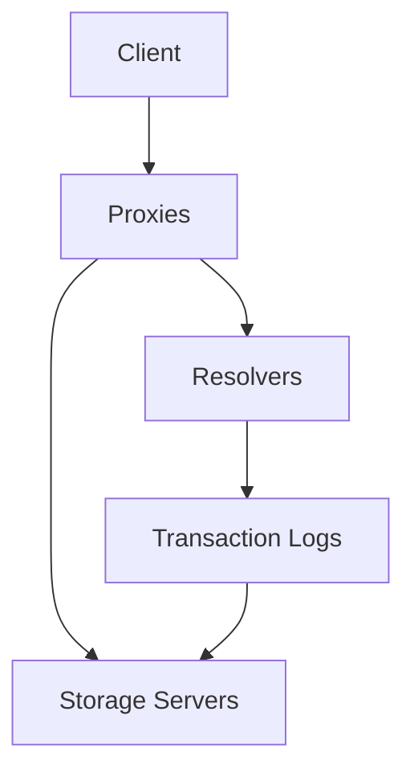

# Architecture

FoundationDB is designed as a distributed, fault-tolerant database.

!!! note "Coming Soon"
    This section is being migrated from the original FoundationDB documentation.

## Components

### Coordinators

- Cluster configuration
- Leader election
- Metadata management

### Proxies

- Accept client transactions
- Assign read versions
- Route to storage servers

### Resolvers

- Conflict detection
- Transaction ordering
- Serialization point

### Storage Servers

- Key-value storage
- Range queries
- Data replication

### Transaction Logs

- Write-ahead logging
- Durability guarantees
- Recovery support

## Scaling

FoundationDB scales horizontally:

- Add storage servers for capacity
- Add proxies for throughput
- Automatic data distribution

## Next Steps

- Review [Operations](../operations/index.md) guides
- Learn [Configuration](../operations/configuration.md)

