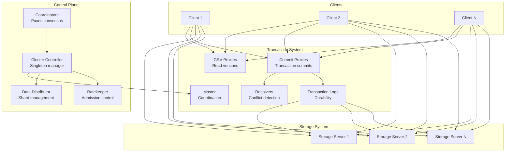
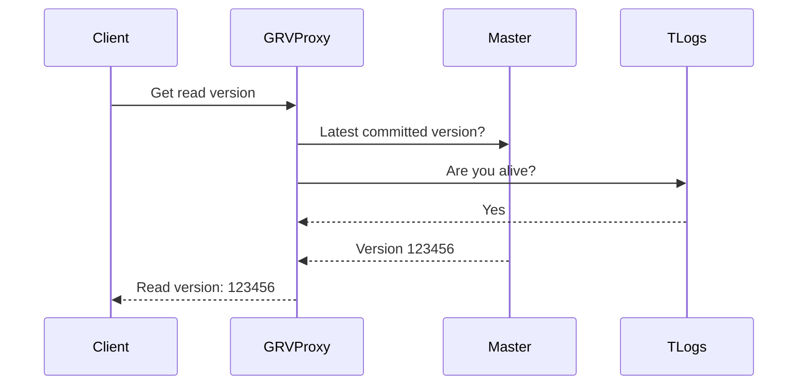
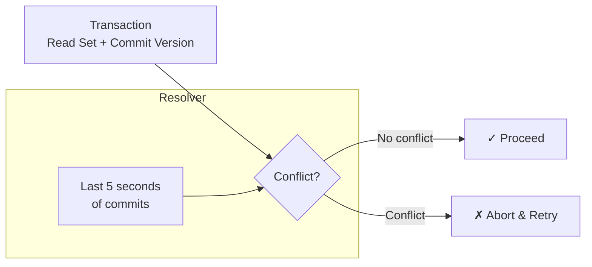
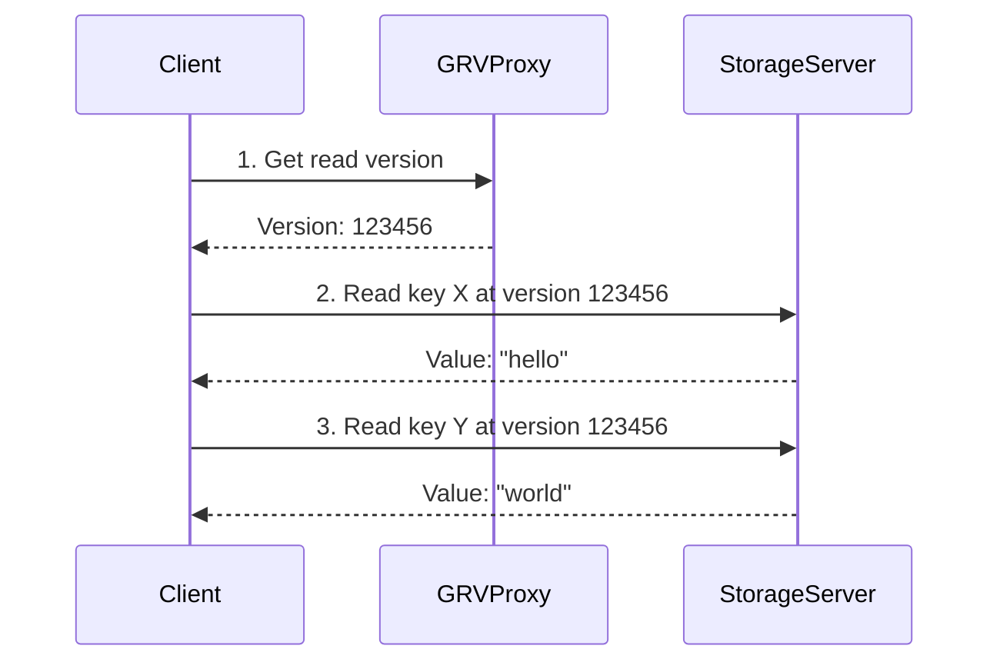
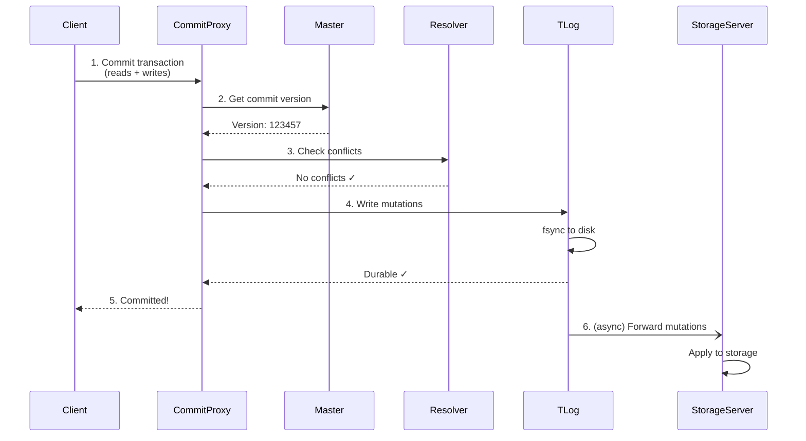
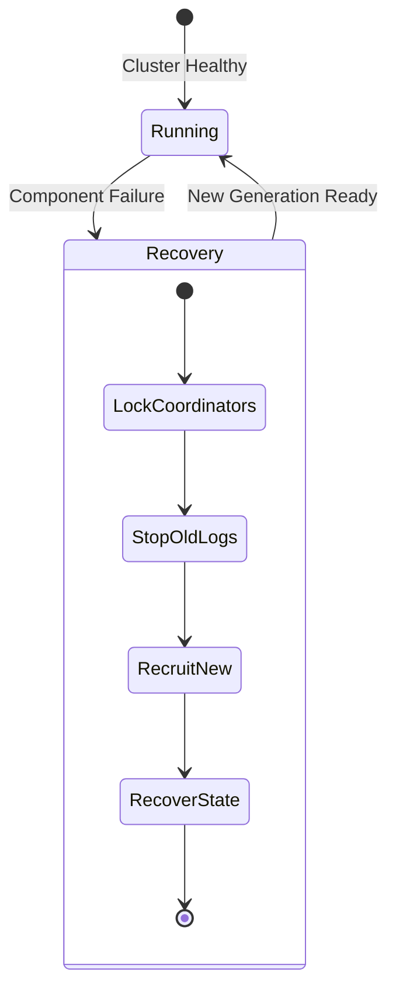

# Architecture

FoundationDB's architecture is designed around a principle of **decoupling**: different processes handle different responsibilities, allowing the system to scale each component independently. This design enables horizontal scaling, fault tolerance, and the strict ACID guarantees that define FoundationDB.

## Design Philosophy

FoundationDB separates the **transaction processing system** (write path) from the **storage system** (read path). This separation allows:

- **Independent scaling**: Add storage servers for capacity, proxies for throughput
- **Fault isolation**: A storage server failure doesn't affect transaction processing
- **Flexible deployment**: Components can be placed on different hardware tiers

## Core Components

### Coordinators

**Coordinators** form the stable anchor for cluster discovery and leader election. They run the **Paxos consensus algorithm** to maintain a small amount of critical shared state. [:material-github: Source](https://github.com/apple/foundationdb/blob/main/fdbserver/Coordination.actor.cpp)

| Responsibility | Details |
|----------------|---------|
| Cluster discovery | Clients and servers connect using coordinator addresses |
| Leader election | Elect the Cluster Controller |
| Configuration storage | Store minimal cluster metadata |

!!! info "Coordinator Placement"
    For production, deploy an odd number of coordinators (3 or 5) across failure domains. A majority must be available for the cluster to operate.

### Cluster Controller

The **Cluster Controller** is a singleton process elected by the coordinators. It's the central orchestrator for the cluster: [:material-github: Source](https://github.com/apple/foundationdb/blob/main/fdbserver/ClusterController.actor.cpp)

- Detects process failures
- Recruits processes into roles
- Distributes cluster configuration

### Master

The **Master** coordinates the transaction system's lifecycle: [:material-github: Source](https://github.com/apple/foundationdb/blob/main/fdbserver/masterserver.actor.cpp)

- Provides commit versions to proxies
- Monitors transaction system health
- Triggers recovery when components fail

The master, proxies, resolvers, and transaction logs form a **generation**. If any component fails, the entire generation is replaced through a recovery process.

### GRV Proxies (Get Read Version)

!!! info "Proxy Split (7.0+)"
    In FoundationDB 7.0, the original "Proxy" role was split into **GRV Proxies** and **Commit Proxies**. This separation reduces GRV tail latency by allowing independent scaling of read version requests.

**GRV Proxies** provide read versions to clients: [:material-github: Source](https://github.com/apple/foundationdb/blob/main/fdbserver/GrvProxyServer.actor.cpp)

The GRV proxy:

1. Gets the latest committed version from the master
2. Verifies transaction logs are still responsive (prevents stale reads after recovery)
3. Applies rate limiting from Ratekeeper

### Commit Proxies

**Commit Proxies** handle transaction commits: [:material-github: Source](https://github.com/apple/foundationdb/blob/main/fdbserver/CommitProxyServer.actor.cpp)

1. Get a commit version from the master
2. Send read/write conflict ranges to resolvers
3. If no conflicts, send mutations to transaction logs
4. Return success/failure to client

Commit proxies also maintain the **key-location cache**—a mapping of key ranges to storage servers that clients use to route reads.

### Resolvers

**Resolvers** determine if transactions conflict: [:material-github: Source](https://github.com/apple/foundationdb/blob/main/fdbserver/Resolver.actor.cpp)

For each incoming transaction, the resolver:

1. Compares the transaction's read set against recent commits
2. If any read key was modified after the transaction's read version, there's a conflict
3. Maintains ~5 seconds of commit history in memory

### Transaction Logs

**Transaction Logs** (TLogs) provide durability: [:material-github: Source](https://github.com/apple/foundationdb/blob/main/fdbserver/TLogServer.actor.cpp)

- Receive mutations from commit proxies **in version order**
- Write to append-only log files with `fsync`
- Forward mutations to storage servers
- Only return success after data is durable

!!! tip "Transaction Logs Are the Durability Boundary"
    A transaction is considered committed only after the TLogs acknowledge the write. This is the synchronous replication that guarantees durability.

### Storage Servers

**Storage Servers** are the workhorses of the cluster: [:material-github: Source](https://github.com/apple/foundationdb/blob/main/fdbserver/storageserver.actor.cpp)

| Responsibility | Details |
|----------------|---------|
| Key-value storage | Each server owns a range of keys (a "shard") |
| Serving reads | Clients read directly from storage servers |
| Applying mutations | Pull from transaction logs, apply to storage |
| Version history | Keep ~5 seconds of MVCC versions in memory |

Storage servers use one of several storage engines:

- **Redwood** (`ssd-redwood-1`): B-tree optimized for SSDs with lower write amplification (recommended for 7.3+)
- **SQLite** (`ssd-2`): Original SSD engine, still available
- **Memory Engine**: In-memory with append-only log (for testing)

!!! note "Storage Engine Evolution"
    Redwood was introduced in 7.0 as `ssd-redwood-1-experimental`. In 7.3, it was renamed to `ssd-redwood-1` (production ready). See [Storage Engines](../guides/storage-engines.md) for migration guidance.

### Data Distributor

The **Data Distributor** manages data placement: [:material-github: Source](https://github.com/apple/foundationdb/blob/main/fdbserver/DataDistribution.actor.cpp)

- Monitors storage server health and capacity
- Splits/merges key ranges (shards) as data grows
- Rebalances data across storage servers
- Handles storage server failures by re-replicating data

### Ratekeeper

**Ratekeeper** prevents cluster overload: [:material-github: Source](https://github.com/apple/foundationdb/blob/main/fdbserver/Ratekeeper.actor.cpp)

- Monitors storage servers, proxies, and logs
- Calculates sustainable transaction rate
- Throttles GRV proxies when cluster is saturated

## Transaction Flow

### Read Path

Reads are served directly by storage servers—no transaction system involvement. Clients:

1. Get a read version (consistent snapshot point)
2. Read directly from storage servers owning the relevant keys
3. All reads see the database as of the read version

### Write Path

The critical path (steps 1-5) determines commit latency. Step 6 happens asynchronously.

## Fault Tolerance

### Storage Server Failure

When a storage server fails:

1. Data Distributor detects the failure
2. Remaining replicas continue serving reads
3. Data Distributor re-replicates data to healthy servers
4. Transaction logs buffer mutations for the dead server (temporarily)

### Transaction System Failure

When any transaction system component fails:

1. Master detects the failure and terminates
2. Cluster Controller elects a new Master
3. New Master recruits fresh proxies, resolvers, and logs
4. **Recovery process** ensures no committed transactions are lost

Recovery typically completes in **100-500 milliseconds**.

### Redundancy Modes

| Mode | Data Copies | Fault Tolerance | Use Case |
|------|-------------|-----------------|----------|
| `single` | 1 | None | Development |
| `double` | 2 | 1 failure | Small clusters |
| `triple` | 3 | 2 failures | Production |
| `three_datacenter` | 3 | 1 datacenter | Multi-DC |
| `three_data_hall` | 3 | 1 data hall | Large facilities |

## Scaling

### Horizontal Scaling

FoundationDB scales by adding processes:

| Bottleneck | Solution |
|------------|----------|
| Storage capacity | Add storage servers |
| Read throughput | Add storage servers |
| Write throughput | Add commit proxies + resolvers |
| Durability throughput | Add transaction logs |

### Performance Characteristics

| Metric | Typical Value | Scaling |
|--------|---------------|---------|
| Read latency | 1-2 ms | Constant |
| Write latency | 5-15 ms | Constant |
| Throughput | 100K+ ops/sec per proxy | Linear with proxies |
| Storage | Petabytes | Linear with storage servers |

## Architecture Highlights

### Deterministic Simulation

FoundationDB is built using a custom **deterministic simulation** framework that allows testing years of cluster-time in hours, including all failure modes.

### Flow Programming Language

The database is written in **Flow**, a custom C++ dialect with actor-model concurrency, enabling deterministic simulation.

### Separation of Concerns

The architecture cleanly separates:

- **Control plane**: Coordinators, Cluster Controller (slow-changing)
- **Transaction plane**: Master, Proxies, Resolvers, TLogs (per-generation)
- **Storage plane**: Storage Servers (long-lived, stateful)

## Further Reading

- **[ACID Guarantees](acid.md)**: How the architecture delivers ACID
- **[Transactions](transactions.md)**: Using transactions effectively
- **[FoundationDB Technical Overview](https://apple.github.io/foundationdb/architecture.html)**: Official architecture docs
- **[SIGMOD 2021 Paper](https://www.foundationdb.org/files/fdb-paper.pdf)**: Academic deep dive into architecture

