# Data Model

FoundationDB's core provides a simple yet powerful data model: an **ordered key-value store**. This minimalist foundation, when combined with ACID transactions, enables you to build any higher-level data model—relational, document, graph, or custom—while inheriting the database's scalability, performance, and reliability guarantees.

## The Core Data Model

At its heart, FoundationDB stores data as an ordered collection of key-value pairs:

| Property | Description | Limit |
|----------|-------------|-------|
| **Keys** | Arbitrary byte strings, lexicographically ordered | 10 KB max |
| **Values** | Arbitrary byte strings | 100 KB max |
| **Ordering** | Keys sorted by byte value (like a dictionary) | — |

```mermaid
graph LR
    subgraph "Ordered Key-Value Store"
        direction LR
        K1["🔑 /users/alice"] --> V1["📄 {...}"]
        K2["🔑 /users/bob"] --> V2["📄 {...}"]
        K3["🔑 /users/carol"] --> V3["📄 {...}"]
    end
    style K1 fill:#e1f5fe
    style K2 fill:#e1f5fe
    style K3 fill:#e1f5fe
```



### Why Ordering Matters

The lexicographic ordering of keys is fundamental to FoundationDB's efficiency. Because keys are sorted, you can:

- **Range reads**: Efficiently scan all keys with a common prefix
- **Pagination**: Read keys in order with efficient continuation
- **Locality**: Store related data together for better performance

!!! example "Ordering Examples"
    - `apple` comes before `banana`
    - `apple` comes before `apple123`
    - Keys starting with `users/` are stored together

## The Tuple Layer

While keys and values are just byte strings, working with raw bytes is cumbersome. FoundationDB provides a **Tuple Layer** that encodes structured data into order-preserving byte strings.

```python
from fdb.tuple import pack, unpack

# Create structured keys using tuples
key = pack(('users', 'alice', 'profile'))
# Result: b'\x02users\x00\x02alice\x00\x02profile\x00'

# Tuples preserve order!
pack(('users', 'alice')) < pack(('users', 'bob'))  # True
```

### Supported Types

The tuple layer supports these types in an order-preserving encoding:

| Type | Example | Notes |
|------|---------|-------|
| Byte strings | `b'hello'` | Raw bytes |
| Unicode strings | `'hello'` | UTF-8 encoded |
| Integers | `42`, `-100` | Signed, variable-length |
| Floats | `3.14` | IEEE 754 encoding |
| Booleans | `True`, `False` | |
| UUIDs | `uuid.uuid4()` | 16 bytes |
| Nested tuples | `('a', ('b', 'c'))` | Recursive structure |
| Null | `None` | |

### Key Design Principles

Good key design is critical for performance:

```python
# ✅ Good: Hierarchical structure enables range reads
('users', user_id, 'posts', post_id)
('users', user_id, 'friends', friend_id)

# ✅ Good: Temporal data with largest-to-smallest units
('logs', year, month, day, hour, event_id)

# ❌ Bad: Random prefixes scatter related data
(random_uuid, 'users', user_id)
```

!!! tip "Design for Your Queries"
    Structure keys so that the data you frequently read together shares a common prefix. This allows efficient retrieval with a single range read.

## Subspaces and the Directory Layer

For larger applications, FoundationDB provides two abstraction layers:

### Subspaces

A **Subspace** prefixes all keys with a common tuple, creating an isolated namespace:

```python
from fdb.subspace import Subspace

users = Subspace(('myapp', 'users'))
posts = Subspace(('myapp', 'posts'))

# Keys are automatically prefixed
users[alice_id]['profile']  # ('myapp', 'users', alice_id, 'profile')
posts[post_id]['content']   # ('myapp', 'posts', post_id, 'content')
```

### Directory Layer

The **Directory Layer** provides a hierarchical namespace that automatically allocates short prefixes, reducing key sizes:

```python
directory = fdb.directory.create_or_open(db, ('myapp', 'users'))
# Directory allocates a short prefix like b'\x15' instead of b'\x02myapp\x00\x02users\x00'
```


## Common Data Patterns

### Arrays

Map array indices to key tuples:

```python
@fdb.transactional
def array_set(tr, name, index, value):
    tr[pack((name, index))] = value

@fdb.transactional
def array_get_all(tr, name):
    return [v for k, v in tr.get_range_startswith(pack((name,)))]
```

### Multimaps (One-to-Many)

Store multiple values per key using the value as part of the key:

```python
# Student -> Classes enrollment
@fdb.transactional
def enroll(tr, student, class_name):
    tr[pack(('enrollment', student, class_name))] = b''

@fdb.transactional
def get_classes(tr, student):
    return [unpack(k)[-1] for k, v in tr.get_range_startswith(
        pack(('enrollment', student))
    )]
```

### Tables (Row-Oriented)

Store tabular data with row and column identifiers:

```python
@fdb.transactional
def set_cell(tr, table, row, column, value):
    tr[pack((table, row, column))] = value

@fdb.transactional
def get_row(tr, table, row):
    return {unpack(k)[-1]: v for k, v in tr.get_range_startswith(
        pack((table, row))
    )}
```

### Indexes

Create secondary indexes in the same transaction as your writes:

```python
@fdb.transactional
def add_user(tr, user_id, name, email):
    # Primary data
    tr[pack(('users', user_id, 'name'))] = name.encode()
    tr[pack(('users', user_id, 'email'))] = email.encode()

    # Secondary index by email
    tr[pack(('idx_email', email, user_id))] = b''

@fdb.transactional
def find_by_email(tr, email):
    for k, v in tr.get_range_startswith(pack(('idx_email', email))):
        return unpack(k)[-1]  # Return user_id
    return None
```

!!! warning "Keep Indexes in Sync"
    Always update indexes in the same transaction as the data. FoundationDB's ACID transactions ensure they stay consistent.

## The Layer Concept

FoundationDB's minimalist core is intentional. Higher-level data models are built as **layers**—libraries that map complex data structures onto ordered key-value pairs.


Transactions are the key enabler: because layers can update multiple keys atomically, they can maintain complex data structures (indexes, references, denormalized copies) reliably.

**Notable Layers:**

- **[Record Layer](https://github.com/FoundationDB/fdb-record-layer)**: Structured records with indexes (used by Apple)
- **[Document Layer](https://github.com/FoundationDB/fdb-document-layer)**: MongoDB-compatible API

## Size Guidelines

Optimal performance requires attention to key and value sizes:

| Metric | Recommendation | Hard Limit |
|--------|----------------|------------|
| Key size | < 32 bytes ideal, < 1 KB good | 10 KB |
| Value size | < 10 KB | 100 KB |
| Transaction size | < 10 MB | 10 MB |

!!! tip "Handling Large Values"
    For values exceeding 10 KB, split across multiple keys or use the [Blob Layer](https://apple.github.io/foundationdb/blob.html).

## Further Reading

- **[Transactions](transactions.md)**: How operations work atomically
- **[ACID Guarantees](acid.md)**: The consistency guarantees you can rely on
- **[Architecture](architecture.md)**: How data is distributed and stored
- **[FoundationDB SIGMOD Paper](https://www.foundationdb.org/files/fdb-paper.pdf)**: Academic deep dive into the system design

