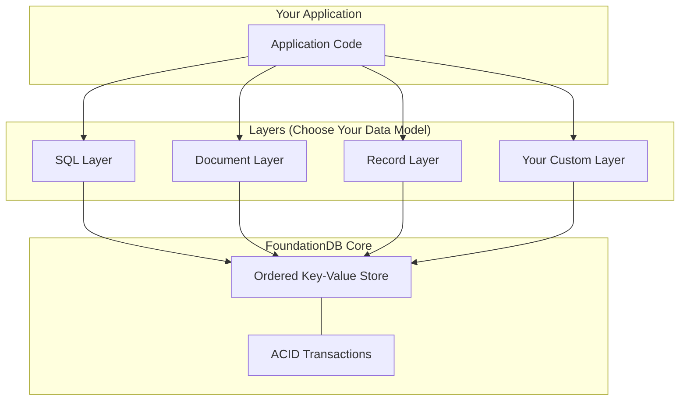

# Core Concepts

Understanding the fundamental concepts behind FoundationDB will help you build better applications.

-   :material-database:{ .lg .middle } **Data Model**

    ---

    Learn how FoundationDB organizes data as ordered key-value pairs.

    [:octicons-arrow-right-24: Data Model](data-model.md)

-   :material-swap-horizontal:{ .lg .middle } **Transactions**

    ---

    Understand ACID transactions and optimistic concurrency.

    [:octicons-arrow-right-24: Transactions](transactions.md)

-   :material-shield-check:{ .lg .middle } **ACID Guarantees**

    ---

    Explore FoundationDB's strong consistency guarantees.

    [:octicons-arrow-right-24: ACID Guarantees](acid.md)

-   :material-server-network:{ .lg .middle } **Architecture**

    ---

    Discover the distributed architecture that powers FDB.

    [:octicons-arrow-right-24: Architecture](architecture.md)

## Why These Concepts Matter

FoundationDB's design philosophy differs from most databases:

| Concept | Traditional DB | FoundationDB |
|---------|---------------|--------------|
| Data model | Tables/documents | Ordered key-value |
| Transactions | Limited scope | Full database |
| Scaling | Vertical first | Horizontal first |
| Consistency | Eventually (often) | Always strict |

## The Layer Concept

FoundationDB provides a minimal, highly reliable core. Higher-level data models (SQL, documents, graphs) are built as **layers** on top:

!!! tip "Why Layers?"
    By keeping the core minimal, FoundationDB can focus on reliability, performance, and consistency. You get to choose the data model that fits your application—or build your own layer that inherits all of FoundationDB's guarantees.

**Notable Layers:**

- **[Record Layer](https://github.com/FoundationDB/fdb-record-layer)** — Structured records with schemas and indexes (powers Apple's CloudKit)
- **[Document Layer](https://github.com/FoundationDB/fdb-document-layer)** — MongoDB-compatible API

## Learning Path

We recommend reading these concepts in order:

1. **[Data Model](data-model.md)** — Ordered key-value pairs, the tuple layer, and key design patterns
2. **[Transactions](transactions.md)** — ACID transactions, optimistic concurrency, and conflict handling
3. **[ACID Guarantees](acid.md)** — What each property means and how FDB achieves them at scale
4. **[Architecture](architecture.md)** — Components, transaction flow, fault tolerance, and scaling

## Academic Resources

For a deeper dive into FoundationDB's design:

- **[SIGMOD 2021 Paper](https://www.foundationdb.org/files/fdb-paper.pdf)** — "FoundationDB: A Distributed Unbounded Ordered Key-Value Store"
- **[Transaction Manifesto](https://apple.github.io/foundationdb/transaction-manifesto.html)** — Why ACID transactions are essential
- **[CAP Theorem Analysis](https://apple.github.io/foundationdb/cap-theorem.html)** — How FoundationDB chooses consistency

