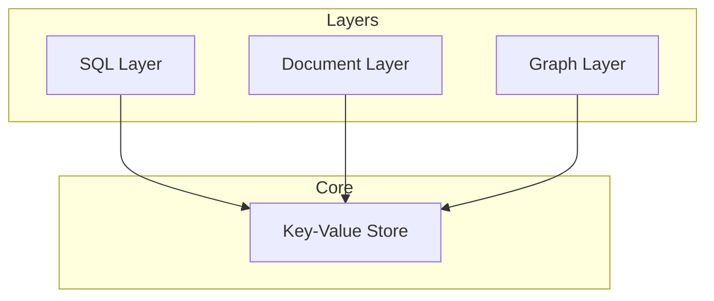

# Core Concepts

Understanding the fundamental concepts behind FoundationDB will help you build better applications.

-   :material-database:{ .lg .middle } **Data Model**

    ---

    Learn how FoundationDB organizes data as ordered key-value pairs.

    [:octicons-arrow-right-24: Data Model](data-model.md)

-   :material-swap-horizontal:{ .lg .middle } **Transactions**

    ---

    Understand ACID transactions and optimistic concurrency.

    [:octicons-arrow-right-24: Transactions](transactions.md)

-   :material-shield-check:{ .lg .middle } **ACID Guarantees**

    ---

    Explore FoundationDB's strong consistency guarantees.

    [:octicons-arrow-right-24: ACID Guarantees](acid.md)

-   :material-server-network:{ .lg .middle } **Architecture**

    ---

    Discover the distributed architecture that powers FDB.

    [:octicons-arrow-right-24: Architecture](architecture.md)

## Why These Concepts Matter

FoundationDB's design philosophy differs from most databases:

| Concept | Traditional DB | FoundationDB |
|---------|---------------|--------------|
| Data model | Tables/documents | Ordered key-value |
| Transactions | Limited scope | Full database |
| Scaling | Vertical first | Horizontal first |
| Consistency | Eventually (often) | Always strict |

## The Layer Concept

FoundationDB provides a minimal, highly reliable core. Higher-level data models (SQL, documents, graphs) are built as **layers** on top:

## Learning Path

We recommend reading these concepts in order:

1. **Data Model** - Foundation of everything
2. **Transactions** - How operations work
3. **ACID Guarantees** - What you can rely on
4. **Architecture** - How it all fits together

