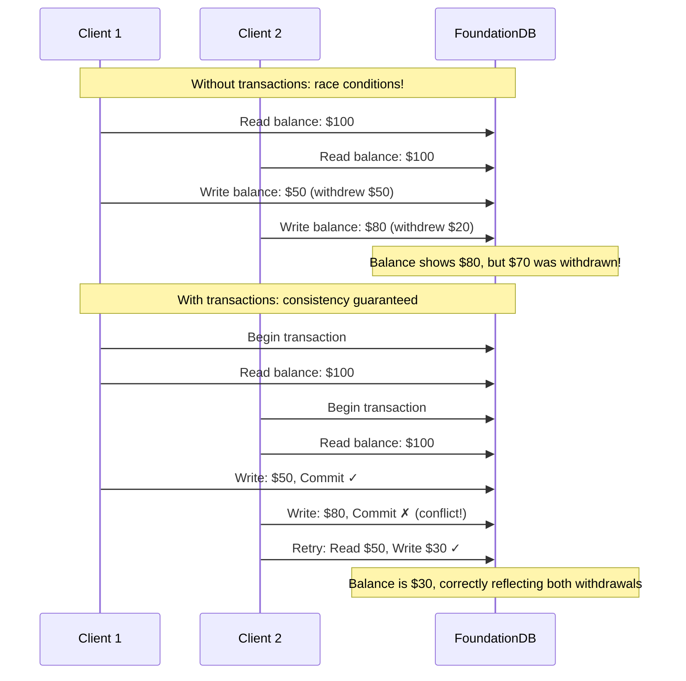
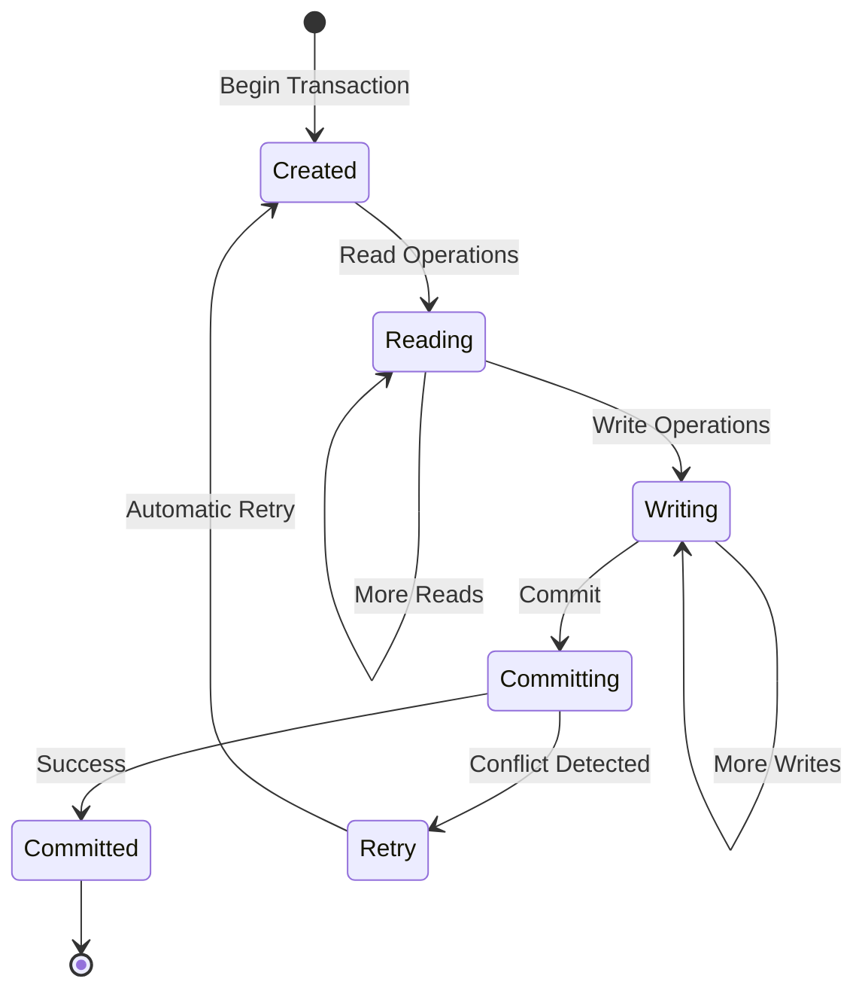
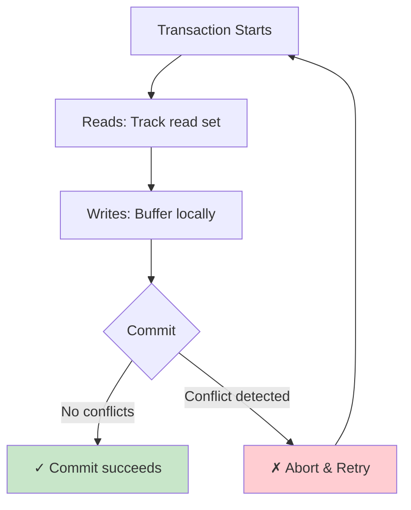

# Transactions

FoundationDB provides **full ACID transactions** across the entire database—not just within a single document or partition. This is fundamental to how FoundationDB works: every read and write happens within a transaction, giving you the strongest possible consistency guarantees at any scale.

## Why Transactions Matter

Every application with concurrent users needs to manage shared state. Transactions provide the simplest and most reliable way to do this:



!!! quote "The Transaction Manifesto"
    "Every application that needs to support simultaneous clients should be built using transactions with ACID properties. Transactions are the simplest and strongest programming model available to handle concurrency."

    — [FoundationDB Transaction Manifesto](https://apple.github.io/foundationdb/transaction-manifesto.html)

## Transaction Lifecycle

A FoundationDB transaction follows a clear lifecycle:



### 1. Begin Transaction

Get a **read version** from the cluster. This version represents a consistent snapshot of the database at that moment.

### 2. Read Operations

All reads see the database as it existed at the read version—a consistent snapshot. Concurrent writes by other transactions are invisible.

### 3. Write Operations

Writes are buffered locally in the client. They don't touch the database until commit.

### 4. Commit

At commit time, FoundationDB:

1. Checks for **conflicts**: Did any key you read get modified by another transaction?
2. If no conflicts: Writes are durably stored and become visible
3. If conflicts: Transaction aborts and retries automatically

## Basic Transaction Patterns

### Python with Decorator (Recommended)

The `@fdb.transactional` decorator handles retries automatically:

```python
import fdb
fdb.api_version(730)

db = fdb.open()

@fdb.transactional
def transfer_funds(tr, from_acct, to_acct, amount):
    """Transfer funds atomically between accounts."""
    from_balance = int(tr[from_acct] or b'0')
    to_balance = int(tr[to_acct] or b'0')

    if from_balance < amount:
        raise ValueError("Insufficient funds")

    tr[from_acct] = str(from_balance - amount).encode()
    tr[to_acct] = str(to_balance + amount).encode()

# Usage: automatic retry on conflicts
transfer_funds(db, b'alice', b'bob', 50)
```

### Explicit Transaction Control

For more control, use transactions explicitly:

```python
def transfer_with_logging(db, from_acct, to_acct, amount):
    tr = db.create_transaction()
    while True:
        try:
            from_balance = int(tr[from_acct] or b'0')
            to_balance = int(tr[to_acct] or b'0')

            tr[from_acct] = str(from_balance - amount).encode()
            tr[to_acct] = str(to_balance + amount).encode()

            tr.commit().wait()
            print(f"Transfer committed at version {tr.get_committed_version()}")
            return
        except fdb.FDBError as e:
            tr.on_error(e).wait()  # Handles retry logic
```

### Read-Only Transactions

For read-only operations, use snapshot reads for better performance:

```python
@fdb.transactional
def get_all_balances(tr):
    """Read all account balances (read-only)."""
    return {k: int(v) for k, v in tr.get_range_startswith(b'account/')}
```

## Optimistic Concurrency Control

FoundationDB uses **optimistic concurrency control (OCC)**, assuming conflicts are rare:



**How conflict detection works:**

1. Each transaction tracks which keys it reads (the "read set")
2. At commit time, the system checks if any key in the read set was modified by a committed transaction with a higher version
3. If so, there's a conflict—the transaction aborts and retries with fresh data

!!! info "Optimistic vs. Pessimistic"
    Unlike databases that lock data during transactions (pessimistic locking), FoundationDB lets transactions proceed in parallel and detects conflicts only at commit time. This approach is more efficient when conflicts are rare.

## Conflict Ranges

Transactions track **conflict ranges**, not just individual keys:

```python
@fdb.transactional
def increment_counter(tr, counter_key):
    # This read creates a conflict range on counter_key
    value = int(tr[counter_key] or b'0')
    tr[counter_key] = str(value + 1).encode()

@fdb.transactional
def scan_all_users(tr):
    # This range read creates a conflict range on the entire prefix
    for k, v in tr.get_range_startswith(b'users/'):
        pass  # Any write to users/* by another transaction causes conflict
```

### Reducing Conflicts

When conflicts are common, use these patterns:

```python
# ❌ High conflict: increment by reading and writing
@fdb.transactional
def increment_bad(tr, key):
    val = int(tr[key] or b'0')
    tr[key] = str(val + 1).encode()

# ✅ Low conflict: use atomic operations
@fdb.transactional
def increment_good(tr, key):
    tr.add(key, struct.pack('<q', 1))  # Atomic add, no read conflict
```

**Atomic operations** (add, min, max, etc.) don't create read conflicts—multiple transactions can atomically modify the same key simultaneously.

## Transaction Limits

FoundationDB transactions are designed for short, focused operations:

| Limit | Value | Reason |
|-------|-------|--------|
| Duration | 5 seconds | MVCC version history retention |
| Size | 10 MB | Total reads + writes |
| Keys written | ~1000 (soft limit) | Performance optimization |

!!! warning "Long-Running Transactions"
    Transactions lasting more than 5 seconds will fail with `transaction_too_old`. Design your application to use shorter transactions, breaking large operations into batches if needed.

### Handling Large Operations

Break large operations into transaction batches:

```python
def delete_all_users(db):
    """Delete all users in batches (not one giant transaction)."""
    while True:
        @fdb.transactional
        def delete_batch(tr):
            keys = [k for k, v in tr.get_range_startswith(b'users/', limit=100)]
            for k in keys:
                del tr[k]
            return len(keys)

        count = delete_batch(db)
        if count == 0:
            break
        print(f"Deleted {count} users")
```

## Isolation Levels

FoundationDB provides **serializable isolation**—the strongest isolation level:

| Isolation Level | Dirty Reads | Non-Repeatable Reads | Phantom Reads | FoundationDB |
|-----------------|-------------|----------------------|---------------|--------------|
| Read Uncommitted | ✗ | ✗ | ✗ | — |
| Read Committed | ✓ | ✗ | ✗ | — |
| Repeatable Read | ✓ | ✓ | ✗ | — |
| Serializable | ✓ | ✓ | ✓ | **✓ Always** |

**Serializable** means transactions behave as if they executed one at a time, in some order. You never need to worry about concurrent transactions seeing inconsistent data.

## Error Handling

FoundationDB transactions can fail with retryable errors:

```python
@fdb.transactional
def idempotent_operation(tr, key, value):
    """
    Good: This operation is idempotent.
    If retried, it produces the same result.
    """
    tr[key] = value

@fdb.transactional
def non_idempotent_operation(tr, key):
    """
    Caution: This operation is NOT idempotent.
    If retried, value grows unbounded.
    Consider using atomic operations instead.
    """
    val = int(tr[key] or b'0')
    tr[key] = str(val + 1).encode()
```

!!! tip "Design for Idempotency"
    Because transactions can retry automatically, design your transaction logic to be **idempotent**—running it twice should produce the same result as running it once.

### Common Errors

| Error | Meaning | Handling |
|-------|---------|----------|
| `transaction_too_old` | Transaction exceeded 5 seconds | Shorten transaction or batch |
| `not_committed` | Conflict detected | Automatic retry (with `@fdb.transactional`) |
| `commit_unknown_result` | Network issue during commit | Transaction may or may not have committed—design for idempotency |

## Transactions Enable Layers

The true power of transactions comes from **composability**. Because multiple operations are atomic, you can build reliable abstractions:

```python
@fdb.transactional
def add_user_with_index(tr, user_id, email, name):
    """
    Add user and maintain email index atomically.
    Layers like Record Layer are built on this principle.
    """
    # Primary data
    tr[pack(('users', user_id))] = json.dumps({'email': email, 'name': name}).encode()

    # Secondary index - always consistent with primary
    tr[pack(('idx_email', email))] = pack((user_id,))
```

Without transactions, maintaining indexes, denormalized copies, or complex data structures would require complex coordination logic and still risk inconsistencies.

## Further Reading

- **[ACID Guarantees](acid.md)**: Deep dive into consistency guarantees
- **[Architecture](architecture.md)**: How transactions are processed at scale
- **[Data Model](data-model.md)**: Structuring data for efficient transactions
- **[Transaction Manifesto](https://apple.github.io/foundationdb/transaction-manifesto.html)**: Why transactions are essential

