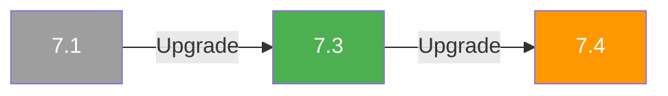

# Version Overview

This page provides a comprehensive overview of FoundationDB versions, their status, and guidance for choosing the right version for your deployment.

## Supported Versions

| Version | Status | Docker Tag | Recommended For |
|---------|--------|------------|-----------------|
| **7.3** | :material-check-circle:{ .text-green } **Stable** | `foundationdb/foundationdb:7.3.71` | New deployments |
| **7.4** | :material-alert:{ .text-orange } Pre-release | `foundationdb/foundationdb:7.4.6` | Testing & evaluation |
| **7.1** | :material-archive:{ .text-grey } Legacy | `foundationdb/foundationdb:7.1.67` | Existing deployments |

## Version Lifecycle

Understanding version status helps you make informed deployment decisions:

**:material-check-circle:{ .text-green } Stable**
:   The recommended version for production deployments. Receives bug fixes and security updates. Currently: **7.3**.

**:material-alert:{ .text-orange } Pre-release**
:   Contains new features under development. Not recommended for production. Use for testing upcoming capabilities. Currently: **7.4**.

**:material-archive:{ .text-grey } Legacy**
:   Previous stable releases. Still supported but users should plan upgrades. Currently: **7.1**.

## Version Documentation

Each version has dedicated documentation reflecting its specific features and configuration:

<div class="grid cards" markdown>

-   :material-star:{ .lg .middle } **[7.3 Documentation](/7.3/)**

    ---

    Current stable release. Recommended for all new deployments.

-   :material-flask:{ .lg .middle } **[7.4 Documentation](/7.4/)**

    ---

    Pre-release with Backup V2 and bulk loading features.

-   :material-history:{ .lg .middle } **[7.1 Documentation](/7.1/)**

    ---

    Legacy release. Plan upgrade to 7.3.

</div>

## Key Differences Between Versions

### Storage Engine Names

The Redwood storage engine was renamed between versions:

| Engine | 7.1 | 7.3 / 7.4 |
|--------|-----|-----------|
| Redwood | `ssd-redwood-1-experimental` | `ssd-redwood-1` |
| RocksDB | `ssd-rocksdb-v1` (experimental) | `ssd-rocksdb-v1` (experimental) |
| SQLite | `ssd-2` (default) | `ssd-2` (default) |

!!! note "Redwood in 7.1"
    Despite the `-experimental` suffix in 7.1, Redwood is production-ready in all supported versions.

### Version-Specific Features

=== "7.4 (Pre-release)"

    - **Backup V2**: 50% reduction in write amplification during backups
    - **Bulk Loading**: Experimental support for efficient data loading
    - **Improved Tenant Support**: Enhanced multi-tenancy capabilities
    - **Go Binding Change**: `Close()` now required on Database objects
    - All 7.3 features

=== "7.3 (Stable)"

    - **Redwood Production Ready**: Storage engine name changed from `ssd-redwood-1-experimental` to `ssd-redwood-1`
    - **Improved Stability**: Enhanced reliability and performance tuning
    - **Better Monitoring**: Additional metrics and status reporting
    - All 7.1 features

=== "7.1 (Legacy)"

    - **GetMappedRange**: Advanced range query capabilities for secondary indexes
    - **Version Vector**: Enhanced conflict detection for improved transaction throughput
    - **RocksDB**: Experimental storage engine support
    - **Tenant Management**: Basic multi-tenancy support

### Feature Availability Matrix

| Feature | 7.1 | 7.3 | 7.4 |
|---------|:---:|:---:|:---:|
| Redwood Storage Engine | ✅ (experimental) | ✅ (production) | ✅ (production) |
| RocksDB Storage Engine | ✅ (experimental) | ✅ (experimental) | ✅ (experimental) |
| GetMappedRange | ✅ | ✅ | ✅ |
| Version Vectors | ✅ | ✅ | ✅ |
| Tenant Management | ✅ | ✅ | ✅ (improved) |
| Backup V2 | ❌ | ❌ | ✅ |
| Bulk Loading | ❌ | ❌ | ✅ (experimental) |

## Storage Engine Compatibility

| Engine | 7.1 | 7.3 | 7.4 | Production Ready |
|--------|:---:|:---:|:---:|:----------------:|
| SQLite (`ssd-2`) | ✅ | ✅ | ✅ | Yes |
| Redwood | ✅ | ✅ | ✅ | Yes |
| RocksDB | ✅ | ✅ | ✅ | No (experimental) |

!!! tip "Choosing a Storage Engine"
    **Redwood** is recommended for most deployments. It offers better performance than SQLite and is production-ready. Use SQLite for small deployments or when disk space is limited.

## Upgrade Paths

### Recommended Upgrade Sequence



### Upgrade Considerations

| From | To | Notes |
|------|-----|-------|
| 7.1 | 7.3 | Safe direct upgrade. Review storage engine name changes. |
| 7.3 | 7.4 | Pre-release only. Wait for stable release for production. |
| 7.1 | 7.4 | Not recommended. Upgrade to 7.3 first. |

!!! warning "Pre-release Warning"
    Version 7.4 is a pre-release and should not be used in production environments. Wait for the stable release before upgrading production clusters.

## API Version Compatibility

FoundationDB uses API versioning to maintain backward compatibility. Clients specify which API version they target:

| FDB Version | API Version | Min Supported API | Notes |
|-------------|-------------|-------------------|-------|
| **7.4** | `{{ "740" }}` | 510 | Latest API features |
| **7.3** | `{{ "730" }}` | 510 | Stable API |
| **7.1** | `{{ "710" }}` | 510 | Legacy API |

!!! info "API Version Best Practice"
    Always specify an explicit API version when opening a database connection. This ensures your application behaves consistently even when the underlying client library is upgraded.

    ```python
    import fdb
    fdb.api_version(730)  # Lock to 7.3 API behavior
    ```

## Client Library Versions

Always match your client library version to your cluster version:

| Cluster Version | Python | Java | Go |
|-----------------|--------|------|----|
| 7.1.x | 7.1.x | `org.foundationdb:fdb-java:7.1.x` | `github.com/apple/foundationdb/bindings/go@v7.1.x` |
| 7.3.x | 7.3.x | `org.foundationdb:fdb-java:7.3.x` | `github.com/apple/foundationdb/bindings/go@v7.3.x` |
| 7.4.x | 7.4.x | `org.foundationdb:fdb-java:7.4.x` | `github.com/apple/foundationdb/bindings/go@v7.4.x` |

### Go Binding Breaking Change (7.4+)

!!! warning "Go Binding: Close() Required in 7.4+"
    Starting in version 7.4, the Go binding **requires** calling `Close()` on the `Database` object when you're done using it. Failure to call `Close()` will result in resource leaks.

    **Before 7.4:**
    ```go
    db := fdb.MustOpenDefault()
    // Use db... no Close() needed
    ```

    **7.4 and later:**
    ```go
    db := fdb.MustOpenDefault()
    defer db.Close()  // Required!
    // Use db...
    ```

    This change was made to properly release native resources and prevent memory leaks in long-running applications.

## Next Steps

- [Installation Guide](installation.md) - Install your chosen version
- [Quick Start](quickstart.md) - Connect and run your first transaction
- [Storage Engines](../guides/storage-engines.md) - Learn about storage engine options

