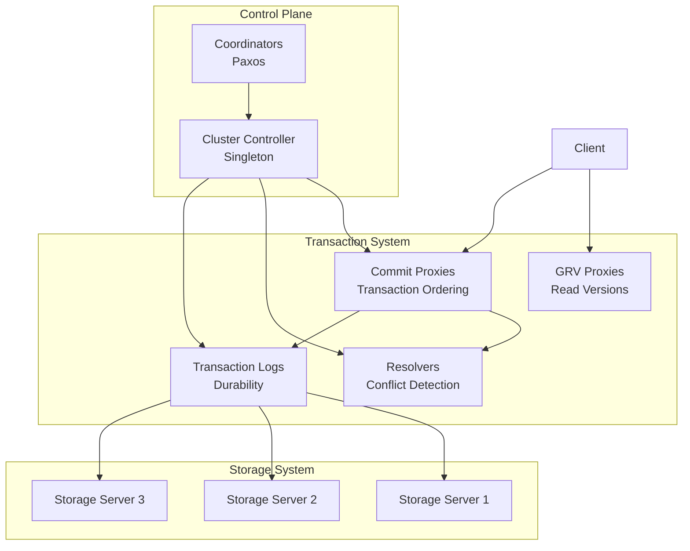
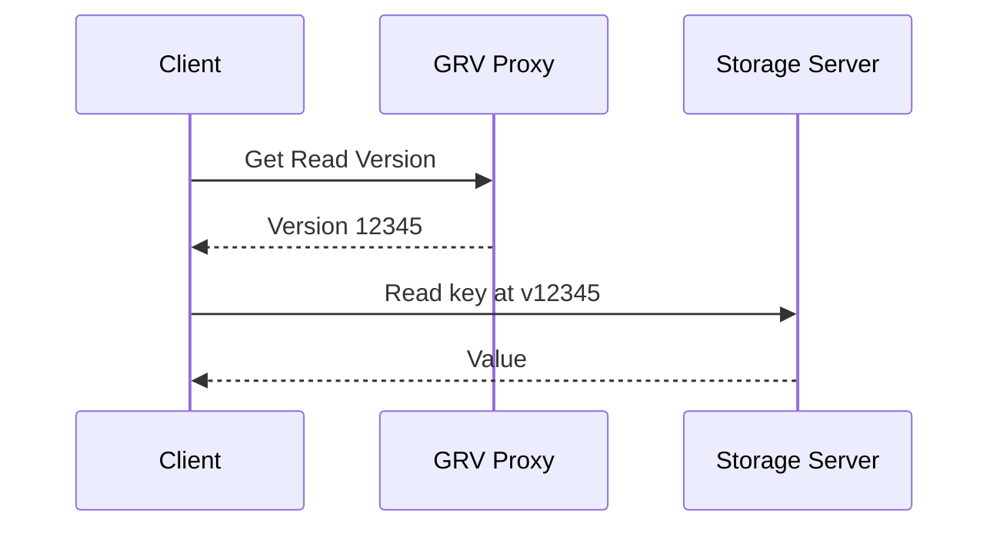
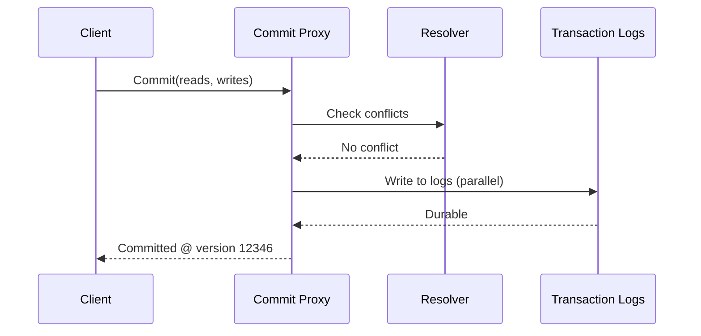
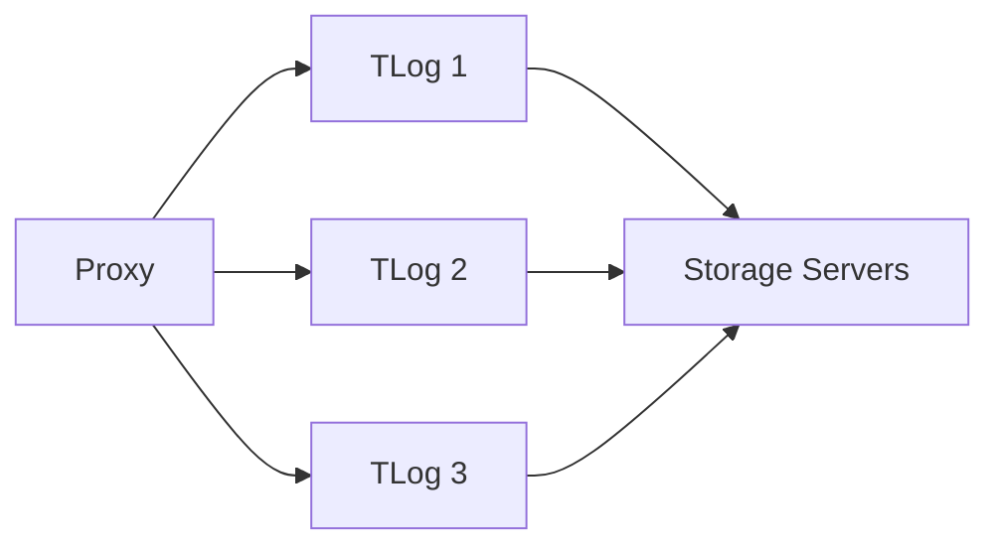
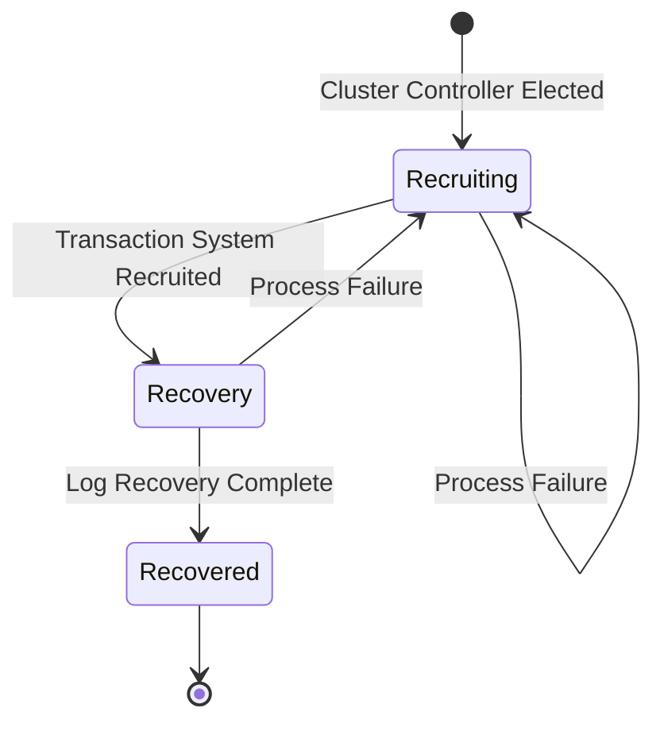
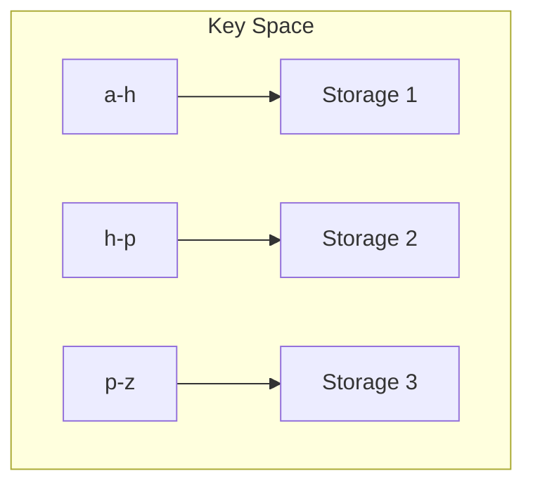

# Architecture Deep Dive

This guide explores FoundationDB's internal architecture—how transactions are processed, how consensus is reached, and how the system recovers from failures.

!!! tip "Prerequisites"
    Read the [Architecture overview](../concepts/architecture.md) first for component basics.

## System Overview

FDB's architecture is "unbundled"—each concern is handled by a separate subsystem:



## Transaction Processing

### Read Path

Reads go directly to storage servers:



1. **Get Read Version (GRV)** - Client asks proxy for current committed version
2. **Read at Version** - Client reads from storage servers at that version
3. **Snapshot Isolation** - Reads see consistent snapshot

### Write Path

Writes are buffered locally, then committed atomically:



1. **Buffer locally** - Writes accumulate in client memory
2. **Submit to proxy** - Send reads (for conflict check) and writes
3. **Conflict detection** - Resolver checks for overlapping writes
4. **Write to logs** - Parallel write to transaction logs
5. **Respond to client** - Transaction committed

### Conflict Detection

FDB uses optimistic concurrency control with **read-write conflict detection**:

```cpp
// Simplified conflict resolution logic
bool hasConflict(Transaction tr, Version commitVersion) {
    for (auto& readRange : tr.readRanges) {
        // Check if any committed transaction modified this range
        // between our read version and commit version
        if (wasModified(readRange, tr.readVersion, commitVersion)) {
            return true;
        }
    }
    return false;
}
```

Resolvers maintain a sliding window of recent commits to detect conflicts efficiently.

## Consensus & Coordination

### Coordinators

Coordinators run a Paxos-based consensus protocol:

- **Cluster file location** - Where to find the cluster
- **Cluster controller election** - Elect the cluster controller
- **Configuration changes** - Store cluster configuration

```
# fdb.cluster file points to coordinators
my_cluster:xyz123@10.0.0.1:4500,10.0.0.2:4500,10.0.0.3:4500
```

### Cluster Controller

The cluster controller (singleton) manages:

- **Role assignment** - Which processes serve which roles
- **Failure detection** - Monitor process health
- **Reconfiguration** - Respond to failures and changes

### Transaction Logs

Transaction logs provide durability with synchronous replication:



- **Parallel writes** - Commit waits for quorum of TLogs
- **Streaming to storage** - Storage servers tail the logs
- **Bounded memory** - Old log data is garbage collected

## Recovery

Recovery is FDB's most carefully designed subsystem. When failures occur:



### Recovery Phases

1. **Coordinator Election** - Elect new cluster controller via Paxos
2. **Role Recruitment** - CC assigns new TLogs, Resolvers, Proxies
3. **Log Recovery** - Determine recovery point, replay logs
4. **Resume Service** - Accept new transactions

### Recovery Guarantees

FDB guarantees:

- **No committed data loss** - All committed transactions survive
- **No false positives** - Uncommitted transactions don't appear
- **Bounded recovery time** - Typically seconds

```cpp
// Simplified recovery logic
ACTOR Future<Void> recover(Reference<MasterData> self) {
    // Find the recovery point
    state Version recoveryVersion = wait(getRecoveryVersion(self));
    
    // Recruit new transaction system
    wait(recruitTransactionSystem(self, recoveryVersion));
    
    // Resume serving transactions
    return Void();
}
```

## Data Distribution

FDB automatically distributes data across storage servers:

### Sharding

Data is divided into shards (key ranges):



### Shard Movement

The data distributor manages shard placement:

- **Balance load** - Move hot shards
- **Handle failures** - Re-replicate lost shards
- **Add capacity** - Distribute to new servers

## Further Reading

- [:material-file-pdf-box: SIGMOD Paper](https://www.foundationdb.org/files/fdb-paper.pdf) - Complete architecture description
- [:material-github: Transaction Processing Code](https://github.com/apple/foundationdb/tree/main/fdbserver) - Implementation details
- [Storage Engines](storage-engines.md) - How data is persisted

