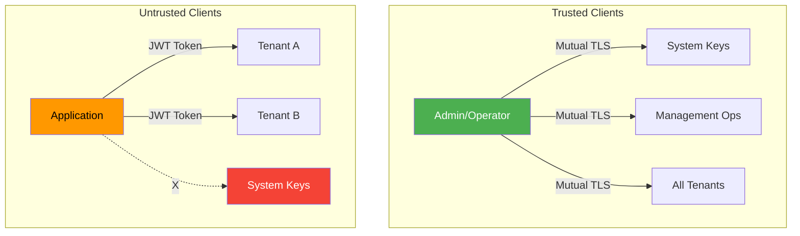

# Authorization <span class="pill-new">NEW in 7.3</span> <span class="pill-experimental">EXPERIMENTAL</span>


!!! warning "Version Notice"
    This feature is only available in FoundationDB 7.3 and later. You are viewing docs for version {{ fdb_version }}.


FoundationDB's authorization feature extends the [multi-tenant](tenants.md) system with privilege levels and access control. This enables restricting database access to specific tenant key-spaces using JSON Web Tokens (JWT).

!!! warning "Experimental Feature"
    Authorization is currently experimental and is not recommended for use in production.

!!! info "Prerequisite"
    Authorization requires [TLS configuration](../operations/configuration.md#tls-configuration) and [Tenants](tenants.md) to be enabled.

## Concepts

### Privilege Levels

Authorization distinguishes between two types of clients:

| Level | Description | Capabilities |
|-------|-------------|--------------|
| **Trusted** | Successfully completed mutual TLS authentication | Full access including system keyspace and management operations |
| **Untrusted** | Empty certificate chain or IP not in trusted subnet | Limited to authorized tenant keyspaces only |



### Becoming a Trusted Client

A client is considered trusted when:

1. Configured with a valid X.509 certificate chain and private key
2. Certificate chain is trusted by the server (mutual TLS)
3. Client IP belongs to a trusted subnet (if configured)

```bash
# Server configured with trusted subnets
fdbserver --trusted-subnet-internal=10.0.0.0/8 \
          --trusted-subnet-vpn=172.16.0.0/12
```

!!! note "Certificate Errors"
    Presenting a bad or untrusted certificate chain causes the server to break the connection and throttle the client. It does not allow untrusted access.

### Access Control with JWT

Untrusted clients can access tenant data by presenting JSON Web Tokens. Tokens grant access to one or more specific tenants.

## Token Configuration

### Supported Token Fields

| Location | Field | Required | Purpose |
|----------|-------|----------|---------|
| Header | `typ` | Yes | Must be `JWT` |
| Header | `alg` | Yes | `ES256` or `RS256` only |
| Header | `kid` | Yes | Key identifier for verification |
| Claim | `exp` | Yes | Expiration timestamp |
| Claim | `nbf` | Yes | Not-before timestamp |
| Claim | `iat` | Yes | Issued-at timestamp |
| Claim | `tenants` | Yes | Base64-encoded tenant names (array) |
| Claim | `iss` | No | Token issuer |
| Claim | `sub` | No | Token subject |
| Claim | `aud` | No | Intended recipients (array) |
| Claim | `jti` | No | Unique token identifier |

### Example Token Payload

```json
{
  "exp": 1700000000,
  "nbf": 1699900000,
  "iat": 1699900000,
  "tenants": ["dGVuYW50X2E=", "dGVuYW50X2I="]
}
```

!!! warning "Token Duration"
    FoundationDB does not support revocation of outstanding tokens. Use caution when signing tokens with long durations.

## Public Key Configuration

Token verification requires a JWK Set file containing public keys:

```bash
fdbserver --authorization-public-key-file=/path/to/keys.jwks
```

### JWK Set Format

```json
{
  "keys": [
    {
      "kty": "EC",
      "kid": "key-1",
      "alg": "ES256",
      "crv": "P-256",
      "x": "base64url-encoded-x-coordinate",
      "y": "base64url-encoded-y-coordinate"
    },
    {
      "kty": "RSA",
      "kid": "key-2", 
      "alg": "RS256",
      "n": "base64url-encoded-modulus",
      "e": "base64url-encoded-exponent"
    }
  ]
}
```

Supported key types:

- **EC (Elliptic Curve)**: P-256 curve with `x` and `y` coordinates
- **RSA**: Modulus `n` and exponent `e` parameters

!!! tip "No Private Keys"
    Private keys should not be included in the public key set and are excluded if found.

### Key Rotation

The in-memory public key set automatically refreshes based on the key file's content every `PUBLIC_KEY_FILE_REFRESH_INTERVAL_SECONDS` seconds.

!!! note "Valid JWK Set Required"
    The key set only updates if the file contains a valid JWK Set.

## Client Configuration

### Using Authorization Tokens

Untrusted clients must:

1. Trust the server's CA certificate (`TLS_CA_FILE`)
2. **Not** configure client certificates (`TLS_CERTIFICATE_FILE`, `TLS_KEY_FILE`)
3. Set the `AUTHORIZATION_TOKEN` transaction option

```python
import fdb
fdb.api_version({{ api_version }})

db = fdb.open()
tenant = db.open_tenant(b'my_tenant')

@fdb.transactional
def read_tenant_data(tr, token):
    tr.options.set_authorization_token(token)
    return tr[b'key']

# Client is responsible for keeping token up-to-date
token = get_fresh_token()  # Your token management
result = read_tenant_data(tenant, token)
```

!!! note "Similar to HTTPS"
    The TLS mode for untrusted clients is similar to how web browsers connect to HTTPS services—they authenticate the server but don't authenticate themselves.

## Token Caching

FoundationDB caches valid tokens to avoid expensive signature verification on every request. Cache size is configurable via the `TOKEN_CACHE_SIZE` knob.

!!! note "Cache Independence"
    Token cache is independent of the active public key set. Once cached, a token is valid until expiration, regardless of key rotation.

## Incremental Rollout

For large-scale deployments, the `ALLOW_TOKENLESS_TENANT_ACCESS` knob allows untrusted clients to access tenant data without tokens. This preserves TLS-based privilege levels while rolling out token infrastructure.

With this knob active:

- TLS determines trusted vs untrusted status
- Untrusted clients can access any tenant
- Authorization tokens are ignored

## Next Steps

- Configure [TLS](../operations/configuration.md#tls-configuration) as a prerequisite
- Set up [Tenants](tenants.md) for multi-tenant isolation
- Review [Monitoring](../operations/monitoring.md) for security-related metrics

