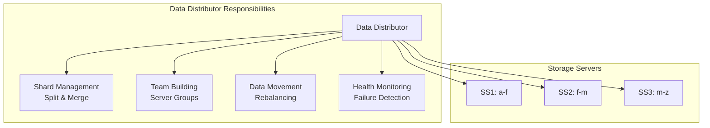
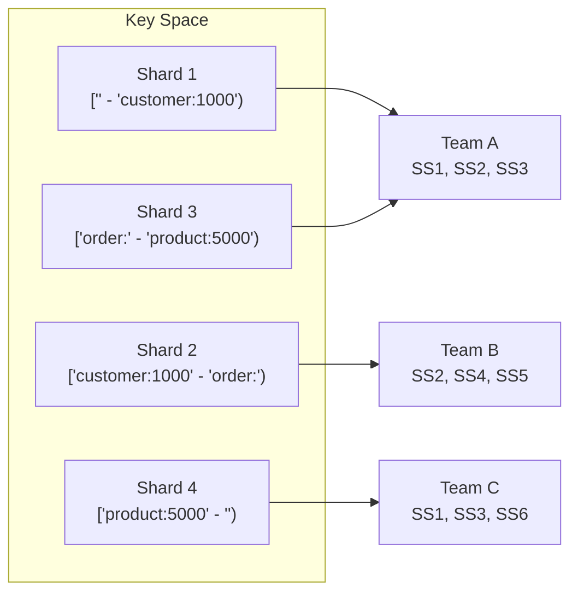
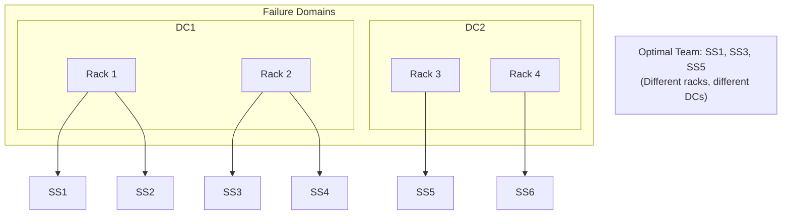
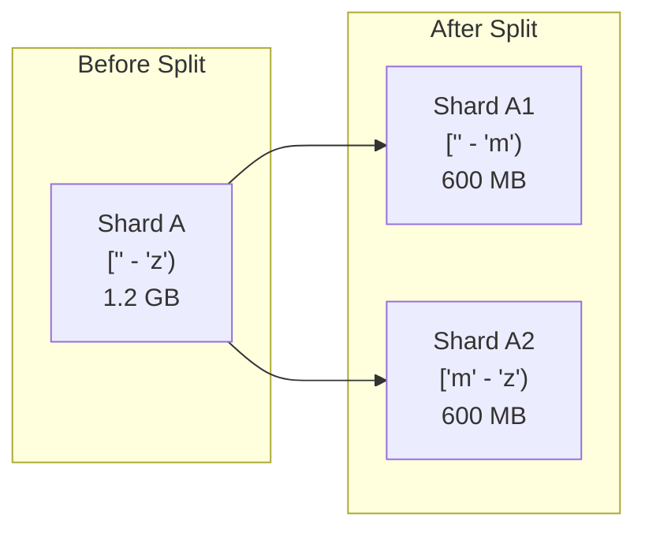
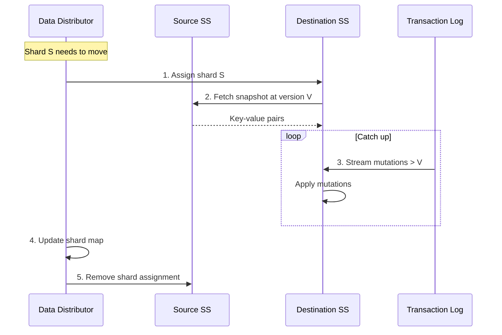

# Data Distribution & Shard Management

This guide explores how FoundationDB distributes data across storage servers—including keyspace partitioning, team formation, shard splitting and merging, and automatic rebalancing.

!!! warning "Advanced Content"
    This section covers internal implementation details. Familiarity with [Architecture](../concepts/architecture.md) and [Storage Engines](storage-engines.md) is recommended.

## Overview

The **Data Distributor** is a singleton process that manages how data is placed across storage servers. It ensures:

- **Balanced load** - Data and workload spread evenly across servers
- **Fault tolerance** - Data replicated according to redundancy mode
- **Automatic healing** - Re-replication when servers fail
- **Efficient scaling** - Data migrates when servers are added/removed



## Keyspace Partitioning

FoundationDB divides the entire key space into **shards** (also called key ranges). Each shard is a contiguous range of keys assigned to a **team** of storage servers.

### Shard Structure



Key properties of shards:

| Property | Details |
|----------|---------|
| **Size target** | ~500 MB per shard (configurable) |
| **Replication** | Each shard replicated to a team of servers |
| **Boundaries** | Split at key boundaries, not byte boundaries |
| **Dynamic** | Shards split/merge as data changes |

### How Shards Are Tracked

The Data Distributor maintains shard metadata in the system keyspace (`\xff/`):

- **Shard map** - Key range → team assignment
- **Server info** - Storage server locations and health
- **Move queues** - Pending shard movements

## Team Building

A **team** is a group of storage servers that together store replicas of a shard. Teams are formed to maximize fault tolerance.

### Team Formation Strategy



Team building considers:

1. **Locality** - Servers across failure domains (racks, data centers)
2. **Capacity** - Balance data across servers by free space
3. **Machine diversity** - Avoid placing replicas on the same physical machine
4. **Zone awareness** - Respect configured failure zones

### Team Health States

| State | Meaning |
|-------|---------|
| **Healthy** | All servers responsive, data fully replicated |
| **Unhealthy** | One or more servers unresponsive |
| **Missing** | Replicas below redundancy requirement |

## Shard Splitting & Merging

Shards dynamically split and merge to maintain optimal sizes.

### Splitting

When a shard exceeds the size threshold:

1. Data Distributor identifies a split point (typically the median key)
2. Creates two new shards from the original range
3. Assigns each new shard to teams (may reuse existing team)



### Merging

When adjacent shards are small enough to combine:

1. Data Distributor identifies mergeable neighbors
2. Combines ranges into a single shard
3. Updates team assignments

Merging helps reduce metadata overhead and improve scan performance.

## Data Movement & Rebalancing

When the Data Distributor needs to move data:

### Reasons for Movement

| Reason | Trigger |
|--------|---------|
| **Server failure** | Re-replicate to maintain redundancy |
| **Server added** | Distribute data to new capacity |
| **Server removed** | Migrate data off before decommission |
| **Load balancing** | Move hot shards to reduce skew |
| **Storage rebalancing** | Even out disk usage |

### Movement Process



### Throttling & Prioritization

Data movement is throttled to avoid impacting production:

- **Bandwidth limits** - Configurable bytes/second for replication
- **Priority queue** - Re-replication prioritized over rebalancing
- **Concurrent moves** - Limited parallel shard movements

## Monitoring Data Distribution

Key metrics to monitor:

| Metric | Description | Warning Threshold |
|--------|-------------|-------------------|
| `MovingData` | Bytes currently being moved | Sustained high values |
| `MachineNotResponding` | Servers not responding | Any > 0 |
| `TeamCount` | Number of healthy teams | Below expected |
| `HighestPriority` | Priority of pending work | > 0 indicates issues |

Use `fdbcli` to inspect shard state:

```bash
# View data distribution status
fdb> status details

# Check specific key range location
fdb> getrangekeys \\x00 \\xff 100
```

## Source Code References

Key implementation files:

[:material-github: DataDistribution.actor.cpp](https://github.com/apple/foundationdb/blob/main/fdbserver/DataDistribution.actor.cpp)
: Main data distribution logic

[:material-github: DDTeamCollection.actor.cpp](https://github.com/apple/foundationdb/blob/main/fdbserver/DDTeamCollection.actor.cpp)
: Team building and management

[:material-github: DataDistributorInterface.h](https://github.com/apple/foundationdb/blob/main/fdbserver/include/fdbserver/DataDistributorInterface.h)
: Interface definitions

## Further Reading

- [Architecture Overview](../concepts/architecture.md) - Component roles
- [Storage Engines](storage-engines.md) - How data is stored on disk
- [Architecture Deep Dive](architecture-deep-dive.md) - Transaction processing
- [:material-file-pdf-box: SIGMOD Paper, Section 4](https://www.foundationdb.org/files/fdb-paper.pdf) - Replication architecture

