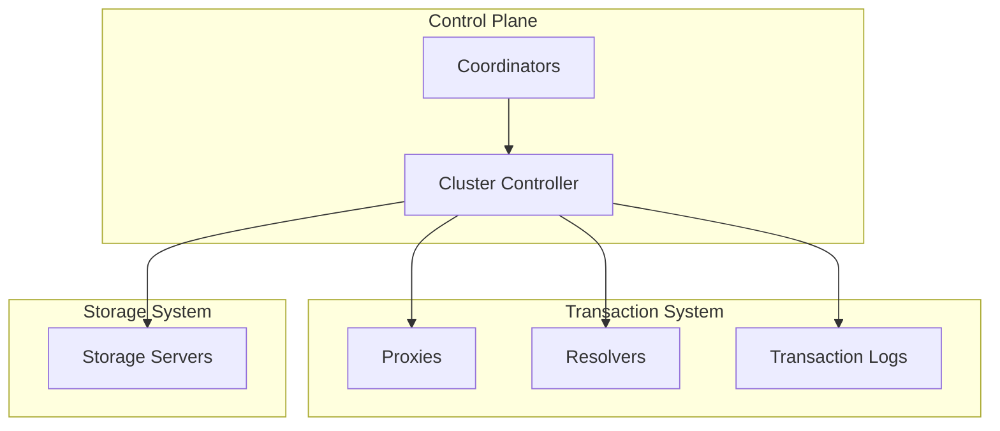

# Internals & Deep Dives

This section covers FoundationDB's internal architecture and design for advanced users who want to understand how FDB achieves its remarkable reliability and performance.

!!! warning "Advanced Content"
    This section assumes familiarity with distributed systems concepts and the [Core Concepts](../concepts/index.md) section.

## Why Understand Internals?

FoundationDB is unique among distributed databases:

- **Deterministic simulation testing** - Found bugs before they hit production
- **Unbundled architecture** - Separation of concerns at every layer
- **Proven at scale** - Powers Apple's iCloud and other critical infrastructure

Understanding these internals helps you:

- Debug complex issues
- Make informed architectural decisions
- Contribute to the project

## Deep Dive Topics

<div class="grid cards" markdown>

-   :material-test-tube:{ .lg .middle } **Simulation Testing**

    ---

    How FDB tests millions of failure scenarios with deterministic simulation.

    [:octicons-arrow-right-24: Simulation Testing](simulation-testing.md)

-   :material-sitemap:{ .lg .middle } **Architecture Deep Dive**

    ---

    Transaction processing, consensus, and recovery internals.

    [:octicons-arrow-right-24: Architecture Deep Dive](architecture-deep-dive.md)

-   :material-database-cog:{ .lg .middle } **Storage Engines**

    ---

    Redwood B-tree, SSD engine, and storage internals.

    [:octicons-arrow-right-24: Storage Engines](storage-engines.md)

</div>

## The SIGMOD Paper

The definitive technical reference is the 2021 SIGMOD paper:

!!! abstract "FoundationDB: A Distributed Unbundled Transactional Key Value Store"
    **Authors:** Jingyu Zhou, Meng Xu, Alexander Shraer, Bala Namasivayam, Alex Miller, et al.
    
    **Published:** SIGMOD 2021 (Best Industry Paper Award)
    
    [:material-file-pdf-box: Read the Paper](https://www.foundationdb.org/files/fdb-paper.pdf){ .md-button }

The paper covers:

- Overall system architecture
- Transaction processing model
- Simulation testing methodology
- Production deployment lessons

## Conference Talks

Learn from the engineers who built FDB:

| Talk | Speaker | Event |
|------|---------|-------|
| [Testing Distributed Systems w/ Deterministic Simulation](https://www.youtube.com/watch?v=4fFDFbi3toc) | Will Wilson | Strange Loop 2014 |
| [FoundationDB: A Distributed Key-Value Store](https://www.youtube.com/watch?v=EMwhsGsxfPU) | A.J. Christensen | Apple Tech Talks |
| [Simulation Testing at Apple](https://www.youtube.com/watch?v=OJb8A6h9jQQ) | Markus Pilman | FDB Summit 2019 |

## The Flow Language

FoundationDB is written in **Flow**, a custom language that compiles to C++ and enables deterministic simulation:

```cpp
// Flow actor - enables deterministic concurrency testing
ACTOR Future<Void> fetchValue(Database db, Key key) {
    state Transaction tr(db);
    loop {
        try {
            Optional<Value> val = wait(tr.get(key));
            if (val.present()) {
                TraceEvent("GotValue").detail("Key", key).detail("Value", val.get());
            }
            return Void();
        } catch (Error& e) {
            wait(tr.onError(e));
        }
    }
}
```

Key Flow concepts:

- **Actors** - Cooperative tasks with explicit `wait` points
- **Futures** - Represent asynchronous results
- **Determinism** - Same inputs produce same outputs, enabling simulation

## Core Design Principles

### 1. Unbundled Architecture

FDB separates concerns into independent subsystems:



### 2. Simulation-First Development

Every feature is tested in simulation before production:

1. Write the feature with Flow actors
2. Run millions of simulated scenarios
3. Inject every possible failure mode
4. Only ship when simulation passes

### 3. Recovery Over Prevention

FDB embraces failure as inevitable:

- Design for fast recovery, not failure prevention
- Every component can be replaced quickly
- System continues operating during recovery

## Learning Path

1. **Start with [Simulation Testing](simulation-testing.md)** - Understand FDB's secret weapon
2. **Read [Architecture Deep Dive](architecture-deep-dive.md)** - Learn how transactions work
3. **Explore [Storage Engines](storage-engines.md)** - Understand data persistence

## Additional Resources

- [FDB Design Documents](https://github.com/apple/foundationdb/tree/main/design) - Internal design proposals
- [FDB Source Code](https://github.com/apple/foundationdb) - The definitive reference
- [Community Forums](https://forums.foundationdb.org) - Ask questions, discuss internals

## Source Code Quick Links

| Component | Source File |
|-----------|-------------|
| Cluster Controller | [:material-github: ClusterController.actor.cpp](https://github.com/apple/foundationdb/blob/main/fdbserver/ClusterController.actor.cpp) |
| Commit Proxy | [:material-github: CommitProxyServer.actor.cpp](https://github.com/apple/foundationdb/blob/main/fdbserver/CommitProxyServer.actor.cpp) |
| GRV Proxy | [:material-github: GrvProxyServer.actor.cpp](https://github.com/apple/foundationdb/blob/main/fdbserver/GrvProxyServer.actor.cpp) |
| Resolver | [:material-github: Resolver.actor.cpp](https://github.com/apple/foundationdb/blob/main/fdbserver/Resolver.actor.cpp) |
| Transaction Logs | [:material-github: TLogServer.actor.cpp](https://github.com/apple/foundationdb/blob/main/fdbserver/TLogServer.actor.cpp) |
| Storage Server | [:material-github: storageserver.actor.cpp](https://github.com/apple/foundationdb/blob/main/fdbserver/storageserver.actor.cpp) |
| Data Distributor | [:material-github: DataDistribution.actor.cpp](https://github.com/apple/foundationdb/blob/main/fdbserver/DataDistribution.actor.cpp) |
| Ratekeeper | [:material-github: Ratekeeper.actor.cpp](https://github.com/apple/foundationdb/blob/main/fdbserver/Ratekeeper.actor.cpp) |
| Coordinators | [:material-github: Coordination.actor.cpp](https://github.com/apple/foundationdb/blob/main/fdbserver/Coordination.actor.cpp) |
| Master | [:material-github: masterserver.actor.cpp](https://github.com/apple/foundationdb/blob/main/fdbserver/masterserver.actor.cpp) |

