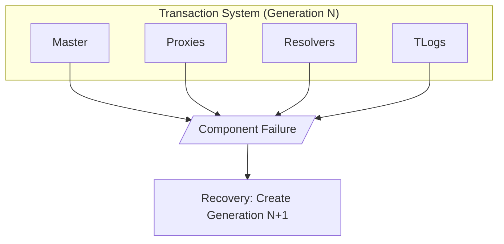
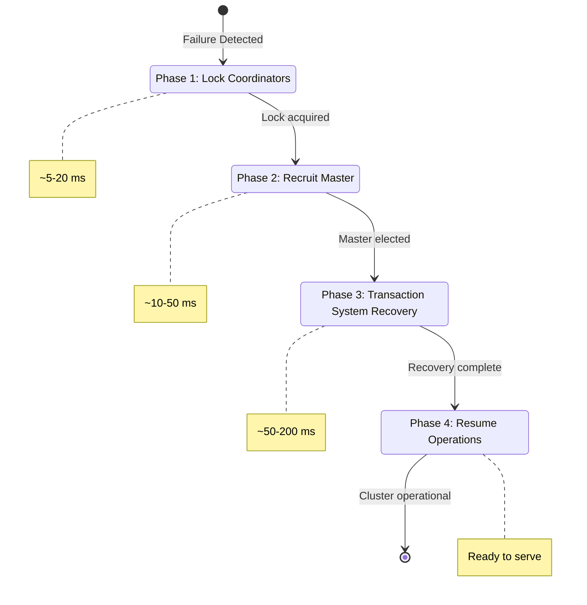
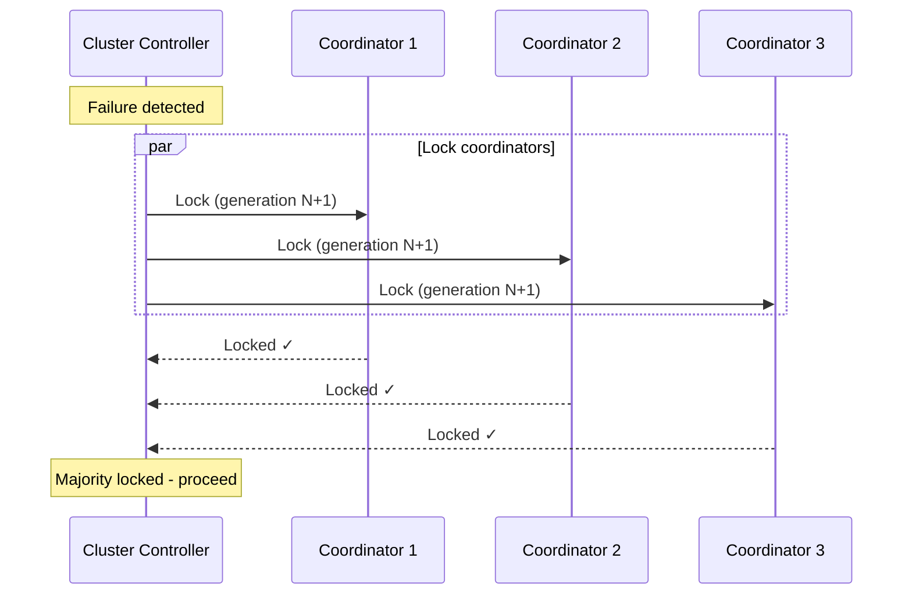
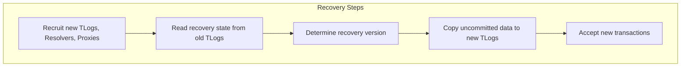
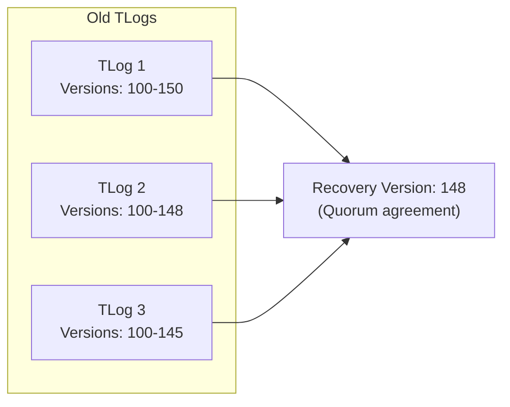
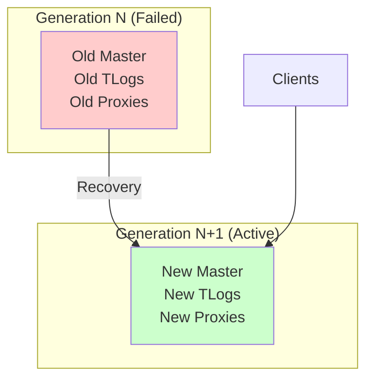
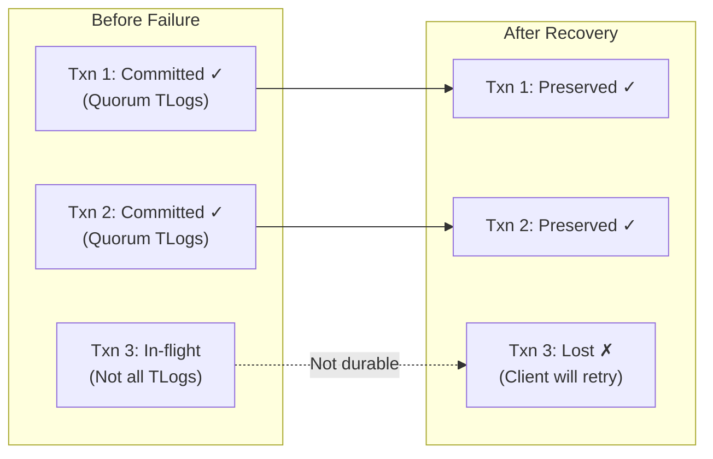
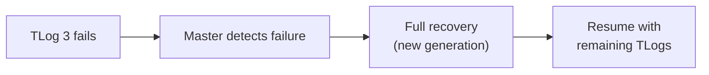

# Cluster Recovery Process

FoundationDB is designed to recover quickly from any component failure. This guide explains the multi-phase recovery process that ensures no committed data is lost while minimizing downtime.

!!! warning "Advanced Content"
    This builds on [Architecture](../concepts/architecture.md). Understanding the transaction system components is essential.

## Recovery Philosophy

FDB embraces failure as inevitable and designs for fast recovery:

> "FDB assumes that failures will happen and focuses on recovering quickly rather than preventing failures."

Key principles:

- **Fail fast** - Detect failures quickly, don't wait
- **Recovery over prevention** - Optimize recovery time, not MTBF
- **Generation-based** - Replace entire transaction system atomically
- **Guaranteed durability** - No committed transactions are ever lost

## What Triggers Recovery

Recovery is triggered when any critical component fails:



| Trigger | Description |
|---------|-------------|
| **Master failure** | Master process crashes or becomes unreachable |
| **TLog failure** | Transaction log below quorum |
| **Resolver failure** | Resolver process crashes |
| **Proxy failure** | Commit proxy crashes |
| **Network partition** | Components can't communicate |
| **Configuration change** | Redundancy mode, storage engine changes |

## Recovery Phases

Recovery proceeds through four distinct phases:



### Phase 1: Lock Coordinators

The Cluster Controller detects failure and begins recovery:

1. **Failure detection** - Heartbeat timeout or explicit notification
2. **Coordinator lock** - CC acquires lock on coordinators (Paxos)
3. **Prevent split-brain** - Old generation cannot make progress



### Phase 2: Recruit Master

The Cluster Controller recruits a new Master:

1. **Select candidate** - Choose healthy process for Master role
2. **Master startup** - New Master initializes
3. **Version handoff** - New Master gets last committed version

### Phase 3: Transaction System Recovery

The most complex phase—rebuilding the transaction system:



#### Determining Recovery Version

The new Master must determine which transactions committed:



The recovery version is the highest version that:

- Was acknowledged by a quorum of TLogs
- Was marked as committed by the old Master

### Phase 4: Resume Operations

Once the new transaction system is ready:

1. **New TLogs ready** - Accepting writes
2. **Resolvers ready** - Conflict detection active
3. **Proxies ready** - Accepting client requests
4. **Master announces** - New generation is live



## Recovery Guarantees

FDB's recovery provides strong guarantees:

| Guarantee | Description |
|-----------|-------------|
| **No data loss** | All committed transactions survive recovery |
| **No phantoms** | Uncommitted transactions don't appear after recovery |
| **Consistency** | Database remains consistent throughout |
| **Bounded time** | Recovery typically < 1 second |

### How Durability Is Maintained



## Availability During Recovery

FDB remains partially available during recovery:

| Operation | During Recovery |
|-----------|-----------------|
| **Reads (recent)** | Available if storage server has data |
| **Reads (old)** | May fail if version too old |
| **Writes** | Blocked until recovery completes |
| **New transactions** | Blocked during GRV unavailability |

### Client Behavior

Clients automatically handle recovery:

1. **Retry loop** - Built into client bindings
2. **Backoff** - Exponential backoff during unavailability
3. **Reconnect** - Discover new proxies via coordinators

## Recovery Timing

Typical recovery phases:

```mermaid
gantt
    title Recovery Timeline
    dateFormat X
    axisFormat %L ms

    section Phase 1
    Lock Coordinators    :0, 20

    section Phase 2
    Recruit Master       :20, 50

    section Phase 3
    Recruit TLogs        :50, 100
    Read Old TLogs       :100, 200
    Determine Recovery   :200, 250

    section Phase 4
    Resume Service       :250, 300
```



| Phase | Typical Duration | Factors |
|-------|------------------|---------|
| Coordinator lock | 5-20 ms | Coordinator latency |
| Master recruitment | 10-30 ms | Process availability |
| TLog recovery | 50-200 ms | Log size, network |
| **Total** | **100-500 ms** | Cluster size, load |

## Failure Scenarios

### Single TLog Failure



### Master Failure

The Cluster Controller detects and initiates recovery:

1. CC notices Master heartbeat missing
2. CC triggers full transaction system recovery
3. New Master recruited, new generation started

### Coordinator Failure

Coordinators use Paxos for fault tolerance:

- **Majority available** - Cluster continues
- **Minority lost** - No cluster impact
- **Majority lost** - Cluster unavailable (configuration issue)

## Monitoring Recovery

Key recovery metrics:

| Metric | Description |
|--------|-------------|
| `Recoveries` | Count of recovery events |
| `RecoveryDuration` | Time spent in recovery |
| `RecoveryState` | Current recovery phase |

Monitor recovery in `fdbcli`:

```bash
fdb> status details
# Shows recovery state and history
```

## Source Code References

[:material-github: MasterProxyServer.actor.cpp](https://github.com/apple/foundationdb/blob/main/fdbserver/MasterProxyServer.actor.cpp)
: Master and recovery coordination

[:material-github: ClusterController.actor.cpp](https://github.com/apple/foundationdb/blob/main/fdbserver/ClusterController.actor.cpp)
: Cluster controller logic

[:material-github: Coordination.actor.cpp](https://github.com/apple/foundationdb/blob/main/fdbserver/Coordination.actor.cpp)
: Coordinator implementation

## Further Reading

- [Architecture Overview](../concepts/architecture.md) - Component roles
- [Architecture Deep Dive](architecture-deep-dive.md) - Transaction processing
- [Simulation Testing](simulation-testing.md) - How recovery is tested
- [:material-file-pdf-box: SIGMOD Paper, Section 5](https://www.foundationdb.org/files/fdb-paper.pdf) - Recovery design

