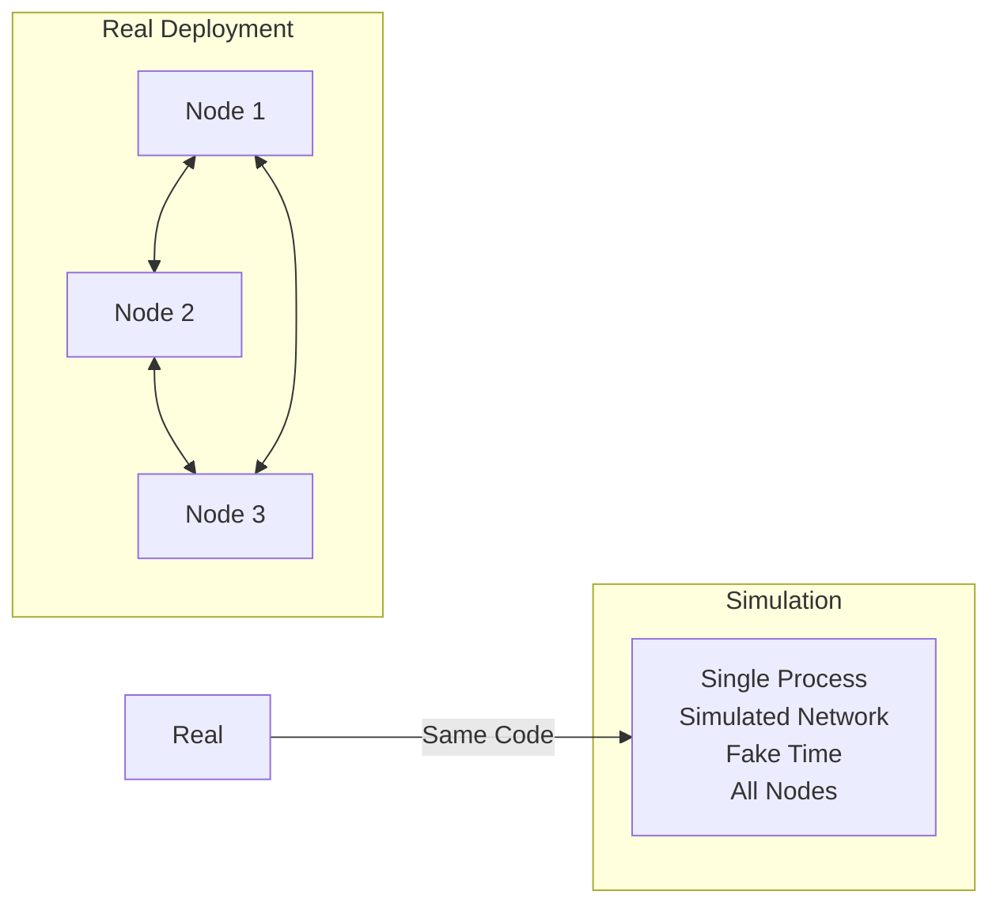
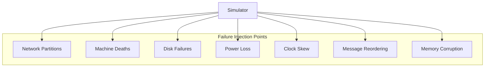

# Simulation Testing

FoundationDB's deterministic simulation testing is its most innovative feature—a technique that has found thousands of bugs that would be nearly impossible to detect with traditional testing.

!!! quote "Will Wilson, FoundationDB Founder"
    "We've run the equivalent of trillions of hours of simulation testing. Every bug we've ever found in production, we could reproduce in simulation."

## The Problem with Testing Distributed Systems

Traditional testing approaches fail for distributed systems:

| Approach | Problem |
|----------|---------|
| Unit tests | Don't catch distributed bugs |
| Integration tests | Can't cover all failure modes |
| Chaos testing | Non-deterministic, hard to reproduce |
| Formal verification | Doesn't test implementation |

Distributed bugs are:

- **Rare** - May only appear under specific timing
- **Non-deterministic** - Hard to reproduce
- **Catastrophic** - Can cause data loss

## Deterministic Simulation

FoundationDB's solution: simulate the entire distributed system in a single process with fake time.



### Key Properties

1. **Same code runs in production and simulation** - No separate test implementation
2. **Fake time** - Simulate years of operation in minutes
3. **Controlled randomness** - Every random decision uses seeded PRNG
4. **Full network simulation** - All messages are simulated, with delays and failures

## How It Works

### The Flow Language

FDB uses Flow, a custom language compiled to C++, that makes all operations deterministic:

```cpp
// Every async operation goes through the simulator
ACTOR Future<Void> simulatableOperation(Database db) {
    // This wait is intercepted by the simulator
    wait(delay(1.0));  // In simulation: controlled fake time
    
    state Transaction tr(db);
    // Network calls go through simulated network
    Optional<Value> result = wait(tr.get(key));
    
    return Void();
}
```

### Failure Injection

The simulator can inject any failure at any point:



The simulator randomly injects combinations of:

- **Network failures** - Partitions, delays, reordering, duplication
- **Process failures** - Crashes, restarts, hangs
- **Disk failures** - I/O errors, corruption, full disks
- **Clock issues** - Skew, jumps, NTP failures

### Buggification

"Buggify" macros introduce rare code paths that simulate real-world edge cases:

```cpp
if (BUGGIFY) {
    // This path is taken randomly in simulation
    // but never in production
    wait(delay(g_random->random01() * 10));
}
```

## Testing Methodology

### Continuous Simulation

FDB runs thousands of simulation tests continuously:

1. **Seed-based tests** - Each test run has a unique seed
2. **Failure injection** - Random failures throughout execution
3. **Invariant checking** - Verify correctness properties constantly
4. **Regression testing** - Save failing seeds, replay to reproduce

### What Gets Tested

Every simulation run verifies:

- **ACID properties** - Transactions are atomic, consistent, isolated, durable
- **Linearizability** - Operations appear to execute in order
- **Recovery correctness** - System recovers from any failure
- **Liveness** - System makes progress when possible

### Bug Detection

Simulation has detected bugs like:

- Race conditions in transaction ordering
- Recovery failures after specific crash sequences
- Data loss scenarios with particular network partitions
- Deadlocks under high contention

## Running Simulation Tests

To run simulation tests locally:

```bash
# Build with simulation enabled
cmake -DFDB_RELEASE=ON ..
make -j

# Run a simulation workload
bin/fdbserver -r simulation -f tests/fast/AtomicRestore.toml
```

### Test Configuration

Simulation tests are defined in TOML:

```toml
[[test]]
testTitle = "AtomicRestore"

[[test.workload]]
testName = "AtomicRestore"
simBackupAgents = "BackupToFile"
```

## The Philosophy

### Test the Real Thing

> "Test the code you ship, ship the code you test."

FDB doesn't have a separate test implementation. The same binary runs in simulation and production.

### Embrace Failure

Instead of preventing failures, FDB:

1. Assumes everything can fail
2. Tests every failure combination
3. Ensures recovery always works
4. Ships with confidence

### Reproducibility

Every simulation run is reproducible:

```bash
# Reproduce a failing test with exact same seed
bin/fdbserver -r simulation -s 12345 -f test.toml
```

## Further Reading

- [:material-video: Testing Distributed Systems w/ Deterministic Simulation](https://www.youtube.com/watch?v=4fFDFbi3toc) - Will Wilson's Strange Loop talk
- [:material-file-pdf-box: SIGMOD Paper, Section 6](https://www.foundationdb.org/files/fdb-paper.pdf) - Detailed testing methodology
- [:material-github: FDB Simulation Code](https://github.com/apple/foundationdb/tree/main/fdbserver/workloads) - Test workloads source

