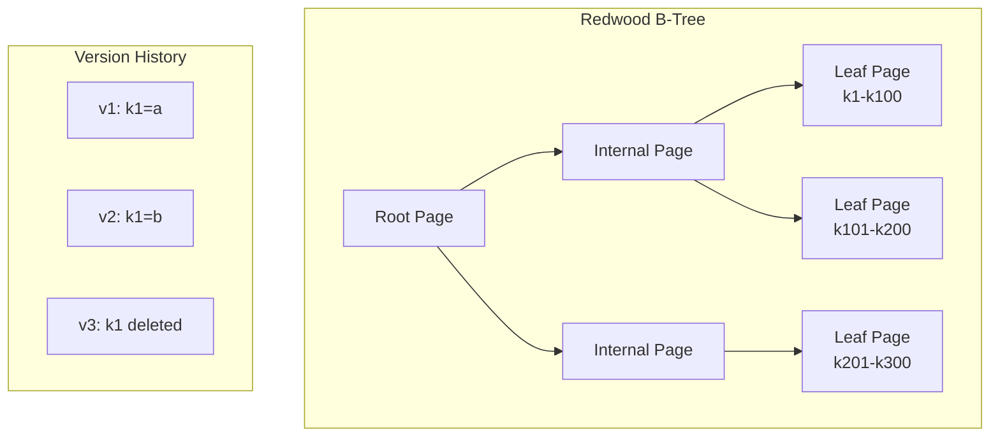
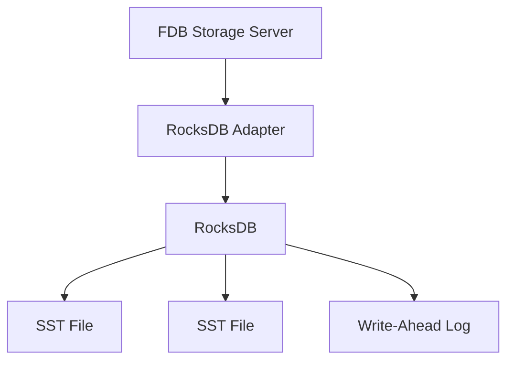
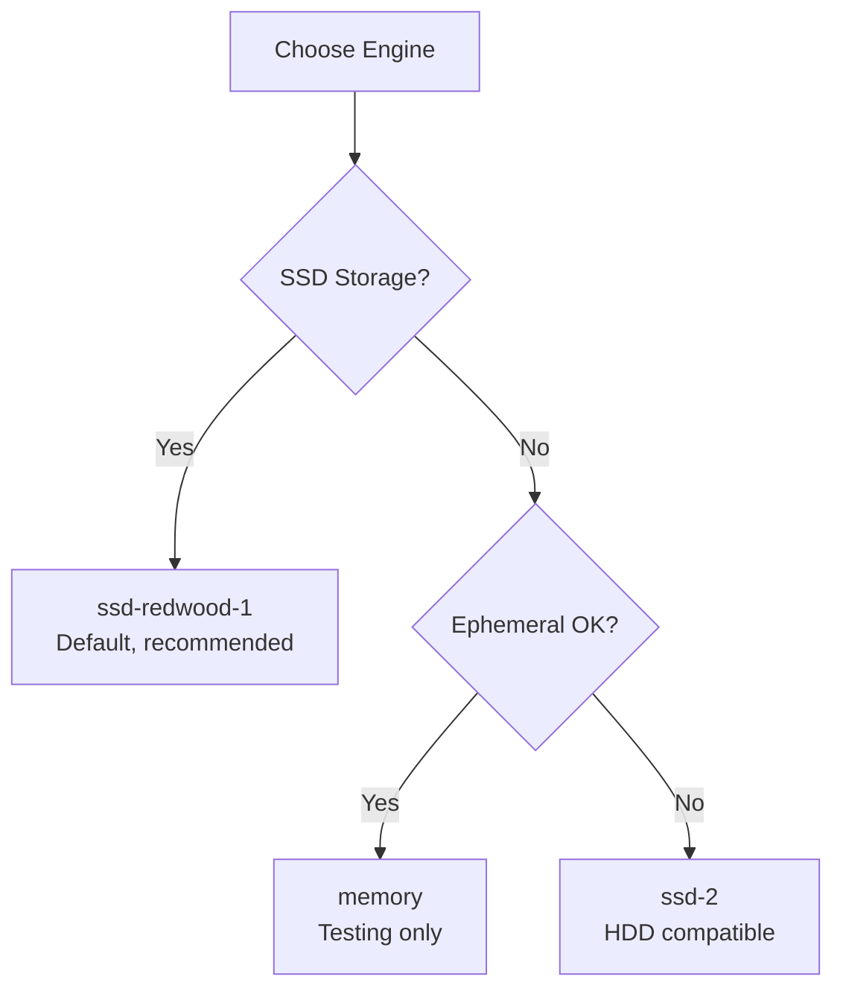

# Storage Engines

FoundationDB supports multiple storage engines, each optimized for different hardware and workload characteristics.

## Available Engines

| Engine | Storage Type | Use Case | Status |
|--------|--------------|----------|--------|
| **ssd-redwood-1** | SSD | Default, best performance | Production |
| **ssd-2** | SSD | Legacy SSD engine | Production |
| **memory** | RAM | Ephemeral, testing | Production |
| **ssd-rocksdb-v1** | SSD | RocksDB-based | Experimental |

## Configuring Storage Engine

```bash
fdb> configure storage_engine=ssd-redwood-1
```

!!! warning "Engine Changes"
    Changing storage engines requires data migration. Plan for extended maintenance window.

## Redwood (ssd-redwood-1)

**Redwood** is FDB's purpose-built B-tree storage engine, designed specifically for FDB's versioned workload.

### Architecture



### Key Features

**Versioned Storage**
: Every key stores version history, enabling snapshot reads at any version within the retention window.

**Prefix Compression**
: Keys sharing prefixes are stored efficiently, critical for FDB's tuple-based key design.

**Delta Encoding**
: Page modifications stored as deltas, reducing write amplification.

**Lock-Free Reads**
: Read operations don't block on writes.

### Configuration

```cpp
// Redwood configuration (internal settings)
struct RedwoodOptions {
    int pageSizeBytes = 8192;        // B-tree page size
    int extentSizePages = 16;        // Contiguous allocation unit
    int pageVersionSoftLimit = 1000; // Versions per page before split
};
```

### Internals

Redwood pages contain versioned key-value pairs:

```
Page Layout:
┌────────────────────────────────────────┐
│ Page Header (version, checksum)        │
├────────────────────────────────────────┤
│ Key: "users/alice"                     │
│   v100: {"name": "Alice"}              │
│   v150: {"name": "Alice Smith"}        │
│   v200: DELETED                        │
├────────────────────────────────────────┤
│ Key: "users/bob"                       │
│   v100: {"name": "Bob"}                │
└────────────────────────────────────────┘
```

## SSD Engine (ssd-2)

The legacy SSD engine, based on SQLite, is still supported but Redwood is preferred.

### When to Use

- Upgrading from older FDB versions
- Specific compatibility requirements
- Known-good baseline for comparison

### Differences from Redwood

| Aspect | SSD-2 | Redwood |
|--------|-------|---------|
| Write amplification | Higher | Lower |
| Compression | None | Delta + Prefix |
| Concurrent reads | Limited | Lock-free |
| Space efficiency | Moderate | Better |

## Memory Engine

The memory engine stores all data in RAM with writes logged to disk for durability—useful for testing and small datasets.

```bash
fdb> configure storage_engine=memory
```

### Characteristics

- All data resident in memory
- Writes logged to disk for durability
- Default 1GB limit per process (configurable via `storage_memory`)
- Good for spinning disks with small datasets

### Use Cases

- Unit testing
- Development environments
- Performance testing (remove disk bottleneck)
- Small datasets on spinning disks

## RocksDB Engine (Experimental)

FDB includes an experimental RocksDB-based engine:

```bash
fdb> configure storage_engine=ssd-rocksdb-v1
```

### Architecture



### Trade-offs

**Pros:**

- Mature, battle-tested storage engine
- Extensive tuning options
- Active community

**Cons:**

- Not designed for FDB's versioned model
- Higher latency tail
- More complex tuning

## Choosing an Engine



### Recommendations

1. **New deployments**: Use `ssd-redwood-1` (default)
2. **Upgrading**: Test with current engine, migrate to Redwood
3. **Testing**: Use `memory` for fast iteration
4. **Experimentation**: Try `ssd-rocksdb-v1` for specific needs

## Further Reading

- [:material-github: Redwood Source Code](https://github.com/apple/foundationdb/tree/main/fdbserver/Redwood.actor.cpp)
- [:material-github: Storage Server Implementation](https://github.com/apple/foundationdb/tree/main/fdbserver/storageserver.actor.cpp)
- [Architecture Deep Dive](architecture-deep-dive.md) - How storage fits in the system

