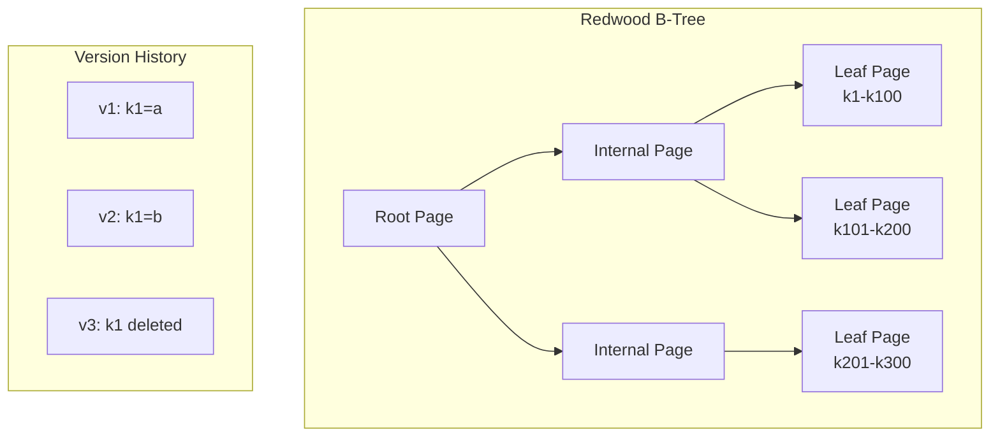
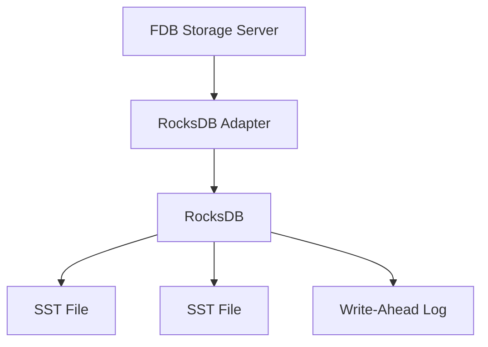
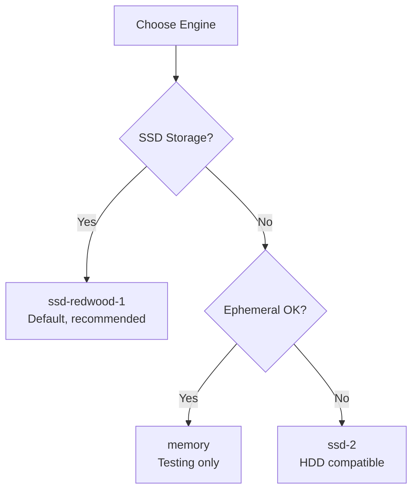

# Storage Engines

FoundationDB supports multiple storage engines, each optimized for different hardware and workload characteristics.

## Available Engines

| Engine | Storage Type | Use Case | Status |
|--------|--------------|----------|--------|
| **ssd-redwood-1** | SSD | Default, best performance | Production |
| **ssd-2** | SSD | Legacy SSD engine | Production |
| **memory** | RAM | Ephemeral, testing | Production |
| **ssd-rocksdb-v1** | SSD | RocksDB-based | Experimental |

!!! note "Version Differences: Redwood Naming"
    In **FDB 7.1 and 7.2**, Redwood's engine name is `ssd-redwood-1-experimental`.
    Despite the "experimental" label, Redwood has been production-ready since 7.1.

    In **FDB 7.3+**, the canonical name was changed to `ssd-redwood-1` (dropping the `-experimental` suffix).
    The old name `ssd-redwood-1-experimental` is still accepted as an alias in 7.3+ for backward compatibility.

## Configuring Storage Engine

```bash
fdb> configure storage_engine=ssd-redwood-1
```

!!! warning "Engine Changes"
    Changing storage engines requires data migration. Plan for extended maintenance window.

## Redwood (ssd-redwood-1)

<!-- Version note: Called ssd-redwood-1-experimental in 7.1/7.2, renamed to ssd-redwood-1 in 7.3+ -->

**Redwood** is FDB's purpose-built B-tree storage engine, designed specifically for FDB's versioned workload. It has been production-ready since FDB 7.1 and is the recommended engine for new deployments.

### Architecture


```mermaid
graph TB
    subgraph "Redwood B-Tree"
        Root[Root Page]
        Internal1[Internal Page]
        Internal2[Internal Page]
        Leaf1[Leaf Page<br/>k1-k100]
        Leaf2[Leaf Page<br/>k101-k200]
        Leaf3[Leaf Page<br/>k201-k300]
    end
    
    Root --> Internal1
    Root --> Internal2
    Internal1 --> Leaf1
    Internal1 --> Leaf2
    Internal2 --> Leaf3
    
    subgraph "Version History"
        V1[v1: k1=a]
        V2[v2: k1=b]
        V3[v3: k1 deleted]
    end
```

### Key Features

**Versioned Storage**
: Every key stores version history, enabling snapshot reads at any version within the retention window.

**Prefix Compression**
: Keys sharing prefixes are stored efficiently, critical for FDB's tuple-based key design.

**Delta Encoding**
: Page modifications stored as deltas, reducing write amplification.

**Lock-Free Reads**
: Read operations don't block on writes.

### Configuration

```cpp
// Redwood configuration (internal settings)
struct RedwoodOptions {
    int pageSizeBytes = 8192;        // B-tree page size
    int extentSizePages = 16;        // Contiguous allocation unit
    int pageVersionSoftLimit = 1000; // Versions per page before split
};
```

### Internals

Redwood pages contain versioned key-value pairs:

```
Page Layout:
┌────────────────────────────────────────┐
│ Page Header (version, checksum)        │
├────────────────────────────────────────┤
│ Key: "users/alice"                     │
│   v100: {"name": "Alice"}              │
│   v150: {"name": "Alice Smith"}        │
│   v200: DELETED                        │
├────────────────────────────────────────┤
│ Key: "users/bob"                       │
│   v100: {"name": "Bob"}                │
└────────────────────────────────────────┘
```

## SSD Engine (ssd-2)

The legacy SSD engine, based on SQLite, is still supported but Redwood is preferred for all workloads.

!!! warning "Migration Recommended"
    SQLite-based storage (ssd-2) has significant performance limitations that are widely recognized by production operators. Write amplification, lack of compression, and limited read concurrency make it substantially slower than Redwood under production workloads. **Most companies running FoundationDB at scale are actively migrating from ssd-2 to Redwood or RocksDB.** New deployments should always use Redwood, and existing ssd-2 deployments should plan migration.

### When to Use

- Temporarily, while planning migration to Redwood
- Specific legacy compatibility requirements
- Known-good baseline for comparison during migration testing

### Differences from Redwood

| Aspect | SSD-2 | Redwood |
|--------|-------|---------|
| Write amplification | Higher | Lower |
| Compression | None | Delta + Prefix |
| Concurrent reads | Limited | Lock-free |
| Space efficiency | Moderate | Better |

## Memory Engine

The memory engine stores all data in RAM with writes logged to disk for durability—useful for testing and small datasets.

```bash
fdb> configure storage_engine=memory
```

### Characteristics

- All data resident in memory
- Writes logged to disk for durability
- Default 1GB limit per process (configurable via `storage_memory`)
- Good for spinning disks with small datasets

### Use Cases

- Unit testing
- Development environments
- Performance testing (remove disk bottleneck)
- Small datasets on spinning disks

## RocksDB Engine (ssd-rocksdb-v1)

FDB includes a RocksDB-based storage engine. While still labeled "experimental" in FDB's codebase, RocksDB is in **active production use at multiple companies** including Adobe and others running large-scale deployments:

```bash
fdb> configure storage_engine=ssd-rocksdb-v1
```

### Architecture


```mermaid
graph TB
    FDB[FDB Storage Server] --> Adapter[RocksDB Adapter]
    Adapter --> RocksDB[RocksDB]
    RocksDB --> SST1[SST File]
    RocksDB --> SST2[SST File]
    RocksDB --> WAL[Write-Ahead Log]
```

### Trade-offs

**Pros:**

- Mature, battle-tested storage engine
- Extensive tuning options
- Active community

**Cons:**

- Not designed for FDB's versioned model
- Higher latency tail
- More complex tuning

## Choosing an Engine


```mermaid
flowchart TD
    Start[Choose Engine] --> SSD{SSD Storage?}
    SSD -->|Yes| Redwood[ssd-redwood-1<br/>Default, recommended]
    SSD -->|No| Memory{Ephemeral OK?}
    Memory -->|Yes| Mem[memory<br/>Testing only]
    Memory -->|No| Legacy[ssd-2<br/>HDD compatible]
```

### Recommendations

1. **New deployments**: Use `ssd-redwood-1` (default)
2. **Existing ssd-2 deployments**: Migrate from SQLite (ssd-2) to Redwood for better performance. Plan a maintenance window for data migration and test thoroughly in a staging environment first.
3. **Testing**: Use `memory` for fast iteration
4. **RocksDB**: Consider `ssd-rocksdb-v1` if your workload benefits from RocksDB's LSM-tree characteristics. Note that multiple companies are running it in production despite the "experimental" label in FDB's source.

## Further Reading

- [:material-github: Redwood Source Code](https://github.com/apple/foundationdb/tree/main/fdbserver/Redwood.actor.cpp)
- [:material-github: Storage Server Implementation](https://github.com/apple/foundationdb/tree/main/fdbserver/storageserver.actor.cpp)
- [Architecture Deep Dive](architecture-deep-dive.md) - How storage fits in the system

