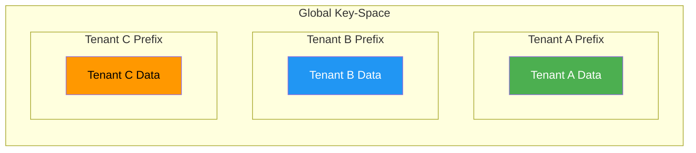

# Tenants <span class="pill-new">NEW in 7.3</span> <span class="pill-experimental">EXPERIMENTAL</span>


!!! warning "Version Notice"
    This feature is only available in FoundationDB 7.3 and later. You are viewing docs for version {{ fdb_version }}.


FoundationDB provides a feature called **tenants** that allow you to configure one or more named transaction domains in your cluster. A transaction domain is a key-space in which a transaction is allowed to operate, and no tenant operations are allowed to use keys outside the tenant key-space.

!!! warning "Experimental Feature"
    Tenants are currently experimental and are not recommended for use in production.

## Use Cases

Tenants can be useful for:

- **Multi-tenant applications** — Isolate data for different customers or services
- **Workload separation** — Prevent unrelated use-cases from interfering with each other
- **Data migration** — Define safe boundaries when moving a subset of data between clusters

## Overview

A tenant in a FoundationDB cluster maps a byte-string name to a key-space that can be used to store data associated with that tenant. This key-space is stored in the cluster's global key-space under a prefix assigned to that tenant, with each tenant being assigned a separate non-intersecting prefix.



!!! tip "Transparent Prefixing"
    Tenant operations are implicitly confined to the key-space associated with the tenant. Client applications do not need to use or be aware of the prefix assigned to the tenant.

## Enabling Tenants

Configure the cluster with an appropriate tenant mode using `fdbcli`:

```bash
fdb> configure tenant_mode=<MODE>
```

### Tenant Modes

| Mode | Description |
|------|-------------|
| `disabled` | Tenants cannot be created or used. **(Default)** |
| `optional_experimental` | Tenants can be created. Each transaction can choose whether or not to use a tenant. Intended for migration and testing. |
| `required_experimental` | Tenants can be created. Each normal transaction **must** use a tenant. Raw key-space access requires the `RAW_ACCESS` transaction option. |

!!! warning "optional_experimental Mode"
    When using `optional_experimental` mode, take care to avoid conflicts between tenant and non-tenant data.

## Creating and Deleting Tenants

Tenants can be managed using the special key range `\xff\xff/management/tenant/map/<tenant_name>` or through APIs provided in language bindings.

### Creating a Tenant

Tenants can be created with any byte-string name that does not begin with `\xff`. Once created, a tenant will be assigned an ID and a prefix where its data will reside.

### Deleting a Tenant

A tenant must be **empty** before it can be deleted. Clear all keys in the tenant before attempting deletion.

## Using Tenants

To use the key-space associated with an existing tenant:

1. Open the tenant using the `Database` object provided by your language binding
2. The resulting `Tenant` object can be used to create transactions
3. Transactions are restricted to the tenant's key-space

### Python Example

```python
import fdb
fdb.api_version({{ api_version }})

db = fdb.open()

# Open a tenant
tenant = db.open_tenant(b'my_tenant')

# Create a transaction on the tenant
@fdb.transactional
def write_to_tenant(tr):
    tr[b'key'] = b'value'  # Writes to tenant key-space

write_to_tenant(tenant)
```

### Key Clamping

Operations that could resolve outside of the tenant key-space (e.g., resolving key selectors) will be clamped to the tenant boundaries.

!!! note "System Keys Restriction"
    Tenant transactions are not permitted to access system keys.

## Raw Access

When operating in `required_experimental` tenant mode or using a metacluster, transactions are not ordinarily permitted to run without using a tenant.

To access system keys or perform maintenance operations spanning multiple tenants, use the `RAW_ACCESS` transaction option:

```python
@fdb.transactional
def maintenance_operation(tr):
    tr.options.set_raw_access()
    # Now can access global key-space
```

!!! note "Implied RAW_ACCESS"
    Setting `READ_SYSTEM_KEYS` or `ACCESS_SYSTEM_KEYS` options implies `RAW_ACCESS` for your transaction.

!!! warning "Multi-Tenant Data Movement"
    Care should be taken when using raw access to run transactions spanning multiple tenants if the tenant feature is being utilized to aid in moving data between clusters. In such scenarios, it may not be guaranteed that all of the data you intend to access is on a single cluster.

## Default Transaction Domain

By default, FoundationDB has a single transaction domain that contains:

- Normal key-space: `['', '\xff')`
- System keys: `['\xff', '\xff\xff')`
- [Special keys](../api/index.md): `['\xff\xff', '\xff\xff\xff')`

## Next Steps

- Learn about [Authorization](authorization.md) for tenant-scoped access control
- Review [Best Practices](best-practices.md) for multi-tenant applications

