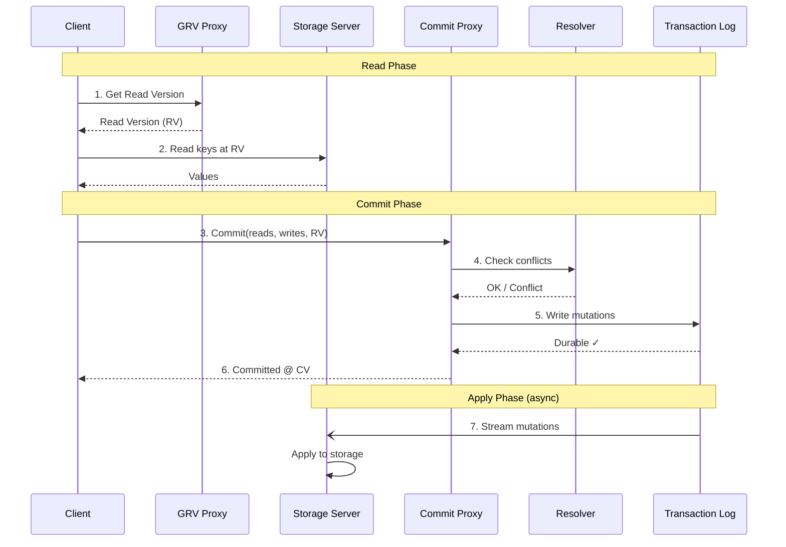
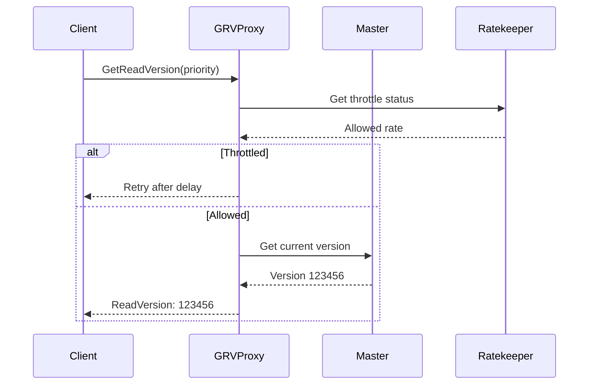
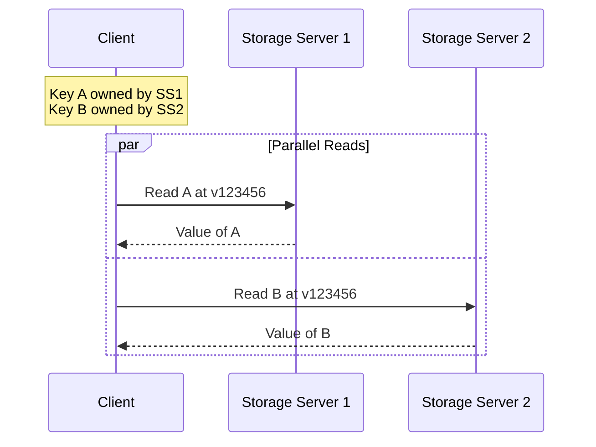
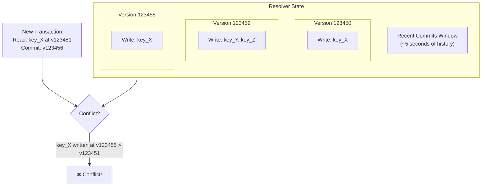
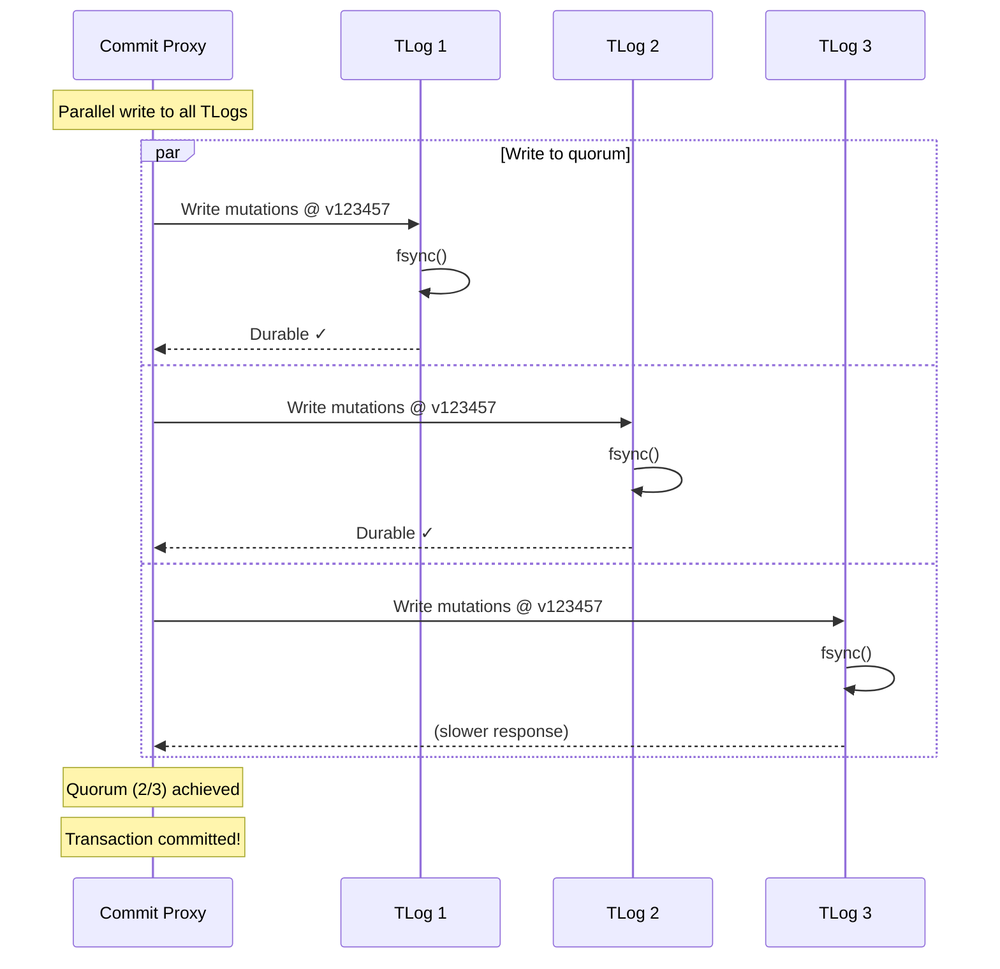
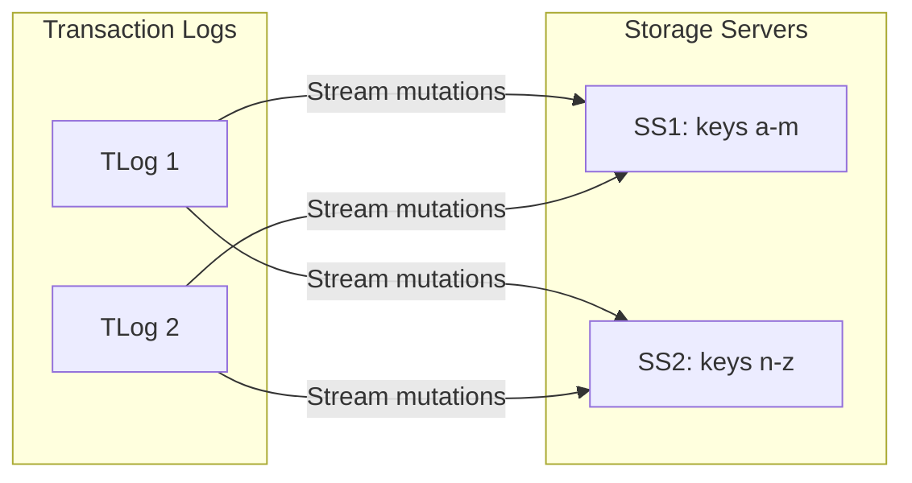
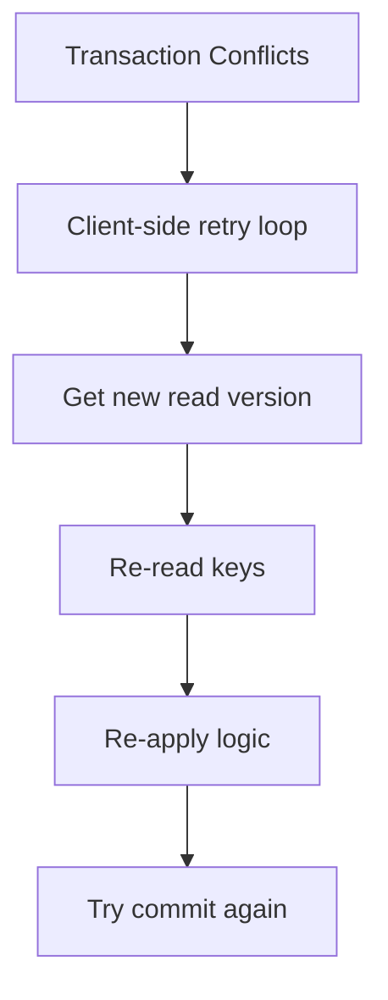

# Transaction Processing Pipeline

This guide traces a transaction's complete journey through FoundationDB—from client to durable storage—explaining the timing characteristics and conflict detection at each stage.

!!! warning "Advanced Content"
    This builds on [Architecture](../concepts/architecture.md) and [Transactions](../concepts/transactions.md). Read those first.

## Pipeline Overview

A FoundationDB transaction flows through multiple components:



## Stage 1: Get Read Version (GRV)

Every transaction starts by obtaining a **read version**—a logical timestamp representing a consistent snapshot of the database.

### GRV Flow



### Timing Characteristics

| Metric | Typical Value | Notes |
|--------|---------------|-------|
| GRV latency | 0.5-2 ms | Network round-trip to proxy |
| Batching window | 1 ms | GRV requests batched for efficiency |
| Throttle delay | 0-100+ ms | Under heavy load |

### Transaction Priorities

Clients can request different priorities:

- **Default** - Normal transaction priority
- **Batch** - Lower priority, may be delayed under load
- **Immediate** - Higher priority (use sparingly)

## Stage 2: Read Keys

Reads go directly to storage servers that own the requested keys.



### Key-Location Resolution

Clients cache the **shard map** (key range → storage server) locally:

1. First read for a key range: client asks Commit Proxy for location
2. Proxy returns storage server addresses
3. Client caches mapping, refreshes on stale errors

### Timing Characteristics

| Metric | Typical Value | Notes |
|--------|---------------|-------|
| Read latency | 0.5-2 ms | Per storage server round-trip |
| Cache hit | ~0 ms overhead | For key location lookup |
| Parallel reads | Overlapped | Client reads multiple servers simultaneously |

## Stage 3: Submit Commit

When the client commits, it sends the transaction to a Commit Proxy:

```cpp
// What the client sends
struct CommitRequest {
    Version readVersion;           // When we read
    vector<KeyRange> readRanges;   // What we read (for conflict check)
    vector<Mutation> mutations;    // What we're writing
    TransactionOptions options;    // Priority, tags, etc.
}
```

The Commit Proxy:

1. Assigns a **commit version** (from Master)
2. Routes transaction to all relevant Resolvers
3. Coordinates the commit protocol

## Stage 4: Conflict Detection

Resolvers determine if the transaction conflicts with concurrent commits.



### Conflict Detection Algorithm

For each transaction with read version `RV` and commit version `CV`:

```
for each key in transaction.readSet:
    if key was written at any version V where RV < V < CV:
        return CONFLICT
return NO_CONFLICT
```

### Resolver Sharding

For scalability, multiple Resolvers each handle a portion of the key space:

- Each key range maps to a specific Resolver
- Transactions touching multiple ranges go to multiple Resolvers
- All Resolvers must approve for commit to proceed

## Stage 5: Write to Transaction Logs

After conflict resolution passes, mutations are written to TLogs:



### Durability Guarantees

| Property | Guarantee |
|----------|-----------|
| **Sync writes** | fsync() before acknowledgment |
| **Quorum** | Majority of TLogs must acknowledge |
| **Ordering** | Mutations written in version order |

## Stage 6: Client Acknowledgment

Once quorum TLogs acknowledge:

1. Commit Proxy marks transaction as committed
2. Returns commit version to client
3. Transaction is now durable and visible

### Timing Summary

| Stage | Typical Latency | On Critical Path? |
|-------|-----------------|-------------------|
| Get Read Version | 0.5-2 ms | Yes |
| Read from Storage | 0.5-2 ms × keys | Yes |
| Commit to Proxy | 0.5-1 ms | Yes |
| Conflict Resolution | 0.1-0.5 ms | Yes |
| TLog Write + fsync | 1-5 ms | Yes |
| **Total Commit** | **3-15 ms** | - |

## Stage 7: Apply to Storage (Async)

After commit, mutations flow to storage servers asynchronously:



Storage servers:

1. **Pull from TLogs** - Request mutations for their key ranges
2. **Apply in order** - Maintain version ordering
3. **Update versions** - Track "durable version" for reads

### Storage Server Lag

If storage servers fall behind:

- Reads at old versions still work (MVCC)
- Ratekeeper throttles new transactions
- TLogs buffer mutations (bounded memory)

## Conflict Handling

When conflicts occur:



The client binding handles this automatically with exponential backoff.

## Source Code References

[:material-github: CommitProxyServer.actor.cpp](https://github.com/apple/foundationdb/blob/main/fdbserver/CommitProxyServer.actor.cpp)
: Commit proxy implementation

[:material-github: Resolver.actor.cpp](https://github.com/apple/foundationdb/blob/main/fdbserver/Resolver.actor.cpp)
: Conflict resolution logic

[:material-github: TLogServer.actor.cpp](https://github.com/apple/foundationdb/blob/main/fdbserver/TLogServer.actor.cpp)
: Transaction log implementation

[:material-github: GrvProxyServer.actor.cpp](https://github.com/apple/foundationdb/blob/main/fdbserver/GrvProxyServer.actor.cpp)
: GRV proxy implementation

## Further Reading

- [ACID Guarantees](../concepts/acid.md) - How the pipeline delivers ACID
- [Architecture Deep Dive](architecture-deep-dive.md) - System overview
- [Recovery Internals](recovery-internals.md) - What happens when components fail
- [:material-file-pdf-box: SIGMOD Paper, Section 3](https://www.foundationdb.org/files/fdb-paper.pdf) - Transaction processing

