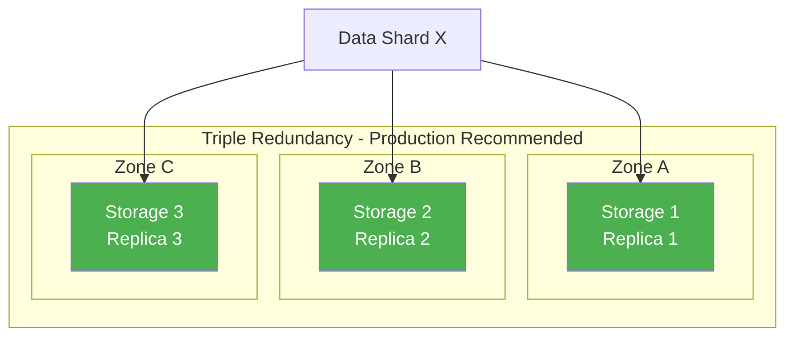
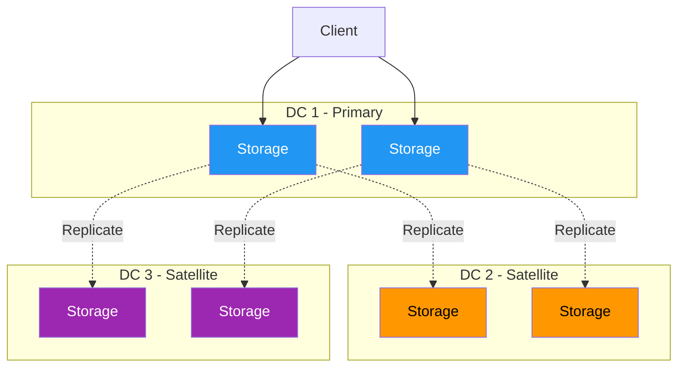
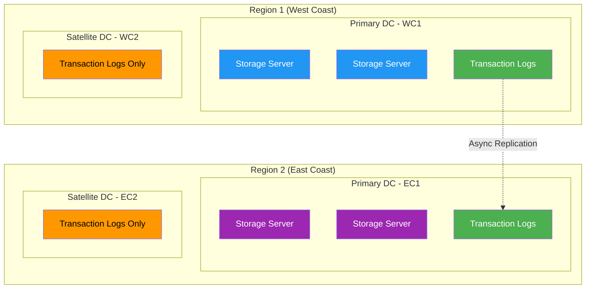

# Configuration

This guide covers configuring FoundationDB clusters for production use. You'll learn about cluster files, redundancy modes, storage engines, and process configuration.

## System Requirements

Before deploying FoundationDB, ensure your systems meet these requirements:

| Requirement | Specification |
|-------------|---------------|
| **OS** | Linux (RHEL/CentOS 6.x-7.x, Ubuntu 12.04+), macOS 10.7+ |
| **Architecture** | 64-bit |
| **RAM** | 4GB ECC RAM per `fdbserver` process |
| **Storage** | SSDs required for datasets larger than memory |

!!! warning "Production Recommendation"
    The macOS version is intended for single-machine development only. Use Linux for production multi-machine clusters.

## Cluster File

The cluster file (`fdb.cluster`) defines how clients and servers connect to the cluster.

### File Format

```
description:ID@IP:PORT,IP:PORT,...
```

| Component | Description |
|-----------|-------------|
| `description` | Logical name using alphanumeric characters and underscores |
| `ID` | Random 8-character identifier (e.g., output of `mktemp -u XXXXXXXX`) |
| `IP:PORT` | Comma-separated list of coordination servers |

**Example:**
```
my_production_db:abc12345@10.0.4.1:4500,10.0.4.2:4500,10.0.4.3:4500
```

### Default Locations

| Platform | Path |
|----------|------|
| Linux | `/etc/foundationdb/fdb.cluster` |
| macOS | `/usr/local/etc/foundationdb/fdb.cluster` |

### Specifying the Cluster File

You can specify the cluster file in several ways (in order of precedence):

1. Command-line: `fdbcli -C /path/to/fdb.cluster`
2. Environment variable: `FDB_CLUSTER_FILE`
3. Current working directory: `./fdb.cluster`
4. Default system location

!!! warning "Important"
    The cluster file and its parent directory must be writable by all server and client processes. This allows automatic updates when coordinators change.

### IPv6 Support

FoundationDB supports IPv6 addresses. Use the format `[IP]:PORT`:

```
description:ID@127.0.0.1:4500,[::1]:4500
```

## Coordination Servers

Coordinators are processes that help maintain cluster availability during network partitions. They store minimal shared state and don't impact transaction performance.

### Choosing Coordinators

Follow these guidelines:

- [x] Use an **odd number** of coordinators (3 or 5 recommended)
- [x] Match coordinator count to your redundancy mode
- [x] Place coordinators in different **failure domains** (racks, circuits, datacenters)
- [x] Coordinator latency doesn't affect normal operations

| Redundancy Mode | Recommended Coordinators |
|-----------------|-------------------------|
| `double` | 3 |
| `triple` | 5 |
| `three_datacenter` | 5 (spread across datacenters) |

### Changing Coordinators

Use `fdbcli` to change coordinators without downtime:

```bash
fdb> coordinators 10.0.4.1:4500 10.0.4.2:4500 10.0.4.3:4500
Coordinators changed
```

Or let FoundationDB choose automatically:

```bash
fdb> coordinators auto
Coordinators changed
```

**Verify the change:**
```bash
fdb> status details
```

!!! tip "Auto Selection"
    `coordinators auto` won't make changes if current coordinators are available and support the current redundancy level.

### Changing Cluster Description

```bash
fdb> coordinators description=production_cluster
Coordination state changed
```

## Redundancy Modes

Redundancy modes control data replication and fault tolerance.



### Single Datacenter Modes

| Mode | Replicas | Min Machines | Fault Tolerance | Best For |
|------|----------|--------------|-----------------|----------|
| `single` | 1 | 1 | None | Development only |
| `double` | 2 | 3 | 1 machine | 3-4 machines |
| `triple` | 3 | 4 | 2 machines | 5+ machines |
| `three_data_hall` | 3 | 4 (2 halls) | 1 hall + 1 machine | Multi-hall deployments |

### Datacenter-Aware Mode

| Mode | Replicas | Description |
|------|----------|-------------|
| `three_datacenter` | 6 | Survives loss of 1 datacenter |



!!! warning "Important"
    For `three_datacenter` mode, all processes must specify `--datacenter-id` or `--locality-dcid`.

## Configuring Regions

Regions enable **automatic failover** between two datacenters without adding WAN latency for commits, while maintaining all FoundationDB consistency properties.

!!! warning "Maximum 2 Regions"
    FoundationDB supports at most **two regions**. This is a fundamental architectural constraint, not a configuration option.

### Regions vs Datacenters

Understanding the difference between regions and datacenters is critical for multi-datacenter deployments:

| Term | Definition | Maximum Count |
|------|------------|---------------|
| **Region** | A logical grouping containing one primary datacenter plus optional satellite datacenters. Supports automatic failover. | **2** |
| **Datacenter** | A physical location with failure independence (like an Availability Zone). Can be primary or satellite. | Unlimited |
| **Primary Datacenter** | A datacenter within a region that stores full data replicas. | 1 per region |
| **Satellite Datacenter** | A datacenter that only stores transaction logs (not full data). Provides synchronous durability without WAN latency. | Multiple per region |



### How Regions Work

Region configuration combines two features:

1. **Asynchronous replication** between regions — The remote region slightly lags behind the primary, avoiding WAN latency on commits
2. **Synchronous satellite logs** — Mutations are made durable in nearby satellite datacenters before commits succeed

When the primary datacenter fails, the satellite logs ensure no committed transactions are lost. The remote region catches up using these logs, then starts accepting new commits.

### Region Configuration JSON

Regions are configured via a JSON document using `fileconfigure` in `fdbcli`:

```bash
fdb> fileconfigure regions.json
Configuration changed.
```

**Example: Two-region configuration with satellites**

```json
{
  "regions": [{
    "datacenters": [{
      "id": "WC1",
      "priority": 1
    }, {
      "id": "WC2",
      "priority": 0,
      "satellite": 1,
      "satellite_logs": 2
    }],
    "satellite_redundancy_mode": "one_satellite_double"
  }, {
    "datacenters": [{
      "id": "EC1",
      "priority": 0
    }, {
      "id": "EC2",
      "priority": -1,
      "satellite": 1,
      "satellite_logs": 2
    }],
    "satellite_redundancy_mode": "one_satellite_double"
  }]
}
```

**Configuration Parameters:**

| Parameter | Description |
|-----------|-------------|
| `id` | Unique datacenter identifier (case-sensitive) |
| `priority` | Determines which region is active. Higher = preferred. Negative = never recover here |
| `satellite` | Set to `1` for satellite datacenters (log-only) |
| `satellite_logs` | Number of transaction logs in the satellite |
| `satellite_redundancy_mode` | How mutations are replicated to satellites (see below) |

### Satellite Redundancy Modes

| Mode | Copies | Description |
|------|--------|-------------|
| `one_satellite_single` | 1 | One copy in the highest-priority satellite |
| `one_satellite_double` | 2 | Two copies in the highest-priority satellite |
| `one_satellite_triple` | 3 | Three copies in the highest-priority satellite |
| `two_satellite_safe` | 4 | Two copies in each of the two highest-priority satellites |
| `two_satellite_fast` | 4 | Same as `two_satellite_safe`, but only waits for one satellite |

!!! tip "Choosing a Mode"
    Use `one_satellite_double` for most deployments. Use `two_satellite_fast` if you have two nearby satellites and want to hide network latency variations.

### Specifying Datacenter Locality

All processes must specify their datacenter using `--locality-dcid` or `--datacenter-id`:

```ini
## foundationdb.conf
[fdbserver.4500]
locality_dcid = WC1

[fdbserver.4501]
locality_dcid = WC1
```

Clients should also specify their datacenter using the `datacenter-id` database option to route requests to the nearest region.

### Usable Regions

The `usable_regions` option controls how many regions store data replicas:

| Value | Behavior |
|-------|----------|
| `1` | Single region only (no cross-region replication) |
| `2` | Both regions store full replicas (enables failover) |

```bash
fdb> configure usable_regions=2
Configuration changed.
```

!!! warning "Changing usable_regions"
    When changing `usable_regions`, exactly **one** region must have `priority >= 0`. This ensures a deterministic replica to add or remove.

### Incompatibility with three_datacenter Mode

!!! danger "Critical Limitation"
    The `three_datacenter` redundancy mode is **NOT compatible** with region configuration.

| Mode | Use Case | Replicas | Compatible with Regions? |
|------|----------|----------|--------------------------|
| `three_datacenter` | Synchronous replication across 3 DCs | 6 | **No** |
| Region configuration | Automatic failover between 2 regions | 2-4 per region | **Yes** |

If you need synchronous replication to three datacenters with low-latency reads from all locations, use `three_datacenter` mode. If you need automatic failover with lower commit latency, use region configuration.

### Handling Datacenter Failures

When a primary datacenter fails:

1. The cluster recovers to the other region
2. Mutations accumulate on transaction logs while waiting for recovery
3. The cluster continues accepting commits (at reduced throughput—roughly 1/3 of normal)

To permanently drop a failed datacenter:

```bash
# Set failed DC priority to negative
fdb> fileconfigure regions_without_failed_dc.json

# Reduce to single region
fdb> configure usable_regions=1
```

### Choosing Coordinators for Regions

For multi-region setups, coordinators should survive datacenter failures:

- **Option 1:** 5 coordinators in 5 different datacenters
- **Option 2:** 9 coordinators spread across 3 datacenters (3 per DC)

!!! tip "Best Practice"
    Place 3 coordinators in each of the two primary datacenters, plus 3 in a third location. This survives the loss of any single datacenter plus one additional machine.

### Configuring Redundancy

```bash
fdb> configure triple
Configuration changed.
```

### Changing Redundancy Mode

You can change redundancy modes at any time. FoundationDB will replicate data accordingly while remaining available.

!!! danger "Availability Warning"
    Changing to a mode requiring more machines than available will make the database unavailable immediately.

## Storage Engines

FoundationDB supports multiple storage engines optimized for different workloads.

### Available Engines

| Engine | Best For | Notes |
|--------|----------|-------|
| `ssd` (ssd-2) | Production with SSDs | B-tree optimized for SSDs, recommended default |
| `ssd-redwood-v1` | High throughput | Improved B-tree, lower write amplification |
| `ssd-rocksdb-v1` | Write-heavy workloads | LSM-tree based, tunable compression |
| `memory` | Small datasets | Data in memory, logged to disk |

### Configuring Storage Engine

```bash
fdb> configure ssd
Configuration changed.
```

### Storage Engine Details

**SSD Engine (`ssd`)**

- Optimized for solid-state drives
- B-tree data structure
- Deferred space reclamation after deletes
- Poor performance on spinning disks

**Redwood Engine (`ssd-redwood-v1`)**

- Improved B-tree implementation
- Higher throughput than standard SSD engine
- Lower write amplification

**RocksDB Engine (`ssd-rocksdb-v1`)**

- LSM-tree based (Log-Structured Merge Tree)
- Built-in compression
- Extensive tuning options
- Good for write-heavy workloads

**Memory Engine (`memory`)**

- All data resident in memory
- Writes logged to disk for durability
- Default 1GB limit per process (configurable via `storage_memory`)
- Good for spinning disks with small datasets

## Process Configuration

FoundationDB processes are configured via `foundationdb.conf`.

### Configuration File Location

| Platform | Path |
|----------|------|
| Linux | `/etc/foundationdb/foundationdb.conf` |
| macOS | `/usr/local/etc/foundationdb/foundationdb.conf` |

### Configuration File Structure

```ini
## foundationdb.conf

[fdbmonitor]
user = foundationdb
group = foundationdb

[general]
cluster-file = /etc/foundationdb/fdb.cluster
restart-delay = 60

[fdbserver]
command = /usr/sbin/fdbserver
public-address = auto:$ID
listen-address = public
datadir = /var/lib/foundationdb/data/$ID
logdir = /var/log/foundationdb
# logsize = 10MiB
# maxlogssize = 100MiB
# memory = 8GiB
# storage-memory = 1GiB

## Individual fdbserver processes
[fdbserver.4500]

[fdbserver.4501]
```

### Key Configuration Options

| Option | Default | Description |
|--------|---------|-------------|
| `memory` | 8GiB | Maximum resident memory per process |
| `storage-memory` | 1GiB | Memory limit for memory storage engine |
| `cache-memory` | 2GiB | Page cache size for disk reads |
| `logsize` | 10MiB | Roll log files at this size |
| `maxlogssize` | 100MiB | Delete old logs when total exceeds this |
| `class` | (unset) | Process class: `storage`, `transaction`, `stateless` |

### Process Classes

Assign processes to roles for optimal resource utilization:

| Class | Purpose | Recommendation |
|-------|---------|----------------|
| `storage` | Storage servers | Machines with large SSDs |
| `transaction` | Transaction logs | Machines with fast storage |
| `stateless` | Proxies, resolvers | Machines with fast CPUs |

Configure in `foundationdb.conf`:
```ini
[fdbserver.4500]
class = storage

[fdbserver.4501]
class = transaction
```

Or via `fdbcli`:
```bash
fdb> setclass 10.0.4.1:4500 storage
```

### Running Multiple Processes Per Machine

For multi-core machines, run one `fdbserver` per CPU core:

```ini
## 8-core machine example
[fdbserver.4500]
class = storage

[fdbserver.4501]
class = storage

[fdbserver.4502]
class = transaction

# ... etc
```

!!! note "Memory Requirements"
    Each `fdbserver` process requires 4GB ECC RAM minimum.

### Locality Configuration

Configure locality for fault-tolerance aware data placement:

```ini
[fdbserver.4500]
locality_dcid = dc1
locality_zoneid = rack1
locality_machineid = server1
```

| Locality | Purpose |
|----------|---------|
| `locality_dcid` | Datacenter identifier |
| `locality_zoneid` | Failure domain (default: machine ID) |
| `locality_machineid` | Physical machine identifier |
| `locality_data_hall` | Data hall identifier |

## TLS Configuration

Enable encrypted communication between cluster components.

### Enable TLS in Cluster File

Add `:tls` suffix to coordinator addresses:

```
my_cluster:abc12345@10.0.4.1:4500:tls,10.0.4.2:4500:tls
```

### TLS Configuration Options

| Environment Variable | Purpose |
|---------------------|---------|
| `FDB_TLS_CERTIFICATE_FILE` | Path to certificate file |
| `FDB_TLS_KEY_FILE` | Path to private key file |
| `FDB_TLS_CA_FILE` | Path to CA certificates |
| `FDB_TLS_PASSWORD` | Private key password |
| `FDB_TLS_VERIFY_PEERS` | Peer verification requirements |

### Default Certificate Locations

| Platform | Certificate | Key |
|----------|-------------|-----|
| Linux | `/etc/foundationdb/cert.pem` | `/etc/foundationdb/key.pem` |
| macOS | `/usr/local/etc/foundationdb/cert.pem` | `/usr/local/etc/foundationdb/key.pem` |

## Quick Reference

### Common fdbcli Configuration Commands

```bash
# Set redundancy mode
fdb> configure triple

# Set storage engine
fdb> configure ssd

# Combined configuration
fdb> configure triple ssd

# Set specific counts
fdb> configure grv_proxies=3
fdb> configure commit_proxies=5
fdb> configure logs=8

# Change coordinators
fdb> coordinators auto
fdb> coordinators 10.0.4.1:4500 10.0.4.2:4500 10.0.4.3:4500

# Set process class
fdb> setclass 10.0.4.1:4500 storage
```

### Configuration Best Practices

1. **Start with `triple` redundancy** for production clusters of 5+ machines
2. **Use `ssd` or `ssd-redwood-v1`** storage engine for most workloads
3. **Place coordinators** in different failure domains
4. **Assign process classes** to optimize resource usage
5. **Enable TLS** for production deployments
6. **Configure locality** for multi-datacenter setups

## Next Steps

- Set up [Monitoring](monitoring.md) to track cluster health
- Configure [Backup & Recovery](backup.md) for data protection
- Review [Troubleshooting](troubleshooting.md) for common issues

