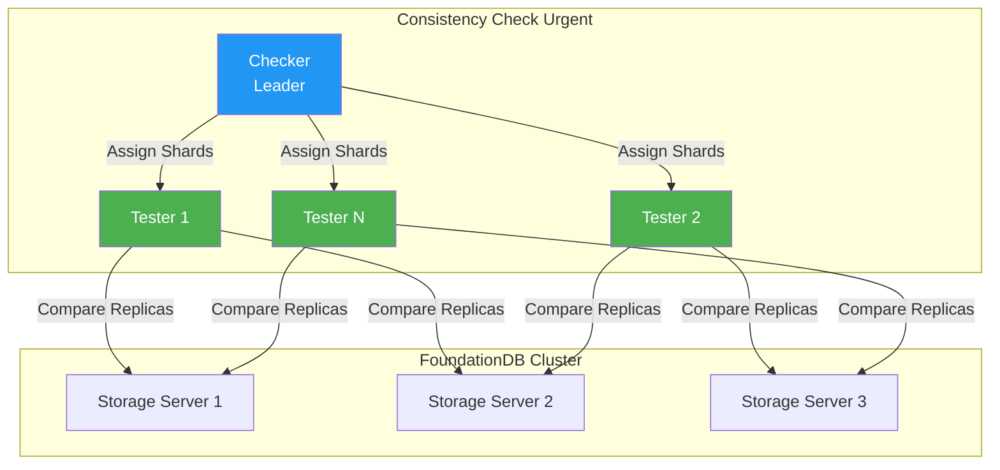

# Consistency Check Urgent <span class="pill-new">NEW IN 7.3</span>


!!! warning "Version Notice"
    This feature is only available in FoundationDB 7.3 and later. You are viewing docs for version {{ fdb_version }}.


The Consistency Check Urgent tool validates the consistency of all replicas for each key-value pair in your FoundationDB cluster. It provides a fast, reliable, and comprehensive way to detect data inconsistencies.

## Overview

In a FoundationDB cluster, every key-value pair is replicated across multiple storage servers. The Consistency Check Urgent tool compares all replicas and reports any discrepancies.

### Types of Inconsistencies

| Type | Description |
|------|-------------|
| **Value Mismatch** | The value of a key on one server differs from another |
| **Unique Key** | A key exists on one server but not on another |

When inconsistencies are detected, the tool generates `ConsistencyCheck_DataInconsistent` trace events.

## Key Features

| Feature | Description |
|---------|-------------|
| **End-to-end completeness** | Continues until all ranges are marked complete |
| **Scalable** | Adding more testers provides near-linear speedup |
| **Progress monitoring** | Single trace event shows remaining shards |
| **Cluster independence** | Does not store data in the cluster being checked |
| **Fault tolerant** | Tester failures don't impact the process; failures are retried |
| **Workload throttling** | Configurable read rate limit (default: 50MB/s max) |
| **Custom ranges** | Check specific key ranges instead of entire key-space |

## Architecture

The tool uses a distributed client-server model:



- **Checker (Leader)**: Coordinates the process, assigns ranges, tracks progress
- **Testers (Agents)**: Perform the actual consistency checks on assigned shards

## Usage

### Step 1: Configure Custom Ranges (Optional)

To check specific ranges instead of the entire key-space, set knobs:

```bash
# Ranges are specified in hexadecimal ASCII format with \\x prefix
CONSISTENCY_CHECK_URGENT_RANGE_BEGIN_0=\\x00
CONSISTENCY_CHECK_URGENT_RANGE_END_0=\\x7f
```

By default, the tool checks the entire key-space (`" "` to `"\xff\xff"`).

### Step 2: Start Testers

Start N tester processes:

```bash
fdbserver --class test --consistency-check-urgent-mode
```

!!! note "Workload Validation"
    When `--consistency-check-urgent-mode` is set, the tester only accepts `ConsistencyCheckUrgent` workloads. Other workloads are dropped with a `SevError` trace event.

### Step 3: Start the Checker

Start the checker process to initiate the consistency check:

```bash
fdbserver -r consistencycheckurgent --num-testers=<N>
```

### Step 4: Monitor Progress

Monitor progress via trace events:

- `ConsistencyCheckUrgent_GotShardsToCheck` — Shows remaining shards
- `ConsistencyCheck_DataInconsistent` — Reports any inconsistencies found
- `ConsistencyCheckUrgent_Complete` — Indicates successful completion

### Step 5: Cleanup

When the check completes, the checker exits automatically. Testers remain alive but idle. Remove testers manually when no longer needed.

!!! tip "Re-running Checks"
    To run another check, simply restart the checker process. Keeping testers running allows for efficient re-checks.

## Workflow Details

### Checker Workflow

1. Load ranges to check from knobs (defaults to entire key-space)
2. Contact cluster controller to obtain tester interfaces
3. Wait for sufficient testers (as specified by `--num-testers`)
4. Partition ranges according to shard boundaries
5. Distribute shards among testers in batches
6. Collect results and retry failed shards
7. Exit when all shards marked complete

### Tester Workflow

1. Receive shard assignments from checker
2. Get storage server interfaces for all data centers
3. Issue read requests to each replica at the same version
4. Compare values key-by-key
5. Record inconsistencies in trace events
6. Retry failed comparisons
7. Report completion status to checker

## Comparison with Legacy Consistency Checker

| Aspect | Legacy Checker | Consistency Check Urgent |
|--------|----------------|--------------------------|
| **Completeness** | Cannot guarantee complete check | Ensures thorough, complete check |
| **Performance** | Single-threaded, slow | Distributed, near-linear speedup |
| **Reliability** | May silently error and lose progress | Retriable components, fault-tolerant |
| **Progress Tracking** | Difficult to track | Clear progress trace events |
| **Range Selection** | Entire key-space only | Custom key ranges supported |

## Configuration Knobs

| Knob | Description |
|------|-------------|
| `CONSISTENCY_CHECK_RATE_LIMIT_MAX` | Maximum read rate per tester (default: 50MB/s) |
| `CONSISTENCY_CHECK_URGENT_BATCH_SHARD_COUNT` | Shards assigned to each tester per batch (default: 10) |
| `CONSISTENCY_CHECK_URGENT_RANGE_BEGIN_*` | Custom range start points (up to 4 ranges) |
| `CONSISTENCY_CHECK_URGENT_RANGE_END_*` | Custom range end points (up to 4 ranges) |

## Best Practices

1. **Plan for time** — Full cluster checks can take hours depending on data size
2. **Use multiple testers** — More testers = faster completion
3. **Monitor trace events** — Set up alerts for `ConsistencyCheck_DataInconsistent`
4. **Schedule during low traffic** — Reduces impact on production workloads
5. **Keep testers running** — Enables quick re-checks if needed

## Next Steps

- Set up [Monitoring](monitoring.md) to track consistency check progress
- Review [Troubleshooting](troubleshooting.md) for handling detected inconsistencies
- Configure [Backup & Recovery](backup.md) as an additional data protection measure

