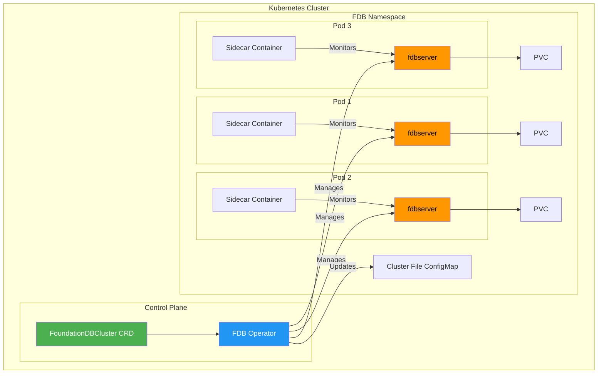

# Kubernetes Deployment

This guide covers deploying and managing FoundationDB clusters on Kubernetes using the official [fdb-kubernetes-operator](https://github.com/FoundationDB/fdb-kubernetes-operator).

!!! warning "Production Considerations"
    Running FoundationDB on Kubernetes requires careful planning. The operator handles much of the complexity, but you should understand [Configuration](configuration.md) and [Monitoring](monitoring.md) before deploying to production.

## Architecture Overview

The fdb-kubernetes-operator manages FoundationDB clusters declaratively through Custom Resource Definitions (CRDs).



**Key components:**

| Component | Purpose |
|-----------|---------|
| **Operator** | Watches CRDs and reconciles cluster state |
| **FoundationDBCluster CRD** | Declares desired cluster configuration |
| **Sidecar Container** | Manages configuration, monitors processes, handles TLS |
| **ConfigMap** | Stores cluster file for client discovery |
| **PersistentVolumeClaim** | Stores FDB data persistently |

## Prerequisites

Before deploying, ensure you have:

- [x] Kubernetes cluster v1.19+ with `kubectl` access
- [x] `kubectl` configured to access your cluster
- [x] Sufficient cluster resources (4GB RAM per FDB process minimum)
- [x] Storage class that supports ReadWriteOnce volumes (SSDs recommended)
- [x] (Optional) Helm 3.x for Helm-based installation

## Installing the Operator

### Option 1: kubectl (Recommended for Testing)

```bash
# Install CRDs
kubectl apply -f https://raw.githubusercontent.com/FoundationDB/fdb-kubernetes-operator/main/config/crd/bases/apps.foundationdb.org_foundationdbclusters.yaml
kubectl apply -f https://raw.githubusercontent.com/FoundationDB/fdb-kubernetes-operator/main/config/crd/bases/apps.foundationdb.org_foundationdbbackups.yaml
kubectl apply -f https://raw.githubusercontent.com/FoundationDB/fdb-kubernetes-operator/main/config/crd/bases/apps.foundationdb.org_foundationdbrestores.yaml

# Install operator
kubectl apply -f https://raw.githubusercontent.com/FoundationDB/fdb-kubernetes-operator/main/config/samples/deployment.yaml
```

### Option 2: Helm (Recommended for Production)

```bash
# Add the FoundationDB Helm repository
helm repo add fdb-operator https://foundationdb.github.io/fdb-kubernetes-operator/
helm repo update

# Install the operator
helm install fdb-operator fdb-operator/fdb-operator \
  --namespace fdb-system \
  --create-namespace
```

**Verify installation:**

```bash
kubectl get pods -n fdb-system
# NAME                            READY   STATUS    RESTARTS   AGE
# fdb-operator-xxxxxxxxxx-xxxxx   1/1     Running   0          30s
```

## Deploying a Basic Cluster

Create a `FoundationDBCluster` resource:

```yaml
# fdb-cluster.yaml
apiVersion: apps.foundationdb.org/v1beta2
kind: FoundationDBCluster
metadata:
  name: my-fdb-cluster
spec:
  version: {{ docker_tag }}
  processGroupIDPrefix: my-fdb
  databaseConfiguration:
    redundancy_mode: double
    storage_engine: ssd-2
    usable_regions: 1
  processCounts:
    storage: 3
    log: 3
    stateless: 3
  processes:
    general:
      podTemplate:
        spec:
          containers:
            - name: foundationdb
              resources:
                requests:
                  cpu: "1"
                  memory: "4Gi"
                limits:
                  cpu: "2"
                  memory: "8Gi"
      volumeClaimTemplate:
        spec:
          storageClassName: fast-ssd
          resources:
            requests:
              storage: 100Gi
```

**Apply the cluster:**

```bash
kubectl apply -f fdb-cluster.yaml

# Watch cluster status
kubectl get fdb my-fdb-cluster -w
```

!!! tip "Cluster Ready"
    The cluster is ready when `GENERATIONS RECONCILED` matches `GENERATIONS` in `kubectl get fdb` output.

## Cluster Status

Check cluster health:

```bash
# Get cluster overview
kubectl get fdb my-fdb-cluster

# Detailed status
kubectl describe fdb my-fdb-cluster

# Check process groups
kubectl get pods -l foundationdb.org/fdb-cluster-name=my-fdb-cluster

# Access fdbcli
kubectl exec -it my-fdb-cluster-storage-1 -c foundationdb -- fdbcli --exec "status"
```

## Scaling the Cluster

### Adding Processes

Update `processCounts` in your cluster spec:

```yaml
spec:
  processCounts:
    storage: 5      # Increased from 3
    log: 5          # Increased from 3
    stateless: 5    # Increased from 3
```

```bash
kubectl apply -f fdb-cluster.yaml
```

The operator automatically:

1. Creates new pods
2. Adds processes to the cluster
3. Rebalances data across new storage servers

### Changing Redundancy Mode

```yaml
spec:
  databaseConfiguration:
    redundancy_mode: triple    # Changed from double
```

!!! warning "Redundancy Requirements"
    `triple` redundancy requires at least 4 storage processes across different failure domains. See [Configuration](configuration.md#redundancy-modes) for requirements.

## Upgrading FDB Version

The operator supports rolling upgrades with zero downtime.

**Step 1: Update the version in your cluster spec:**

```yaml
spec:
  version: {{ docker_tag }}    # Update to latest patch
```

**Step 2: Apply and monitor:**

```bash
kubectl apply -f fdb-cluster.yaml

# Watch the upgrade progress
kubectl get fdb my-fdb-cluster -w
```

The operator performs upgrades in phases:


!!! danger "Version Compatibility"
    Only upgrade one minor version at a time (e.g., 7.1 → 7.3, not 7.1 → 7.4). See [Upgrading](upgrading.md) for detailed upgrade paths.

## TLS Configuration

Enable TLS for encrypted communication:

```yaml
spec:
  mainContainer:
    enableTls: true
  sidecarContainer:
    enableTls: true
  automationOptions:
    configureDatabase: true
```

### Using Custom Certificates

Mount certificates from a Secret:

```yaml
spec:
  processes:
    general:
      podTemplate:
        spec:
          volumes:
            - name: fdb-certs
              secret:
                secretName: fdb-tls-secret
          containers:
            - name: foundationdb
              volumeMounts:
                - name: fdb-certs
                  mountPath: /var/secrets/fdb-certs
                  readOnly: true
              env:
                - name: FDB_TLS_CERTIFICATE_FILE
                  value: /var/secrets/fdb-certs/tls.crt
                - name: FDB_TLS_KEY_FILE
                  value: /var/secrets/fdb-certs/tls.key
                - name: FDB_TLS_CA_FILE
                  value: /var/secrets/fdb-certs/ca.crt
```

## Monitoring

### Prometheus Integration

Deploy [fdb_exporter](https://github.com/apple/foundationdb/tree/main/contrib/fdb_exporter) as a sidecar:

```yaml
spec:
  processes:
    general:
      podTemplate:
        spec:
          containers:
            - name: fdb-exporter
              image: foundationdb/fdb-prometheus-exporter:latest
              ports:
                - containerPort: 9090
                  name: metrics
              env:
                - name: FDB_CLUSTER_FILE
                  value: /var/dynamic-conf/fdb.cluster
```

Add a ServiceMonitor for Prometheus Operator:

```yaml
apiVersion: monitoring.coreos.com/v1
kind: ServiceMonitor
metadata:
  name: fdb-metrics
spec:
  selector:
    matchLabels:
      foundationdb.org/fdb-cluster-name: my-fdb-cluster
  endpoints:
    - port: metrics
      interval: 30s
```

See [Monitoring](monitoring.md) for recommended alerts and dashboards.

## Sidecar Container

The sidecar container manages FDB configuration and lifecycle:

| Function | Description |
|----------|-------------|
| **Configuration sync** | Watches ConfigMap and updates local config |
| **Process monitoring** | Restarts fdbserver if it crashes |
| **Cluster file updates** | Propagates coordinator changes |
| **TLS certificate refresh** | Reloads certificates without restart |

### Customizing Sidecar Resources

```yaml
spec:
  sidecarContainer:
    resources:
      requests:
        cpu: "100m"
        memory: "128Mi"
      limits:
        cpu: "200m"
        memory: "256Mi"
```

## Connecting Applications

### From Within the Cluster

Applications in the same namespace can use the ConfigMap:

```yaml
# application-deployment.yaml
apiVersion: apps/v1
kind: Deployment
metadata:
  name: my-app
spec:
  template:
    spec:
      containers:
        - name: app
          image: my-app:latest
          env:
            - name: FDB_CLUSTER_FILE
              value: /var/fdb/fdb.cluster
          volumeMounts:
            - name: fdb-cluster-file
              mountPath: /var/fdb
      volumes:
        - name: fdb-cluster-file
          configMap:
            name: my-fdb-cluster-config
```

### From Outside the Cluster

Use a LoadBalancer or NodePort Service (not recommended for production):

```yaml
apiVersion: v1
kind: Service
metadata:
  name: fdb-external
spec:
  type: LoadBalancer
  selector:
    foundationdb.org/fdb-cluster-name: my-fdb-cluster
  ports:
    - port: 4500
      targetPort: 4500
```

!!! warning "Network Considerations"
    FDB clients need direct connectivity to all cluster processes. NAT and complex network topologies can cause issues. For production, run clients inside the cluster.

## Troubleshooting

### Common Issues

| Issue | Cause | Solution |
|-------|-------|----------|
| Pods stuck in Pending | Insufficient resources | Check node capacity, adjust resource requests |
| Cluster not reconciling | Operator error | Check operator logs: `kubectl logs -n fdb-system deploy/fdb-operator` |
| Processes not joining | Network policy blocking | Ensure pods can communicate on ports 4500+ |
| TLS handshake failures | Certificate mismatch | Verify certificates match across all pods |
| Data loss after pod restart | Missing PVC | Ensure volumeClaimTemplate is configured |

### Debugging Commands

```bash
# Check operator logs
kubectl logs -n fdb-system deploy/fdb-operator -f

# Check specific pod logs
kubectl logs my-fdb-cluster-storage-1 -c foundationdb
kubectl logs my-fdb-cluster-storage-1 -c foundationdb-kubernetes-sidecar

# Get cluster status from fdbcli
kubectl exec -it my-fdb-cluster-storage-1 -c foundationdb -- fdbcli --exec "status details"

# Check events
kubectl get events --field-selector involvedObject.name=my-fdb-cluster
```

### Recovery from Failures

If the cluster becomes unavailable:

1. **Check coordinator health** — Ensure a majority of coordinators are running
2. **Force recovery** (if needed):
   ```bash
   kubectl exec -it my-fdb-cluster-storage-1 -c foundationdb -- \
     fdbcli --exec "force_recovery_with_data_loss"
   ```

!!! danger "Data Loss Warning"
    `force_recovery_with_data_loss` should only be used as a last resort. It may result in losing recent transactions.

## Next Steps

- Configure [Backup & Recovery](backup.md) for Kubernetes
- Set up [Monitoring](monitoring.md) alerts
- Review [Troubleshooting](troubleshooting.md) for general FDB issues
- Explore the [fdb-kubernetes-operator documentation](https://github.com/FoundationDB/fdb-kubernetes-operator/blob/main/docs/)

