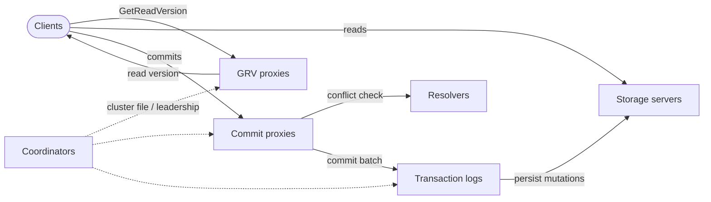

# Cluster Topology Estimator

Interactive sizing calculator for FoundationDB clusters. Describe your hardware and pick a workload shape; the page reports the storage / log / proxy / resolver / coordinator counts that layout supports, the **sustainable workload** it can sustain, and an `fdbcli` snippet you can adapt.

!!! warning "Starting point, not authoritative"
    These recommendations are derived from public benchmarks and operator reports. They are a **starting point** for capacity planning, not a guarantee. Validate against your own workload, and read the [How sizing works](#how-sizing-works) section below to understand the limits of each formula.

## Calculator

<div id="te-root" class="te-root">
<form id="te-form" class="te-card" autocomplete="off">
  <h3>Hardware</h3>
  <div class="te-grid">
    <div class="te-field">
      <label for="te-redundancy">Redundancy mode</label>
      <select id="te-redundancy" name="redundancy">
        <option value="single">single</option>
        <option value="double">double</option>
        <option value="triple" selected>triple</option>
        <option value="three_data_hall">three_data_hall</option>
        <option value="three_datacenter">three_datacenter</option>
      </select>
      <span class="te-help">Drives replication factor and coordinator count.</span>
    </div>
    <div class="te-field">
      <label for="te-machines">Storage machines</label>
      <input id="te-machines" name="machines" type="number" min="1" step="1" value="6">
      <span class="te-help">Number of physical hosts dedicated to <code>class=storage</code>.</span>
    </div>
    <div class="te-field">
      <label for="te-coresPerMachine">Cores per storage machine</label>
      <input id="te-coresPerMachine" name="coresPerMachine" type="number" min="1" max="64" step="1" value="8">
      <span class="te-help">One <code>fdbserver</code> process per core. Storage nodes typically run 4–16.</span>
    </div>
    <div class="te-field">
      <label for="te-dataTB">Total data size (TB)</label>
      <input id="te-dataTB" name="dataTB" type="number" min="0" step="0.1" value="1">
      <span class="te-help">Logical (pre-replication) dataset size.</span>
    </div>
  </div>

  <h3>Workload shape</h3>
  <div class="te-grid">
    <div class="te-field te-field--slider">
      <label for="te-shape">Workload shape</label>
      <input id="te-shape" name="shape" type="range" min="0" max="2" step="1" value="1" class="te-slider" list="te-shape-ticks">
      <datalist id="te-shape-ticks">
        <option value="0"></option>
        <option value="1"></option>
        <option value="2"></option>
      </datalist>
      <div class="te-slider-labels">
        <span>max-read-throughput</span>
        <span>balanced 90/10</span>
        <span>max-write-throughput</span>
      </div>
      <span class="te-help">Active: <strong id="te-shape-label">balanced 90/10</strong>. Sets the SS:T-log default and the read/write split of the sustainable-workload estimate.</span>
    </div>
    <div class="te-field">
      <label for="te-logsRatio">SS : T-log ratio</label>
      <input id="te-logsRatio" name="logsRatio" type="number" min="1" max="32" step="1" value="12" title="Moving the workload-shape slider overwrites this with the preset's default. Type here afterwards to override.">
      <span class="te-help">Slider sets a default (8 / 12 / 20). Override here after if you want.</span>
    </div>
  </div>

  <div class="te-note">
    <strong>Calibrate to your hardware.</strong> The Advanced defaults below come from Apple's published per-process benchmarks (16-byte keys, ≤100-byte values, SATA SSD). Real numbers vary 2–10× with disk class, fsync behaviour, key/value size, and CPU. Before trusting these for capacity planning, <strong>run a saturating single-process benchmark on your target hardware</strong> (one <code>fdbserver</code> process, one core, one disk) and replace the defaults with what you measure.
  </div>

  <details class="te-advanced">
    <summary>Advanced: calibration constants</summary>
    <div class="te-grid te-grid--advanced">
      <div class="te-field">
        <label for="te-perProcReadsSsd">Reads/s per storage process</label>
        <input id="te-perProcReadsSsd" name="perProcReadsSsd" type="number" min="1" step="1000" value="55000">
      </div>
      <div class="te-field">
        <label for="te-perProcWritesSsd">Writes/s per storage process</label>
        <input id="te-perProcWritesSsd" name="perProcWritesSsd" type="number" min="1" step="1000" value="20000">
      </div>
      <div class="te-field">
        <label for="te-headroom">Throughput headroom multiplier</label>
        <input id="te-headroom" name="headroom" type="number" min="0.1" step="0.1" value="1.5">
      </div>
      <div class="te-field">
        <label for="te-maxDataPerSsGB">Soft cap on data per storage process (GB)</label>
        <input id="te-maxDataPerSsGB" name="maxDataPerSsGB" type="number" min="1" step="10" value="500">
      </div>
      <div class="te-field">
        <label for="te-cpPerWriteQps">Writes/s per commit proxy before adding more</label>
        <input id="te-cpPerWriteQps" name="cpPerWriteQps" type="number" min="1" step="1000" value="50000">
      </div>
      <div class="te-field">
        <label for="te-grvPerReadQps">Reads/s per GRV proxy</label>
        <input id="te-grvPerReadQps" name="grvPerReadQps" type="number" min="1" step="1000" value="200000">
      </div>
      <div class="te-field">
        <label for="te-resolverPerWriteQps">Writes/s per resolver</label>
        <input id="te-resolverPerWriteQps" name="resolverPerWriteQps" type="number" min="1" step="1000" value="80000">
      </div>
      <div class="te-field">
        <label for="te-ramPerProcessGB">RAM per fdbserver process (GB)</label>
        <input id="te-ramPerProcessGB" name="ramPerProcessGB" type="number" min="1" step="1" value="4">
      </div>
      <div class="te-field">
        <label for="te-failureDomains">Failure domains (racks / AZs / data halls)</label>
        <input id="te-failureDomains" name="failureDomains" type="number" min="1" step="1" value="3">
      </div>
    </div>
    <button type="button" id="te-reset-defaults" class="te-reset-btn">Reset to defaults</button>
  </details>
</form>

<div class="te-card">
  <h3>Recommended topology</h3>
  <div id="te-results" class="te-results"></div>
</div>

<div class="te-card">
  <h3>Apply this configuration</h3>
  <p>Live-updated <code>fdbcli</code> snippet derived from the recommendations above. Review it carefully before applying to a live cluster — <code>configure new</code> is destructive.</p>
  <div class="te-cli">
    <pre><code id="te-cli-code" class="language-shell">loading…</code></pre>
  </div>
</div>
</div>

## How sizing works

The calculator above is driven by a small set of per-role rules. Each section below explains the rule, what limits it in practice, and when to add more.

### Inputs that drive sizing

| Input | Drives |
|-------|--------|
| Storage machines × cores | Storage-process count (`SS = machines × cores`), and through that the sustainable read/write capacity that every other role is sized from |
| Total data size | Cluster capacity check, per-SS data load |
| Redundancy mode | Replication factor (storage and T-log), coordinator count, write amplification on the storage tier, total RAM |
| Workload shape (slider) | SS : T-log ratio default, and the read- vs write-credit fractions used to compute sustainable reads/writes |
| SS : T-log ratio | T-log process count (`logs = ceil(SS / ratio)`) |
| Failure domains | Validates coordinator placement for `three_data_hall` / `three_datacenter` |
| Advanced calibration constants | Per-process throughput baselines, headroom, max-data-per-SS, and the per-CP / per-GRV / per-resolver thresholds that consume the sustainable numbers |

### Workload-shape slider

The slider has three positions. Each one sets a default SS : T-log ratio and a pair of credit fractions that decide how much of every storage process's per-second budget is spent on reads vs writes:

| Position | Default SS:T-log ratio | Read credit | Write credit | Use when |
|---|---|---|---|---|
| `max-read-throughput` | 20 | 1.0 | 0.1 | Read-heavy serving, analytics, mostly point lookups; T-logs are barely used |
| `balanced 90/10` (default) | 12 | 0.9 | 0.5 | OLTP-style mix dominated by reads with a steady write tail |
| `max-write-throughput` | 8 | 0.5 | 1.0 | Ingest, mutation-heavy pipelines; CP / T-logs need more headroom |

Moving the slider rewrites the SS : T-log ratio input with the preset's default. Type a new value into the ratio input afterwards if you want to override it.


### Role data flow



### Sustainable workload { #sizing-sustainable }

The calculator works backwards from the storage tier. Once you tell it how many storage processes you have (`SS = machines × cores`), it computes a **sustainable read rate** and **sustainable write rate** that the layout can sustain at the chosen workload-shape position. Every other role count is then derived from those two numbers, so the calculator is closing the loop instead of asking the operator to estimate QPS up front.

```text
sustainable_reads  = floor(SS × per_proc_reads  × read_credit  / headroom)
sustainable_writes = floor(SS × per_proc_writes × write_credit / RF / headroom)
```

The `read_credit` and `write_credit` fractions come from the workload-shape slider (see table above). Writes are divided by the replication factor because every logical write fans out to `RF` storage processes — the per-SS write budget is shared by all replicas.

**What limits it.** Per-process throughput is bounded by disk IOPS, fsync latency, and CPU. The Advanced calibration constants (`perProcReadsSsd`, `perProcWritesSsd`, `headroom`) are the knobs that recalibrate this estimate to your hardware. Re-run a saturating single-process benchmark and update them before treating these numbers as authoritative.

### Storage servers { #sizing-storage }

**Rule of thumb.** Storage processes come straight from the hardware inputs:

```text
storage_processes = machines × cores_per_machine
```

The calculator does **not** auto-grow this number. Instead it checks two soft ceilings and warns when the layout cannot hold the data:

```text
cluster_capacity = SS × max_data_per_SS / RF       # logical bytes the layout can hold
data_per_SS      = data_GB × RF / SS               # actual replicated load per process
```

You'll see a warning if `data_GB × RF > SS × max_data_per_SS` (not enough storage processes for the dataset at this replication factor) or if `data_per_SS > max_data_per_SS` (per-SS load above the recovery / data-distribution soft target). Both conditions can fire independently.

**What limits it.** Disk IOPS, fsync latency, and CPU on each SS process. SSDs hit fsync ceilings before CPU does on write-heavy workloads.

**When to add more.** Sustained `data_lag_seconds > 5`, `storage_queue` consistently > 100 MB, or `data_distribution_queue_length > 0` for long stretches. Bump `machines` or `cores_per_machine` until the data-per-SS warning clears and the sustainable-workload card matches your target traffic.

!!! tip "1–3 SSes per disk"
    Modern NVMe can host 2 SSes per disk; high-IOPS network block storage 1–2; low-IOPS block storage 1. Each SS needs its own disk path so writes don't queue against each other.

### Transaction logs { #sizing-tlogs }

**Rule of thumb.** **One T-log per host** on dedicated `class=transaction` nodes. The workload-shape slider sets the SS : T-log ratio default — **20** for `max-read-throughput`, **12** for `balanced 90/10`, **8** for `max-write-throughput`. Override the ratio input afterwards if your write profile sits between two presets.

Community-reported ratios cluster around **8:1 to 10:1** storage-to-T-log ([semisol](https://semisol.dev/blog/fdb-tuning)) for general workloads, with read-heavy deployments going as wide as **20:1** to free more cores for storage. The slider picks within that range based on your workload shape.

```text
logs = max(3, ceil(storage_processes / SS_to_TLog_ratio))
```

**What limits it.** Group-commit fsync latency on the T-log disk. T-logs are **disk-IOPS bound**, not capacity bound. Co-locating two T-logs on the same disk halves throughput; keep one T-log per disk and one per host.

**When to add more.** `commit_latency` rises and `tlog_queue_size` climbs while disk fsync latency is healthy → fan-in is the bottleneck. Move the slider toward `max-write-throughput` (or lower the ratio manually) to widen the T-log tier.

!!! warning "Diminishing returns past 15 T-logs"
    Operators report negligible throughput gains beyond ~15 T-logs in a single log set. Past that point, evaluate sharding the workload across multiple clusters before adding more T-logs.

### Commit proxies { #sizing-commit-proxies }

**Rule of thumb.** Default to **3** commit proxies (FDB's default). The calculator scales by the **sustainable write rate** the storage tier supports — not by a user-supplied write QPS:

```text
commit_proxies = max(3, ceil(sustainable_writes / 50000))
```

**What limits it.** Commit-batch CPU and network bandwidth on each proxy. Each commit proxy adds latency overhead even when idle, so don't over-provision.

**When to add more.** `commit_latency` rises while `tlog_queue_size` is healthy and `resolver_queue` is short — the proxies themselves are the bottleneck. The slider's `max-write-throughput` position raises `sustainable_writes` and therefore the recommended CP count.

### GRV proxies { #sizing-grv-proxies }

**Rule of thumb.** Default **1** proxy. Cluster-wide GRV throughput saturates around **400K/s**, so adding more than ~3–4 GRV proxies rarely helps. The count scales with the **sustainable read rate**:

```text
grv_proxies = max(1, ceil(sustainable_reads / 200000))
```

**What limits it.** Single-master `getReadVersion` serialization. Adding GRV proxies parallelises the GRV path but the underlying master still has to mint version numbers serially.

**When to add more.** `read_version_batch_size` is high or clients see GRV latency growing while master CPU is moderate. The slider's `max-read-throughput` position raises `sustainable_reads` and therefore the recommended GRV count.

### Resolvers { #sizing-resolvers }

**Rule of thumb.** Default **1**. The community guidance is "have one, that is it" unless profiling proves otherwise. The calculator scales with the sustainable write rate:

```text
resolvers = max(1, ceil(sustainable_writes / 80000))
```

**What limits it.** Conflict-set memory and CPU. Each resolver owns a key range; **more resolvers can increase false conflicts** because keys from one transaction can hash across multiple resolvers and trigger spurious aborts.

**When to add more.** `resolver_queue` is consistently long and CPU on the single resolver is pegged. Rarely needs more than 4.

### Coordinators { #sizing-coordinators }

**Rule of thumb.** Use an **odd** number of coordinators in **distinct failure domains** (racks, AZs, datacenters):

| Redundancy | Coordinators |
|------------|--------------|
| `single` | 1 |
| `double` | 3 |
| `triple` | 5 |
| `three_data_hall` | 9 |
| `three_datacenter` | 9 |

Coordinators don't sit on the hot path — their latency does not affect normal transactions. Their job is to maintain a Paxos-like quorum on the cluster's coordination state. Set the **failure-domains** count in Advanced to the number of distinct racks / AZs / data halls you have; the calculator warns when `three_data_hall` or `three_datacenter` is selected and the failure-domain count is below the recommended coordinator count.

### Stateless processes

Reserve a small pool of `class=stateless` processes for the cluster controller, master, commit proxies, GRV proxies, resolvers, plus a couple of standby slots and any log routers you run. The kubernetes-operator [scaling guide](https://github.com/FoundationDB/fdb-kubernetes-operator/blob/main/docs/manual/scaling.md) recommends:

```text
stateless_slots ≈ commit_proxies + grv_proxies + resolvers + 4
```

The `+ 4` covers cluster controller, master, and two warm standbys.

### Machines { #sizing-machines }

The calculator splits machines into three classes:

| Class | Count |
|-------|-------|
| `storage` | `machines` (input — `cores_per_machine` SSes per host) |
| `transaction` (one T-log per host) | = `logs` |
| `stateless` (≤ 8 procs per host) | `ceil((cp + grv + res + 4) / 8)` |

Total cluster RAM is summed across every process: `(SS + logs + cp + grv + res + 4) × ram_per_process × (1 + ram_headroom)`. The default per-process RAM budget is **4 GB** (per `foundationdb.conf` defaults), with **25% headroom** for OS, page cache, and byte-sample memory inside the storage process.

## Replication factor implications

| Redundancy mode | Replication factor (storage) | T-log replication | Coordinators | Notes |
|-----------------|------------------------------|-------------------|--------------|-------|
| `single` | 1 | 1 | 1 | Dev only — no fault tolerance. |
| `double` | 2 | 2 | 3 | Single-machine failure. |
| `triple` | 3 | 3 | 5 | Default for production. |
| `three_data_hall` | 3 (across 3 data halls) | 4 | 9 | Survives loss of one data hall. |
| `three_datacenter` | 6 (3 × 2 sites) | 6 | 9 | Highest cost, multi-region. |

Replication multiplies storage cost (bytes-on-disk and SS RAM) and divides the write tier's per-process budget by `RF` — every logical write fans out to `RF` storage processes. The sustainable-writes formula already accounts for this division.

## Process-class layout patterns

Layouts borrowed from operator playbooks (see [semisol's blog](https://semisol.dev/blog/fdb-tuning) and the [kubernetes-operator scaling guide](https://github.com/FoundationDB/fdb-kubernetes-operator/blob/main/docs/manual/scaling.md)):

=== "Tiny (dev / staging)"

    | Hosts | Roles per host |
    |-------|----------------|
    | 3 | 1 × stateless + 1 × log + 2 × storage, all `class=unset` |

    Use `single` or `double` redundancy. One process per role, all on the same machine class.

=== "Small (1–4 TB)"

    | Hosts | Roles per host |
    |-------|----------------|
    | 3 transaction | 1 × T-log, `class=transaction` |
    | 3 stateless   | cluster controller / master / proxies / resolver, `class=stateless` |
    | N storage     | up to 8 × SS, `class=storage` |

    Triple redundancy. Coordinators co-locate on stateless or transaction machines in distinct failure domains.

=== "Medium / large (10+ TB)"

    | Hosts | Roles per host |
    |-------|----------------|
    | 5–15 transaction | 1 × T-log per host |
    | 3+ stateless     | dedicated, scaled with proxy count |
    | many storage     | one disk = 1–2 SS, ≤ 8 SS per host |

    Triple or three_data_hall. Add transaction-class hosts before commit proxies — most "throughput is too low" issues are T-log fan-in, not proxy count.

!!! note "Calculator vs reality"
    The calculator scales role counts off a few simple per-process throughput heuristics. Real-world commit-proxy scaling is bound by per-CP commit-batch CPU well below the 50K writes/CP rule of thumb, so treat the recommended commit-proxy count as a floor: profile the cluster and raise `commit_proxies` as `commit_latency` warrants. Likewise the **sustainable workload** numbers are a ceiling at the listed per-process baselines and slider position; calibrate `perProcReadsSsd` / `perProcWritesSsd` in Advanced to match a saturating single-process benchmark on your hardware before treating them as authoritative.

## Sources

- [FoundationDB Configuration](https://apple.github.io/foundationdb/configuration.html) — Apple's official configuration guide (redundancy modes, storage backends, process classes).
- [FoundationDB Architecture](https://apple.github.io/foundationdb/architecture.html) — role breakdown for proxies, resolvers, T-logs, storage servers.
- [FoundationDB Performance](https://apple.github.io/foundationdb/performance.html) — published per-process throughput numbers.
- [Forum: Scaling log server and log to storage ratio](https://forums.foundationdb.org/t/scaling-log-server-and-log-to-storage-ratio/4890) — community discussion of T-log scaling and CPU saturation.
- [Forum: How to troubleshoot throughput / performance degrade](https://forums.foundationdb.org/t/how-to-troubleshoot-throughput-performance-degrade/1436) — diagnosing CP / T-log / SS bottlenecks in practice.
- [fdb-kubernetes-operator scaling guide](https://github.com/FoundationDB/fdb-kubernetes-operator/blob/main/docs/manual/scaling.md) — process-class slot accounting and stateless minimum.
- [semisol — FoundationDB tuning](https://semisol.dev/blog/fdb-tuning) — practical layout patterns and proxy/resolver tuning notes.
