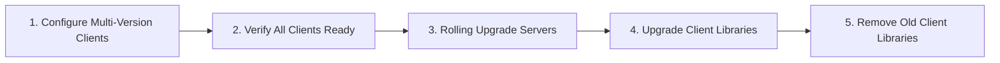

# Upgrading FoundationDB

Upgrading a FoundationDB cluster requires careful planning to minimize downtime and maintain data integrity. Follow this comprehensive guide to perform production upgrades safely.

!!! tip "Version Documentation"
    See [Version Overview](../getting-started/versions.md) for version-specific features, upgrade paths, and compatibility notes.

## Upgrade Paths Overview

FoundationDB supports two upgrade approaches. **Choose your path before starting**—the preparation requirements differ significantly.

### Zero-Downtime Upgrade (Recommended for Production)

Clients remain connected throughout the upgrade with no application interruption.

**Requirements:**

- ✅ Multi-version client configured on ALL clients BEFORE upgrade starts
- ✅ All clients verified to have external client libraries available
- ✅ Rolling upgrade procedure followed exactly



!!! warning "Critical Prerequisite"
    **Multi-version client setup is REQUIRED before starting a zero-downtime upgrade.**
    If you skip this step, clients will disconnect when servers upgrade to the new version.

    See [Multi-Version Client Configuration](#multi-version-client-configuration) to set this up first.

### Upgrade with Planned Downtime

Simpler procedure but requires stopping all client applications during the upgrade window.

**When to use:**

- Development/test environments
- Applications that can tolerate brief outages
- When multi-version client setup is not feasible

**Procedure:**

1. Stop all client applications
2. Perform rolling server upgrade (same as zero-downtime)
3. Upgrade client libraries
4. Restart client applications

---

**Choose your upgrade path:**

| Factor | Zero-Downtime | Planned Downtime |
|--------|---------------|------------------|
| Application availability | ✅ Continuous | ⏸️ Brief outage |
| Setup complexity | Higher (multi-version client) | Lower |
| Client library prep | Required before upgrade | After upgrade |
| Risk if misconfigured | Clients disconnect | N/A (already down) |
| Best for | Production systems | Dev/test |

## Pre-Upgrade Checklist

Before starting an upgrade, complete this checklist:

=== "Zero-Downtime Prerequisites"

    !!! danger "Complete BEFORE Starting Server Upgrades"
        These steps are **mandatory** for zero-downtime upgrades. Skipping them will cause client disconnections.

    - [ ] **Multi-version client libraries deployed** - Install both old and new `libfdb_c` versions on all client machines ([setup instructions](#multi-version-client-configuration))
    - [ ] **External client directory configured** - Set `EXTERNAL_CLIENT_DIRECTORY` or call `set_external_client_directory()` in all applications
    - [ ] **All clients verified** - Confirm every client application can load external libraries (check trace logs for `ClientStart` events)
    - [ ] **API version compatible** - Use an API version supported by BOTH old and new cluster versions
    - [ ] **Test connection during version change** - Verify clients handle `cluster_version_changed` errors with retry logic

=== "Compatibility"

    - [ ] **Verify upgrade path** - Check [supported upgrade paths](../getting-started/versions.md#upgrade-paths)
    - [ ] **Review breaking changes** - Check version-specific notes below
    - [ ] **Client compatibility** - Ensure client libraries match target version
    - [ ] **API version** - Confirm your application's API version is supported
    - [ ] **Test environment** - Validate upgrade in staging first

=== "Backups"

    - [ ] **Full backup** - Complete a full backup before upgrading
    - [ ] **Verify backup** - Confirm backup is restorable
    - [ ] **Backup location** - Ensure backup storage is accessible
    - [ ] **DR cluster** - If using DR, verify secondary is up to date

=== "Infrastructure"

    - [ ] **Cluster health** - Verify `status` shows "Healthy"
    - [ ] **Fault tolerance** - Confirm fault tolerance ≥ 1
    - [ ] **No moving data** - Wait for data movement to complete
    - [ ] **Disk space** - Ensure 20%+ free space on all nodes
    - [ ] **Maintenance window** - Schedule appropriate downtime

```bash
# Pre-upgrade health check script
echo "=== Pre-Upgrade Health Check ==="

# Check cluster status
fdbcli --exec "status"

# Verify fault tolerance
fdbcli --exec "status json" | jq '.cluster.fault_tolerance'

# Check for data movement
fdbcli --exec "status json" | jq '.cluster.data.moving_data'

# Verify all processes are healthy
fdbcli --exec "status details"

# Note current version
fdbcli --version
```

## Upgrade Procedure

This procedure enables zero-downtime upgrades. For upgrades with planned downtime, stop all client applications first, then skip to [Step 2](#step-2-stage-packages-on-all-machines).

### Step 0: Configure Multi-Version Clients (Zero-Downtime Only)

!!! danger "⚠️ REQUIRED for Zero-Downtime Upgrades"
    Complete this step on **ALL client machines** BEFORE upgrading any servers. If you skip this step, clients will lose connectivity when servers upgrade.

**Why this is required:** During a rolling upgrade, some servers run the old version while others run the new version. Clients need access to BOTH client library versions to maintain connections throughout the upgrade.

**Workflow summary:**
```
1. Deploy new client libraries alongside old ones  →  2. Configure applications to load both  →  3. Verify all clients  →  4. Begin server upgrade
```

=== "Quick Setup"

    ```bash
    # 1. Create directory for multiple client library versions
    sudo mkdir -p /opt/fdb-clients

    # 2. Copy existing library (before installing new version)
    CURRENT_VERSION=$(fdbcli --version 2>/dev/null | grep -oE '[0-9]+\.[0-9]+\.[0-9]+')
    sudo cp /usr/lib/libfdb_c.so /opt/fdb-clients/libfdb_c_${CURRENT_VERSION}.so

    # 3. Install new client library
    wget {{ download_url }}/foundationdb-clients_{{ fdb_version }}-1_amd64.deb
    sudo dpkg -i foundationdb-clients_{{ fdb_version }}-1_amd64.deb

    # 4. Copy new library to multi-version directory
    sudo cp /usr/lib/libfdb_c.so /opt/fdb-clients/libfdb_c_{{ fdb_version }}.so

    # 5. Configure applications to use multi-version directory
    export FDB_NETWORK_OPTION_EXTERNAL_CLIENT_DIRECTORY=/opt/fdb-clients
    ```

=== "Detailed Setup"

    See [Multi-Version Client Configuration](#multi-version-client-configuration) for:

    - Platform-specific instructions (Linux, macOS, Windows)
    - Language-specific code examples (Python, Java, Go, C)
    - Verification procedures
    - Troubleshooting

**Verify multi-version client is working:**

```bash
# Check that your application loads the external clients
# Look for ClientStart events in trace logs showing both versions loaded
grep "ClientStart" /var/log/foundationdb/trace.*.json | grep -E "7\.[0-9]+\.[0-9]+"
```

!!! tip "Don't restart applications yet"
    After configuring multi-version client, applications will automatically use external libraries. No restart required unless you made code changes.

---

### Step 1: Install Updated Client Binaries

For non-patch upgrades, install new client binaries on all client machines:

```bash
# Download new packages
wget {{ download_url }}/foundationdb-clients_{{ fdb_version }}-1_amd64.deb

# Install on each client machine
sudo dpkg -i foundationdb-clients_{{ fdb_version }}-1_amd64.deb

# DO NOT restart client applications yet
# Multi-version client keeps them connected
```

!!! warning "Keep Old Libraries Available"
    Do NOT remove old client libraries until the upgrade is complete. The multi-version client needs access to both versions during the rolling upgrade.

### Step 2: Stage Packages on All Machines

Download and stage packages on all cluster machines before starting:

```bash
# On each cluster machine
cd /tmp
wget {{ download_url }}/foundationdb-clients_{{ fdb_version }}-1_amd64.deb
wget {{ download_url }}/foundationdb-server_{{ fdb_version }}-1_amd64.deb
```

### Step 3: Upgrade Coordinators First

**Critical**: Upgrade coordinator machines before other machines to ensure cluster coordination continues.

```bash
# Identify coordinators
fdbcli --exec "coordinators"

# For EACH coordinator machine, in sequence:
# 1. Stop the service
sudo systemctl stop foundationdb

# 2. Install new packages
sudo dpkg -i foundationdb-clients_{{ fdb_version }}-1_amd64.deb \
             foundationdb-server_{{ fdb_version }}-1_amd64.deb

# 3. Start the service
sudo systemctl start foundationdb

# 4. Wait for coordinator to rejoin (check from another machine)
fdbcli --exec "status minimal"
# Wait until "Healthy" before proceeding to next coordinator
```

!!! note "Coordinator Majority"
    Maintain coordinator quorum throughout. With 5 coordinators, upgrade one at a time, ensuring 3+ are always available.

### Step 4: Rolling Upgrade Remaining Machines

After all coordinators are upgraded, upgrade remaining machines one at a time:

```bash
# For EACH remaining machine:

# 1. Optional: Exclude machine to move data off first
fdbcli --exec "exclude 10.0.4.X"
fdbcli --exec "status"
# Wait for "Moving data: 0.000 GB"

# 2. Stop the service
sudo systemctl stop foundationdb

# 3. Install new packages
sudo dpkg -i foundationdb-clients_{{ fdb_version }}-1_amd64.deb \
             foundationdb-server_{{ fdb_version }}-1_amd64.deb

# 4. Start the service
sudo systemctl start foundationdb

# 5. If excluded, re-include the machine
fdbcli --exec "include 10.0.4.X"

# 6. Verify health before proceeding
fdbcli --exec "status minimal"
# Wait until "Healthy" before next machine
```

### Step 5: Verify Upgrade Complete

```bash
# Confirm all processes are on new version
fdbcli --exec "status details"

# Verify cluster health
fdbcli --exec "status"

# Check version in JSON
fdbcli --exec "status json" | jq '.cluster.processes[].version' | sort -u
```

### Step 6: Finalize Client Configuration (Zero-Downtime Only)

After confirming the server upgrade is complete, finalize client configuration:

```bash
# 1. Update applications to use new API version (optional but recommended)
# Edit your application code to use the new API version

# 2. Remove old client libraries from multi-version directory
sudo rm /opt/fdb-clients/libfdb_c_<old_version>.so

# 3. Optionally, simplify configuration by removing multi-version client
# (Only if you won't need it for future upgrades)
unset FDB_NETWORK_OPTION_EXTERNAL_CLIENT_DIRECTORY
```

!!! success "Upgrade Complete"
    Your zero-downtime upgrade is now complete. Client applications remained connected throughout the process.

---

## Timing Expectations

| Cluster Size | Coordinator Upgrade | Full Cluster | Notes |
|-------------|---------------------|--------------|-------|
| 5 machines | 10-15 minutes | 30-45 minutes | Small cluster |
| 20 machines | 10-15 minutes | 1-2 hours | Medium cluster |
| 100+ machines | 15-20 minutes | 4-8 hours | Large cluster |

Actual times depend on:

- **Data volume** - More data = slower exclusion/inclusion
- **Redundancy mode** - Triple replication requires more data movement
- **Disk speed** - SSDs significantly faster than HDDs
- **Network bandwidth** - Data rebalancing limited by network

## Monitoring During Upgrade

Watch these metrics throughout the upgrade:

| Metric | Location | Expected Behavior |
|--------|----------|------------------|
| Cluster status | `status` | May show "Healing" during upgrades |
| Fault tolerance | `status` | Should not drop to 0 |
| Moving data | `status` | Expect spikes after each machine |
| Replication health | `status` | "Healthy" or "Healthy (Rebalancing)" |
| Process count | `status details` | May temporarily decrease |

```bash
# Continuous monitoring during upgrade
watch -n 5 'fdbcli --exec "status minimal"; echo "---"; \
             fdbcli --exec "status json" | jq "{
               health: .cluster.database_status.healthy,
               fault_tolerance: .cluster.fault_tolerance.max_zone_failures_without_losing_data,
               moving_data_gb: (.cluster.data.moving_data.in_flight_bytes / 1073741824),
               processes: .cluster.processes | length
             }"'
```

!!! warning "Alert Thresholds"
    - **Fault tolerance = 0**: Pause upgrade, investigate before continuing
    - **Database unavailable**: Stop upgrade, check coordinator quorum
    - **Moving data stuck**: May indicate storage server issue

## Rollback Procedures

!!! danger "Rollback Limitations"
    Downgrades between major/minor versions are generally **not supported**. Only proceed with rollback if the upgrade hasn't completed or if documented for your specific version pair.

### If Upgrade Fails Mid-Way

1. **Do not continue** with remaining machines
2. **Check cluster health** - If healthy, remaining old-version machines are still functional
3. **Restore backup** if cluster is unavailable and cannot recover

### Downgrade Within Same Minor Version

Patch version downgrades (e.g., 7.3.71 → 7.3.60) may be possible:

```bash
# Only if cluster is still functional
sudo systemctl stop foundationdb
sudo dpkg -i foundationdb-server_<old_version>.deb
sudo systemctl start foundationdb
```

### Recovery from Failed Upgrade

If the cluster becomes unavailable:

1. **Stop all FoundationDB processes** on all machines
2. **Restore coordinator machines** to old version or from backup
3. **Restore data from backup** if necessary
4. **Start coordinators first**, then other machines

```bash
# Emergency restore from backup
fdbcli --exec "status"  # Confirm cluster state

# If backup restore needed:
fdbrestore start -r file:///backup/fdb -C /etc/foundationdb/fdb.cluster --dest_cluster_file /path/to/new_cluster
```

See [Backup & Recovery](backup.md) for detailed restore procedures.

## Version-Specific Upgrade Notes

For detailed version-specific information, see [Version Overview](../getting-started/versions.md).

| Upgrade Path | Key Considerations |
|--------------|-------------------|
| 7.1 → 7.3 | Safe direct upgrade. Storage engine `ssd-redwood-1-experimental` renamed to `ssd-redwood-1` |
| 7.3 → 7.4 | Pre-release only. Go binding requires `Close()` on Database objects |
| 7.1 → 7.4 | Not recommended. Upgrade to 7.3 first |

!!! tip "API Version Compatibility"
    Client applications specify an API version when connecting. All supported versions accept API versions 510+. Lock your application to a specific API version for consistent behavior across cluster upgrades.

## Upgrading Client Libraries

After upgrading the FoundationDB cluster, you must upgrade client libraries on all application machines. Client libraries must match the **major.minor** version of your server (e.g., use 7.3.x clients with a 7.3 server).

!!! warning "Version Matching Required"
    Mismatched client/server versions can cause connection failures, protocol errors, or unexpected behavior. Always upgrade client libraries when upgrading the server.

### Upgrading the C Client Library (libfdb_c)

All language bindings depend on the native C client library (`libfdb_c`). Upgrade this library on **every machine** running FoundationDB client applications before upgrading language-specific bindings.

=== "Ubuntu/Debian"

    ```bash
    # Set the target version
    FDB_VERSION="{{ fdb_release }}"

    # Download the clients package
    wget https://github.com/apple/foundationdb/releases/download/${FDB_VERSION}/foundationdb-clients_${FDB_VERSION}-1_amd64.deb

    # Install (upgrades existing installation)
    sudo dpkg -i foundationdb-clients_${FDB_VERSION}-1_amd64.deb

    # Verify installation
    ls -la /usr/lib/libfdb_c.so
    ```

    The library is installed to `/usr/lib/libfdb_c.so` with headers in `/usr/include/foundationdb/`.

=== "RHEL/CentOS"

    ```bash
    # Set the target version
    FDB_VERSION="{{ fdb_release }}"

    # Download the clients package
    wget https://github.com/apple/foundationdb/releases/download/${FDB_VERSION}/foundationdb-clients-${FDB_VERSION}-1.el7.x86_64.rpm

    # Install (upgrades existing installation)
    sudo rpm -Uvh foundationdb-clients-${FDB_VERSION}-1.el7.x86_64.rpm

    # Verify installation
    ls -la /usr/lib64/libfdb_c.so
    ```

    The library is installed to `/usr/lib64/libfdb_c.so` with headers in `/usr/include/foundationdb/`.

=== "macOS"

    ```bash
    # For Intel Macs:
    curl -LO https://github.com/apple/foundationdb/releases/download/{{ fdb_release }}/FoundationDB-{{ fdb_release }}_x86_64.pkg

    # For Apple Silicon (M1/M2/M3):
    curl -LO https://github.com/apple/foundationdb/releases/download/{{ fdb_release }}/FoundationDB-{{ fdb_release }}_arm64.pkg

    # Install (opens GUI installer)
    open FoundationDB-{{ fdb_release }}_*.pkg
    ```

    The library is installed to `/usr/local/lib/libfdb_c.dylib` with headers in `/usr/local/include/foundationdb/`.

=== "Windows"

    ```powershell
    # Download the Windows installer
    $FDB_VERSION = "{{ fdb_release }}"
    Invoke-WebRequest -Uri "https://github.com/apple/foundationdb/releases/download/$FDB_VERSION/foundationdb-$FDB_VERSION-x64.msi" -OutFile "foundationdb-$FDB_VERSION-x64.msi"

    # Install (run as Administrator)
    msiexec /i foundationdb-$FDB_VERSION-x64.msi /quiet
    ```

    The library is installed to `C:\Program Files\foundationdb\bin\fdb_c.dll`.

### Upgrading Python Client

The Python client is distributed via PyPI and requires the matching `libfdb_c` to be installed on the system.

```bash
# Upgrade to specific version matching your server
pip install --upgrade foundationdb=={{ package_version }}

# Or for a version range matching your server's major.minor
pip install --upgrade "foundationdb>={{ fdb_version }},<{{ fdb_version_next }}"

# Verify installation
python -c "import fdb; print(fdb.__version__)"
```

!!! tip "Virtual Environments"
    When using virtual environments, ensure `libfdb_c` is installed system-wide, as the Python package dynamically loads the native library at runtime.

**Common Errors:**

| Error | Cause | Solution |
|-------|-------|----------|
| `Unable to load libfdb_c` | Missing native library | Install `foundationdb-clients` package |
| `API version not supported` | Version mismatch | Upgrade `libfdb_c` to match Python client version |
| `Incompatible protocol version` | Client/server mismatch | Ensure client and server major.minor versions match |

See [Python API](../api/python.md) for detailed usage.

### Upgrading Java Client

The Java client is distributed via Maven Central and requires `libfdb_c` for native library loading.

=== "Maven"

    Update your `pom.xml`:

    ```xml
    <dependency>
        <groupId>org.foundationdb</groupId>
        <artifactId>fdb-java</artifactId>
        <version>{{ java_version }}</version>
    </dependency>
    ```

    Then run:
    ```bash
    mvn dependency:resolve -U
    ```

=== "Gradle"

    Update your `build.gradle`:

    ```groovy
    implementation 'org.foundationdb:fdb-java:{{ java_version }}'
    ```

    Then run:
    ```bash
    ./gradlew dependencies --refresh-dependencies
    ```

!!! note "Native Library"
    The Java client requires `libfdb_c` to be installed on the system. The JAR includes JNI bindings that load the native library at runtime.

**Common Errors:**

| Error | Cause | Solution |
|-------|-------|----------|
| `UnsatisfiedLinkError: fdb_c` | Missing native library | Install `foundationdb-clients` package |
| `API version not valid` | Invalid API version code | Use correct API version (e.g., 730 for 7.3) |
| `Cluster file not found` | Wrong cluster file path | Verify `/etc/foundationdb/fdb.cluster` exists |

See [Java API](../api/java.md) for detailed usage.

### Upgrading Go Client

The Go client uses CGO to link against `libfdb_c`, requiring the native library at both compile and runtime.

```bash
# Ensure libfdb_c is installed first (see above)

# Update to specific version
go get github.com/apple/foundationdb/bindings/go/src/fdb@v{{ package_version }}

# Update go.mod
go mod tidy

# Verify the binding compiles
go build ./...
```

!!! warning "CGO Requirements"
    The Go bindings require CGO. Ensure you have:

    - `CGO_ENABLED=1` (default on most systems)
    - A C compiler installed (gcc or clang)
    - `libfdb_c` headers available (from `foundationdb-clients` package)

**Environment Variables for CGO:**

```bash
# If libfdb_c is in a non-standard location
export CGO_CFLAGS="-I/path/to/foundationdb/include"
export CGO_LDFLAGS="-L/path/to/foundationdb/lib -lfdb_c"
```


!!! warning "Breaking Change in 7.4: Close() Required"
    Starting with FoundationDB 7.4, you **must** call `db.Close()` on Database objects when done. Update your code:

    ```go
    db := fdb.MustOpenDefault()
    defer db.Close()  // REQUIRED in 7.4+
    ```


**Common Errors:**

| Error | Cause | Solution |
|-------|-------|----------|
| `cannot find -lfdb_c` | Missing native library | Install `foundationdb-clients` package |
| `fdb_c.h: No such file` | Missing headers | Install development package or set `CGO_CFLAGS` |
| `undefined: fdb.MustAPIVersion` | Wrong import path | Use `github.com/apple/foundationdb/bindings/go/src/fdb` |

See [Go API](../api/go.md) for detailed usage.

### Upgrading C Client

For C applications, upgrade `libfdb_c` directly using the platform-specific instructions above. Then recompile your application:

```bash
# Recompile with updated library
gcc -o myapp myapp.c -lfdb_c -lpthread

# Or with explicit paths
gcc -o myapp myapp.c -I/usr/include -L/usr/lib -lfdb_c -lpthread
```

Update the API version in your code if needed:

```c
// Update to match server version
#define FDB_API_VERSION {{ api_version }}  // e.g., 730 for FoundationDB 7.3
#include <foundationdb/fdb_c.h>
```

See [C API](../api/c.md) for detailed usage.

### Upgrading Ruby Client

The Ruby client is distributed via RubyGems and requires `libfdb_c`.

```bash
# Ensure libfdb_c is installed first (see above)

# Upgrade the gem
gem install fdb

# Or with Bundler, update Gemfile:
# gem 'fdb', '~> {{ fdb_version }}'
bundle update fdb

# Verify installation
ruby -e "require 'fdb'; puts 'FDB Ruby client loaded'"
```

**Common Errors:**

| Error | Cause | Solution |
|-------|-------|----------|
| `LoadError: cannot load fdb_c` | Missing native library | Install `foundationdb-clients` package |
| `FFI::NotFoundError` | Wrong library path | Set `LD_LIBRARY_PATH` to include `libfdb_c` location |

### Version Compatibility Matrix

| Server Version | API Version | Python | Java | Go | libfdb_c |
|---------------|-------------|--------|------|-----|----------|
| 7.1.x | 710 | 7.1.x | 7.1.x | v7.1.x | 7.1.x |
| 7.2.x | 720 | 7.2.x | 7.2.x | v7.2.x | 7.2.x |
| 7.3.x | 730 | 7.3.x | 7.3.x | v7.3.x | 7.3.x |

## Multi-Version Client Configuration

!!! danger "⚠️ Required for Zero-Downtime Upgrades"
    **This section describes a PREREQUISITE for zero-downtime upgrades.** Configure multi-version clients on ALL client machines BEFORE starting any server upgrades.

    If you're performing an upgrade, complete this configuration as [Step 0 of the Upgrade Procedure](#step-0-configure-multi-version-clients-zero-downtime-only).

The multi-version client allows applications to connect to clusters running a different FoundationDB version than the client library. This enables zero-downtime upgrades by allowing clients to seamlessly communicate with clusters during version transitions.

### How Multi-Version Client Works

The multi-version client loads an additional client library that is version-compatible with the cluster and proxies all API calls through it. When the cluster version changes, the client automatically switches to the appropriate library. Each loaded library runs its own network thread and generates separate trace files.

**Key benefits:**

- **Zero-downtime upgrades**: Applications continue running while the cluster is upgraded
- **Gradual rollouts**: Upgrade clusters without requiring simultaneous client updates
- **Protocol flexibility**: Connect to clusters with different protocol versions

### Configuration Options

Configure multi-version client behavior using two network options:

| Option | Description |
|--------|-------------|
| `EXTERNAL_CLIENT_LIBRARY` | Path to a specific client library file |
| `EXTERNAL_CLIENT_DIRECTORY` | Directory containing multiple client libraries |

!!! tip "Recommendation"
    Use `EXTERNAL_CLIENT_DIRECTORY` to provide multiple library versions, allowing the client to automatically select the appropriate one for any cluster version.

### Setting Up Multi-Version Client Libraries

Create a directory containing client libraries for each version you need to support:

=== "Linux"

    ```bash
    # Create directory for client libraries
    sudo mkdir -p /opt/fdb-clients

    # Copy current version (preserving original)
    sudo cp /usr/lib/libfdb_c.so /opt/fdb-clients/libfdb_c_{{ fdb_release }}.so

    # Download and extract an older version for compatibility
    wget https://github.com/apple/foundationdb/releases/download/7.1.67/foundationdb-clients_7.1.67-1_amd64.deb
    dpkg-deb -x foundationdb-clients_7.1.67-1_amd64.deb /tmp/fdb-7.1.67
    sudo cp /tmp/fdb-7.1.67/usr/lib/libfdb_c.so /opt/fdb-clients/libfdb_c_7.1.67.so

    # Verify libraries are in place
    ls -la /opt/fdb-clients/
    ```

=== "macOS"

    ```bash
    # Create directory for client libraries
    sudo mkdir -p /opt/fdb-clients

    # Copy current version
    sudo cp /usr/local/lib/libfdb_c.dylib /opt/fdb-clients/libfdb_c_{{ fdb_release }}.dylib
    ```

=== "Windows"

    ```powershell
    # Create directory for client libraries
    New-Item -ItemType Directory -Path "C:\fdb-clients" -Force

    # Copy current version
    Copy-Item "C:\Program Files\foundationdb\bin\fdb_c.dll" "C:\fdb-clients\fdb_c_{{ fdb_release }}.dll"
    ```

### Environment Variable Configuration

Configure multi-version client using environment variables without code changes:

```bash
# Point to a specific library
export FDB_NETWORK_OPTION_EXTERNAL_CLIENT_LIBRARY=/opt/fdb-clients/libfdb_c_7.1.67.so

# Or specify a directory containing multiple versions (recommended)
export FDB_NETWORK_OPTION_EXTERNAL_CLIENT_DIRECTORY=/opt/fdb-clients

# Multiple directories (Linux/macOS use :, Windows uses ;)
export FDB_NETWORK_OPTION_EXTERNAL_CLIENT_DIRECTORY=/opt/fdb-clients:/usr/lib
```

Network options set via environment variables are applied when `fdb.api_version()` is called.

### Language-Specific Multi-Version Client Examples

=== "Python"

    ```python
    import fdb

    # Set API version BEFORE configuring network options
    fdb.api_version({{ api_version }})

    # Option 1: Specify a single external library
    fdb.options.set_external_client_library('/opt/fdb-clients/libfdb_c_7.1.67.so')

    # Option 2: Specify a directory with multiple versions (recommended)
    fdb.options.set_external_client_directory('/opt/fdb-clients')

    # Open database as normal
    db = fdb.open()
    ```

=== "Java"

    ```java
    import com.apple.foundationdb.FDB;
    import com.apple.foundationdb.Database;

    public class MultiVersionClient {
        public static void main(String[] args) {
            // Get FDB instance with API version
            FDB fdb = FDB.selectAPIVersion({{ api_version }});

            // Option 1: Specify a single external library
            fdb.options().setExternalClientLibrary("/opt/fdb-clients/libfdb_c_7.1.67.so");

            // Option 2: Specify a directory with multiple versions (recommended)
            fdb.options().setExternalClientDirectory("/opt/fdb-clients");

            // Open database as normal
            try (Database db = fdb.open()) {
                // Use database
            }
        }
    }
    ```

=== "Go"

    ```go
    package main

    import (
        "github.com/apple/foundationdb/bindings/go/src/fdb"
    )

    func main() {
        // Set API version
        fdb.MustAPIVersion({{ api_version }})

        // Option 1: Specify a single external library
        fdb.Options().SetExternalClientLibrary("/opt/fdb-clients/libfdb_c_7.1.67.so")

        // Option 2: Specify a directory with multiple versions (recommended)
        fdb.Options().SetExternalClientDirectory("/opt/fdb-clients")

        // Open database as normal
        db := fdb.MustOpenDefault()
        defer db.Close()  // Required in Go 7.4+
    }
    ```

=== "C"

    ```c
    #define FDB_API_VERSION {{ api_version }}
    #include <foundationdb/fdb_c.h>
    #include <stdio.h>
    #include <string.h>

    int main() {
        fdb_error_t err;

        // Select API version
        err = fdb_select_api_version(FDB_API_VERSION);
        if (err) {
            fprintf(stderr, "Error selecting API version: %s\n", fdb_get_error(err));
            return 1;
        }

        // Option 1: Specify a single external library
        const char* lib_path = "/opt/fdb-clients/libfdb_c_7.1.67.so";
        err = fdb_network_set_option(
            FDB_NET_OPTION_EXTERNAL_CLIENT_LIBRARY,
            (uint8_t*)lib_path,
            strlen(lib_path)
        );

        // Option 2: Specify a directory with multiple versions (recommended)
        const char* dir_path = "/opt/fdb-clients";
        err = fdb_network_set_option(
            FDB_NET_OPTION_EXTERNAL_CLIENT_DIRECTORY,
            (uint8_t*)dir_path,
            strlen(dir_path)
        );

        // Setup and run network thread
        err = fdb_setup_network();
        // ... start network thread, open database, etc.

        return 0;
    }
    ```

### API Version Compatibility Warning

!!! warning "Critical: API Version Constraints"
    The API version you set **cannot be higher** than what any loaded client library supports. Setting an incompatible API version will prevent that client from connecting to the cluster.

**Upgrade scenario best practice:**

1. Upgrade the cluster first (using multi-version client to maintain connectivity)
2. Verify the cluster is stable on the new version
3. Only then upgrade your application's API version

```python
# Before cluster upgrade: Application uses older API version
fdb.api_version(710)  # Works with 7.1.x cluster
fdb.options.set_external_client_directory('/opt/fdb-clients')

# After cluster upgrade to {{ fdb_version }}: Can update API version
fdb.api_version({{ api_version }})  # Works with {{ fdb_version }} cluster
# No external client needed if local library matches cluster
```

### Handling cluster_version_changed Error

The multi-version client introduces a `cluster_version_changed` error when the client switches between library versions. This error is **retryable**—standard retry loops handle it automatically.

!!! note "Commit Behavior"
    If `cluster_version_changed` occurs during a commit, treat it like `commit_unknown_result`. The commit may or may not have succeeded. Your application should verify the transaction outcome before retrying.

### Multi-Version Client Best Practices

| Practice | Rationale |
|----------|-----------|
| **Minimize external clients** | Only include libraries you need—extra versions consume memory and CPU |
| **Avoid duplicate protocol versions** | Patch releases (e.g., 7.3.70, 7.3.71) are protocol-compatible; include only the latest |
| **Match library architecture** | Don't mix x86_64 and ARM64 libraries in the same directory |
| **Check trace logs by version** | Each client generates separate traces; check `ClientStart` events to identify versions |
| **Test version transitions** | Verify your application handles `cluster_version_changed` gracefully before production |

### Troubleshooting Multi-Version Client

| Issue | Cause | Solution |
|-------|-------|----------|
| "API version not supported" | API version higher than external client supports | Lower API version or update external client library |
| Connection timeouts | No compatible client library available | Add external client matching cluster version |
| High memory usage | Too many external clients loaded | Remove unnecessary client libraries from directory |
| Missing events in trace logs | Looking in wrong client's logs | Check logs from version matching cluster (`ClientStart` event shows version) |

### Example: Rolling Upgrade Scenario

This example demonstrates maintaining connectivity during a cluster upgrade from 7.1 to {{ fdb_version }}:

```bash
# 1. Prepare client libraries directory
sudo mkdir -p /opt/fdb-clients
sudo cp /usr/lib/libfdb_c.so /opt/fdb-clients/libfdb_c_7.1.67.so
```

```python
# 2. Configure application to use multi-version client
import fdb

# Use API version compatible with BOTH versions
fdb.api_version(710)  # 710 works with 7.1.x and {{ fdb_version }}

# Point to directory with both libraries
fdb.options.set_external_client_directory('/opt/fdb-clients')

db = fdb.open()
# Application can now connect during cluster upgrade
```

```bash
# 3. Perform rolling cluster upgrade (see upgrade procedure above)
# Application continues running throughout

# 4. After upgrade completes, optionally update application API version
# (Update code to use fdb.api_version({{ api_version }}))
```

### Verifying Client Upgrade

After upgrading, verify the client can connect to the cluster:

=== "Python"

    ```python
    import fdb
    fdb.api_version({{ api_version }})
    db = fdb.open()
    print("Connected to FoundationDB!")
    ```

=== "Java"

    ```java
    FDB fdb = FDB.selectAPIVersion({{ api_version }});
    try (Database db = fdb.open()) {
        System.out.println("Connected!");
    }
    ```

=== "Go"

    ```go
    fdb.MustAPIVersion({{ api_version }})
    db := fdb.MustOpenDefault()
    defer db.Close()
    fmt.Println("Connected!")
    ```

=== "CLI"

    ```bash
    # Quick connectivity test
    fdbcli --exec "status minimal"
    ```

## Upgrade Troubleshooting

This section covers common upgrade errors, best practices, and recovery procedures when upgrades encounter issues.

### Common Upgrade Errors

| Error Code | Error Message | Cause | Solution |
|------------|---------------|-------|----------|
| 1039 | `cluster_version_changed` | Cluster version changed during transaction | Implement retry logic; use multi-version client |
| 1040 | `incompatible_protocol_version` | Client/server protocol mismatch | Install matching client library or use multi-version client |
| 1036 | `connection_failed` | Unable to connect during upgrade | Wait for cluster recovery; check coordinator availability |
| 1007 | `transaction_too_old` | Transaction took too long during upgrade | Reduce transaction duration; implement smaller batches |
| 1021 | `commit_unknown_result` | Commit status uncertain during failover | Implement idempotent operations; check before retry |

#### Error: `cluster_version_changed` (1039)

This is the most common error during upgrades. It occurs when the cluster configuration changes while a transaction is in flight.

**Symptoms:**
```
fdb.FDBError: cluster_version_changed (1039)
Transaction failed to commit due to cluster version change
```

**Why it happens:**

- Coordinator restart triggers version change
- Recovery process completes during transaction
- Protocol version negotiation during mixed-version window

**Solutions:**

```python
# Solution 1: Use @fdb.transactional decorator (auto-retries)
@fdb.transactional
def safe_operation(tr):
    # Automatically retries on cluster_version_changed
    value = tr.get(b'mykey')
    tr.set(b'mykey', b'newvalue')
    return value

# Solution 2: Manual retry loop with explicit handling
def retry_aware_operation(db):
    max_retries = 50  # Higher during upgrades
    for attempt in range(max_retries):
        try:
            return db.transact(lambda tr: tr.get(b'mykey'))
        except fdb.FDBError as e:
            if e.code == 1039:  # cluster_version_changed
                time.sleep(0.1 * (attempt + 1))  # Backoff
                continue
            raise
    raise Exception("Max retries exceeded")
```

#### Error: `incompatible_protocol_version` (1040)

**Symptoms:**
```
fdb.FDBError: incompatible_protocol_version (1040)
Protocol version mismatch between client and cluster
```

**Causes:**

- Client library version too old for upgraded cluster
- Attempting multi-major-version jump (e.g., 6.3 → 7.3)
- Missing client library update after cluster upgrade

**Solutions:**

```bash
# Check current client version
python3 -c "import fdb; print(fdb.__file__)"
fdbcli --version

# Update client to match cluster
# Debian/Ubuntu
sudo apt-get update && sudo apt-get install foundationdb-clients

# RHEL/CentOS
sudo yum update foundationdb-clients
```

For stepping-stone upgrades:
```
Required path: 6.2.x → 6.3.x → 7.0.x → 7.1.x → 7.3.x
Cannot skip: 6.2.x → 7.3.x (will fail with incompatible_protocol_version)
```

#### Error: Connection Failures During Upgrade

**Symptoms:**

- Client connections time out
- `Unable to communicate with cluster`
- Intermittent connectivity

**Diagnostic steps:**
```bash
# Check coordinator availability
fdbcli --exec "coordinators"

# Test network connectivity to coordinators
for coord in 10.0.4.1 10.0.4.2 10.0.4.3; do
  nc -zv $coord 4500 && echo "$coord OK" || echo "$coord FAILED"
done

# Check cluster file
cat /etc/foundationdb/fdb.cluster
```

**Solution - Implement connection retry with exponential backoff:**

```python
import fdb
import time

def get_database_with_retry(cluster_file=None, max_attempts=10):
    """Get database connection with upgrade-resilient retry."""
    for attempt in range(max_attempts):
        try:
            db = fdb.open(cluster_file)
            # Verify connectivity
            db.get(b'\xff').wait()
            return db
        except fdb.FDBError as e:
            wait_time = min(2 ** attempt, 30)  # Cap at 30 seconds
            print(f"Connection attempt {attempt + 1} failed: {e}")
            print(f"Retrying in {wait_time} seconds...")
            time.sleep(wait_time)
    raise Exception("Failed to connect after maximum retries")
```

### Multi-Version Client vs Direct Upgrade

Use this decision tree to determine when to use multi-version clients:

| Scenario | Use Multi-Version? | Rationale |
|----------|-------------------|-----------|
| Zero-downtime required | **Yes** | Clients remain connected during upgrade |
| Clients cannot restart during upgrade | **Yes** | Avoids client-side changes |
| Major version upgrade (e.g., 7.1 → 7.3) | **Recommended** | Smoother protocol negotiation |
| Patch upgrade (e.g., 7.3.60 → 7.3.71) | Optional | Direct upgrade usually sufficient |
| Short maintenance window planned | Optional | Direct upgrade faster if clients can restart |

**Multi-version client setup:**

```python
import fdb
fdb.api_version(730)

# Option 1: Via code
fdb.options.set_external_client_library('/usr/lib/libfdb_c.so.7.1.35')

# Option 2: Via environment variable (before importing fdb)
# export FDB_NETWORK_OPTION_EXTERNAL_CLIENT_LIBRARY=/usr/lib/libfdb_c.so.7.1.35

# Option 3: Directory of client libraries (multiple versions)
fdb.options.set_external_client_directory('/usr/lib/foundationdb/')
```

**Advantages:**

- Automatic protocol negotiation
- Clients work with old and new cluster versions
- No client restart needed during upgrade

**Trade-offs:**

- ~10-20MB additional memory per version loaded
- Must distribute multiple client library versions
- Slightly more complex deployment

### Handling Mixed-Version Clusters

During rolling upgrades, the cluster operates in mixed-version mode.

```bash
# Monitor version distribution during upgrade
fdbcli --exec "status details" | grep -E "^\s+[0-9]+\.[0-9]+\.[0-9]+"

# Example mixed-version status:
# 10.0.4.1:4500  (7.1.35)  coordinator, log, storage
# 10.0.4.2:4500  (7.3.71)  coordinator, log, storage  # Upgraded
# 10.0.4.3:4500  (7.1.35)  coordinator, log, storage
```

**Expected behavior:**

- Cluster remains available
- Read/write operations continue
- Slight performance overhead from protocol bridging
- Some new-version features unavailable until upgrade completes

**Best practices for mixed-version window:**

1. **Minimize duration** - Complete upgrade within hours, not days
2. **Don't deploy new features** - Wait until all nodes upgraded
3. **Monitor closely** - Watch for elevated error rates
4. **Avoid configuration changes** - Don't reconfigure during upgrade

```bash
# Continuous mixed-version monitoring
watch -n 10 'echo "=== Version Distribution ===" && \
  fdbcli --exec "status json" | \
  jq -r ".cluster.processes | to_entries[] | .value.version" | \
  sort | uniq -c'
```

### Client Reconnection Behavior and Retry Logic

Understanding how clients behave during upgrade helps set appropriate timeouts:

| Event | Client Impact | Recovery Time | Client Action |
|-------|---------------|---------------|---------------|
| Single storage node restart | None (replica handles reads) | 0-2 seconds | Transparent |
| Coordinator restart | Brief connection reset | 5-15 seconds | Auto-reconnect |
| Cluster recovery | Transactions may retry | 10-30 seconds | Retry with backoff |
| Full cluster restart | Connections fail | 30-120 seconds | Reconnect required |

**Recommended client configuration during upgrades:**

```python
import fdb
fdb.api_version(730)

db = fdb.open()

# Increase timeouts during upgrade window
db.options.set_transaction_timeout(120000)      # 2 minutes (default: 60s)
db.options.set_transaction_retry_limit(200)      # More retries
db.options.set_transaction_max_retry_delay(2000) # Up to 2 seconds between retries
```

**Implementing robust retry logic:**

```python
import fdb
import time
from functools import wraps

def upgrade_resilient(max_retries=100, base_delay=0.1, max_delay=10.0):
    """Decorator for upgrade-resilient operations."""
    def decorator(func):
        @wraps(func)
        def wrapper(db, *args, **kwargs):
            for attempt in range(max_retries):
                try:
                    return func(db, *args, **kwargs)
                except fdb.FDBError as e:
                    # Retryable errors during upgrade
                    if e.code in (1039, 1036, 1007):  # version_changed, connection, too_old
                        delay = min(base_delay * (2 ** attempt), max_delay)
                        time.sleep(delay)
                        continue
                    raise
            raise Exception(f"Operation failed after {max_retries} retries")
        return wrapper
    return decorator

@upgrade_resilient(max_retries=50)
def safe_read(db, key):
    return db[key]
```

### Upgrade Failure Recovery

#### Scenario 1: Single Node Fails to Start After Upgrade

```bash
# Check which node failed
fdbcli --exec "status details" | grep -v "Healthy"

# Check logs on failed node
sudo journalctl -u foundationdb -n 100
tail -100 /var/log/foundationdb/trace.*.xml

# Common fixes:
# - Disk full: Clear space, restart
# - Memory issue: Check ulimits, increase memory
# - Package corruption: Reinstall package
sudo apt-get install --reinstall foundationdb-server
sudo systemctl restart foundationdb
```

#### Scenario 2: Cluster Becomes Unavailable During Upgrade

```bash
# 1. Verify coordinator status
fdbcli --exec "coordinators"

# 2. Check how many nodes are running new version
fdbcli --exec "status details" 2>/dev/null | grep -c "7.3" || echo "Cannot connect"

# 3. If coordinators are down, check each:
for host in coord1 coord2 coord3; do
  ssh $host "systemctl status foundationdb"
done

# 4. Restart coordinators first (they must all agree)
for host in coord1 coord2 coord3; do
  ssh $host "sudo systemctl restart foundationdb"
done

# 5. Then restart other nodes one at a time
```

#### Scenario 3: Need to Abort Mid-Upgrade

If you must stop an upgrade midway:

!!! danger "Avoid Partial Rollback"
    Do NOT restart upgraded nodes with old version. This may cause data format incompatibilities.

```bash
# Options when stuck mid-upgrade:

# Option A: Complete the upgrade (preferred)
# Continue upgrading remaining machines one at a time

# Option B: Restore from pre-upgrade backup
# Stop ALL nodes first
for host in $ALL_HOSTS; do
  ssh $host "sudo systemctl stop foundationdb"
done

# Restore from backup (see Backup & Recovery documentation)
fdbrestore start -r file:///backup/pre_upgrade -C /etc/foundationdb/fdb.cluster
```

#### Scenario 4: Protocol Version Deadlock

Rarely, mixed versions may prevent recovery:

```bash
# Symptoms:
# - Cluster stuck in recovery
# - status shows "Recovery not completing"
# - Logs show version negotiation failures

# Solution: Complete upgrade quickly
# Upgrade all remaining nodes as fast as possible
for host in $REMAINING_OLD_NODES; do
  ssh $host "sudo systemctl stop foundationdb && \
             sudo dpkg -i /tmp/foundationdb-*-7.3*.deb && \
             sudo systemctl start foundationdb"
done
```

### Upgrade Best Practices Summary

| Practice | Why It Matters |
|----------|----------------|
| **Test in staging first** | Catch issues before production impact |
| **Backup before upgrade** | Recovery option if upgrade fails |
| **Upgrade coordinators first** | Maintain cluster coordination |
| **One node at a time** | Preserve fault tolerance |
| **Wait for healthy between nodes** | Detect issues early |
| **Monitor throughout** | Catch problems before they cascade |
| **Use multi-version client** | Clients remain connected during upgrade |
| **Complete quickly** | Minimize mixed-version exposure |
| **Don't change config during upgrade** | Avoid compounding issues |
| **Have rollback plan ready** | Know recovery steps before starting |
```

